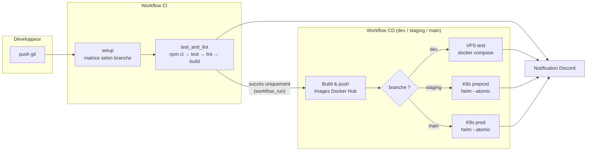
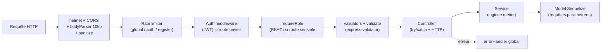
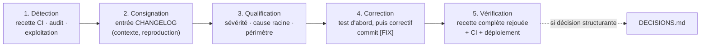

# Dossier de certification — Bloc 2 : Concevoir et développer des applications logicielles

**Projet : MyMemoMaster** — plateforme web de révision et de suivi pédagogique

**Candidat : Macabiau Frédéric** — Expert en développement logiciel (RNCP niveau 7)

---

### Plan du dossier

| Section      | Contenu                                                                                                                                                                                    | Compétence couverte |
| ------------ | ------------------------------------------------------------------------------------------------------------------------------------------------------------------------------------------ | -------------------- |
| Introduction | Présentation du projet                                                                                                                                                                    | —                   |
| 1            | Environnements de développement, de test et de déploiement                                                                                                                               | C2.1.1               |
| 2            | Intégration continue                                                                                                                                                                      | C2.1.2               |
| 3            | Prototypage et conception de l'application                                                                                                                                                 | C2.2.1               |
| 4            | Environnement de tests unitaires                                                                                                                                                           | C2.2.2               |
| 5            | Développement : évolutivité, sécurisation, accessibilité                                                                                                                              | C2.2.3               |
| 6            | Déploiement continu et progressif                                                                                                                                                         | C2.2.4               |
| 7            | Cahier de recettes                                                                                                                                                                         | C2.3.1               |
| 8            | Plan de correction des bogues                                                                                                                                                              | C2.3.2               |
| 9            | Documentation technique d'exploitation                                                                                                                                                     | C2.4.1               |
| Annexes      | A. Galerie du prototype · B. Démonstration de l'application · C. Index des documents du dépôt · D. Sources bibliographiques · E. Synthèse de couverture des compétences · F. Glossaire | —                   |

---

# Présentation du projet

La plupart des étudiants ont des méthodes de révision peu efficaces qui les mettent en difficulté : 83,6 % s'appuient sur des méthodes de révision passives, 27 % préparent leurs examens au dernier moment, seulement 34 % disposent d'un calendrier de révision utile et seul 1 étudiant sur 2 s'entraîne via des annales ou des exercices (études et enquêtes versionnées dans [docs/sources/](annexes/docs/sources/) — voir Annexe D).

Pour remédier à ces problèmes, MyMemoMaster propose une plateforme de révision et de suivi étudiant tout-en-un, à destination des étudiants principalement et des enseignants. La plateforme centralise des fonctionnalités fondées sur des méthodes pédagogiques actives dont l'efficacité est documentée par ces mêmes travaux :

- **Systèmes de Leitner** : questions-réponses à répétition espacée — l'algorithme représente les cartes dans des « boîtes » et fait remonter plus fréquemment les questions échouées et moins fréquemment les questions réussies ;
- **Cartes mentales** : éditeur graphique de schémas de notions et de leurs liens ;
- **Séries d'exercices** : entraînement avec correction automatique, y compris une correction par similarité sémantique pour les réponses ouvertes, exécutée par un modèle d'IA embarqué dans l'API (bibliothèque `@xenova/transformers`, modèle `all-mpnet-base-v2`);
- **Calendrier, échéances et rappels** : planification des sessions de révision, todo-list, notifications par email (file de traitement BullMQ/Redis) ;
- **KPI personnels et pédagogiques** : indicateurs de progression pour l'étudiant, tableaux de bord pour l'enseignant, avec gestion du consentement de partage ;
- **Groupes classes et établissements** : partage de ressources pédagogiques, invitations, périmètre d'administration pour les gérants d'établissement.

## Stack technique

La stack est documentée dans [dev/CONVENTIONS.md](annexes/dev/CONVENTIONS.md) et vérifiable dans le manifeste npm de l'api ([my_memo_master_api/package.json](my_memo_master_api/package.json)) et celui du front ([my_memo_master_front/package.json](my_memo_master_front/package.json)) :

| Couche                      | Technologie                                                                      |
| --------------------------- | -------------------------------------------------------------------------------- |
| Runtime API                 | Node.js 22                                                                       |
| Framework API               | Express.js v4                                                                    |
| ORM / Base de données      | Sequelize v6 — PostgreSQL 17 (test/preprod/prod), SQLite (développement local) |
| Authentification            | JWT (`jsonwebtoken`) + `bcryptjs`, refresh token avec rotation               |
| File de tâches asynchrones | BullMQ + Redis (rappels, notifications email)                                    |
| IA embarquée               | `@xenova/transformers` (correction par similarité sémantique)                |
| Front                       | Vue.js 3 + Vite v6 + Pinia (state) + Tailwind CSS v3                             |
| Tests                       | Jest + Supertest (API), Vitest + @vue/test-utils (front)                         |
| Qualité                    | ESLint (API v9, front v8) + Prettier                                             |
| Documentation API           | swagger-jsdoc + swagger-ui-express                                               |
| Conteneurisation            | Docker, Docker Compose, Helm/Kubernetes                                          |
| CI/CD                       | GitHub Actions                                                                   |

## Organisation du dépôt

```txt
MyMemoMaster/
├── my_memo_master_api/       # API Express (controllers, services, models, tests…)
├── my_memo_master_front/     # Front Vue 3 (pages, components, stores, tests…)
├── .github/workflows/        # Pipelines CI/CD (ci.yml, cd.yml, notify_ci.yml)
├── helm/                     # Chart Helm (déploiements Kubernetes preprod/prod)
├── k8s/                      # Manifests Kubernetes + scripts de migration Helm
├── docker-compose.yml        # Compose unifié : profil dev (local) + profil test (VPS)
├── docs/                     # Documentation : manuels (déploiement, utilisation, RUNBOOK), audits (OWASP, RGAA), prototype + captures, sources bibliographiques, synthèse mémoire du projet
└── diagrams/                 # Spécifications : règles métier, schéma BDD, UI
```

La mémoire du projet est synthétisée dans [docs/MEMOIRE_PROJET.md](annexes/docs/MEMOIRE_PROJET.md), qui présente le dispositif et renvoie vers les fichiers sources de [dev/](annexes/dev/). Le choix du monorepo est une décision de conception, argumentée en section 1.4.

## Architecture de l'application

Le schéma ci-dessous représente l'architecture de l'application.


Chaque sous-graphe correspond à une couche d'infrastructure ; les flèches indiquent le sens des requêtes. Redis sert **exclusivement** de broker BullMQ, pas de cache applicatif (règle de [dev/CONVENTIONS.md](annexes/dev/CONVENTIONS.md)).

---

# Section 1 — Environnements de développement, de test et de déploiement

**Compétence couverte : C2.1.1** — Mettre en œuvre des environnements de déploiement et de test en y intégrant les outils de suivi de performance et de qualité afin de permettre le bon déroulement de la phase de développement du logiciel.

## 1.1 Environnement de développement local

J'ai conçu l'environnement de développement pour qu'un contributeur soit opérationnel rapidement : créer le `.env` à partir du `.env.example` (URLs et clefs d'accès aux services externes — S3, serveur SMTP, token Cloudflare), puis lancer `docker compose up --build`. La procédure complète et l'outillage attendu (VS Code, Postman, Git, Docker) sont documentés dans le [README.md](annexes/README.md), partie « Bien commencer ».

### Un docker-compose unifié piloté par profils

Plutôt que d'avoir plusieurs docker compose divergents, j'ai unifié les environnements Docker dans un seul [docker-compose.yml](docker-compose.yml) piloté par les *profiles*, documentés dans l'en-tête du fichier :

```yaml
#  Profils (via COMPOSE_PROFILES dans le .env, ou --profile en CLI) :
#    dev  — Traefik local HTTP, build depuis les sources, hot-reload API
#    test — Images DockerHub, Traefik externe HTTPS Let's Encrypt, domaines de test
```

Les services de données (`postgres`, `redis`), sans profil, démarrent dans les deux environnements ; le profil `dev` y ajoute Traefik local, PgAdmin, le front et l'API buildée depuis les sources, le profil `test` les images Docker Hub avec TLS Let's Encrypt (déployé par le CD, job `deploy_test`). En dev, l'API monte le code source en volume pour le hot-reload nodemon, et le dashboard du Traefik local (`localhost:8080`) sert d'outil de diagnostic du routage.

### Développement hors Docker : la bascule SQLite / PostgreSQL

Pour permettre un développement encore plus léger (hors docker), l'API peut fonctionner avec SQLite. La bascule est automatique et repose sur une seule condition — la présence (ou pas) de `PG_HOST` dans l'environnement ([my_memo_master_api/models/index.js](my_memo_master_api/models/index.js)) :

```javascript
const dbmsConfig = require('../config/dbms.config')  // PostgreSQL + pool
const dbConfig = require('../config/db.config')       // SQLite fichier local

// Instantiate Sequelize using the right configuration for the current environment
const instance = new Sequelize(process.env.PG_HOST ? dbmsConfig : dbConfig)
```

Ce même mécanisme permet aux tests de tourner en SQLite in-memory, sans BDD externe (section 4.2) — décision documentée dans [dev/DECISIONS.md](annexes/dev/DECISIONS.md).

### Configuration par variables d'environnement

Toute la configuration passe par des variables d'environnement, présentes dans le fichier .env qui est unique à chaque environnement et non versionné ([.gitignore](.gitignore)). Ces variables d'environnement sont documentées dans le fichier [.env.example](.env.example).  Côté API, les accès sont centralisés dans [my_memo_master_api/config/](my_memo_master_api/config/) (`db.config.js`, `dbms.config.js`, `redis.config.js`, `storage.config.js`, `swagger.config.js`) ; côté front dans `src/config.js` — règle formalisée dans [dev/CONVENTIONS.md](annexes/dev/CONVENTIONS.md). L'homogénéité de style entre contributeurs est en outre garantie par un [.editorconfig](.editorconfig) à la racine.

## 1.2 Environnements de déploiements

Le projet est déployé dans trois environnements distincts, alimentés par des branches git dédiées :

| Branche git | Environnement     | Infrastructure                          | Images Docker Hub                         |
| ----------- | ----------------- | --------------------------------------- | ----------------------------------------- |
| `dev`     | **test**    | VPS (Docker Compose + Traefik)          | `mymemomaster_test_api` / `_front`    |
| `staging` | **preprod** | Kubernetes Infomaniak mutualisé (Helm) | `mymemomaster_preprod_api` / `_front` |
| `main`    | **prod**    | Kubernetes Infomaniak dédié (Helm)    | `mymemomaster_api` / `_front`         |

Cette correspondance est documentée dans le [README.md](annexes/README.md) (partie 3) et implémentée dans le pipeline [.github/workflows/cd.yml](.github/workflows/cd.yml).

**L'environnement de test** tourne sur un VPS avec le profil `test` du compose unifié, déployé automatiquement par le CD (section 6) : PostgreSQL et Redis avec healthchecks, API, front, PgAdmin, et un service `backup` produisant un dump PostgreSQL quotidien avec rétention configurable. **La preprod et la prod** sont déployées sur Kubernetes par un chart Helm unique ([helm/](helm/)) : chaque environnement surcharge les templates communs par son fichier de valeurs ([helm/values-preprod.yaml](helm/values-preprod.yaml), [helm/values-prod.yaml](helm/values-prod.yaml)) — en preprod Redis sans volume persistant et PgAdmin activé, en prod persistance systématique et administration restreinte.

**Isolation des environnements** : namespaces Kubernetes distincts, réseaux Docker nommés par environnement, images Docker Hub distinctes, secrets hors dépôt. Le pipeline CD vérifie même que le `.env` du VPS correspond à l'environnement attendu avant de déployer (`grep -q '^ENVIRONMENT=test$' .env`).

## 1.3 Outils de suivi de qualité et de performance

### Qualité du code : linters et formateurs

L'application a deux configurations de lint, exécutées localement et **bloquantes en CI** (section 2) : ESLint v9 *flat* + `eslint-config-prettier` côté API ([eslint.config.mjs](my_memo_master_api/eslint.config.mjs)), ESLint v8 + `eslint-plugin-vue` + Prettier côté front. Les scripts npm normalisent l'usage (`npm run lint` / `npm run format` des deux côtés du monorepo).

### Qualité fonctionnelle : les tests

Les tests Jest + Supertest côté API, Vitest + @vue/test-utils côté front sont exécutés en CI à chaque push. L'environnement de tests est détaillé en section 4 ; il est **auto-suffisant** (SQLite in-memory, mock du modèle d'IA dans [my_memo_master_api/__mocks__/](my_memo_master_api/__mocks__/)) : aucun service externe n'est requis pour valider un commit.

### Suivi de performance et de disponibilité

- **Healthchecks** à tous les étages : `pg_isready` (PostgreSQL), `redis-cli ping` (Redis), `wget --spider` (front) — utilisés par les dépendances de démarrage (`depends_on: condition: service_healthy`) et comme critère de succès du déploiement (section 6) ;
- **Limites de ressources** : `limits`/`reservations` CPU-mémoire sur chaque service Compose, `requests`/`limits` Kubernetes par environnement, pool de connexions PostgreSQL dimensionné par configuration ([dbms.config.js](my_memo_master_api/config/dbms.config.js)) ;
- **Logs structurés** : logger Winston + logs d'accès Morgan pipés dans Winston, format `combined` en production ([app.js](my_memo_master_api/app.js)) ;
- **Métriques RED/USE (Prometheus)** : histogramme de latence et compteur de requêtes labellisés méthode/route/code via `prom-client` ([helpers/metrics.js](my_memo_master_api/helpers/metrics.js)) ; l'endpoint `/metrics` est servi par un **serveur HTTP dédié** (port 9090) jamais exposé par l'Ingress ([dev/DECISIONS.md](annexes/dev/DECISIONS.md)), instrumentation couverte par 9 tests ;
- **Notifications temps réel** : chaque exécution CI/CD notifie un canal Discord (succès/échec, branche concernée) — l'équipe est prévenue d'une régression sans surveiller GitHub (section 2.5).

### Analyse statique continue : SonarCloud (SonarQube Cloud)

Le projet intègre une analyse statique continue sur SonarCloud : configuration versionnée ([sonar-project.properties](sonar-project.properties)), job `sonarcloud` exécuté par la CI après le succès des tests et du lint à chaque push sur `main` (l'analyse multi-branches est réservée aux plans payants). Le tableau de bord (bugs, code smells, duplication, quality gate) est consultable sur sonarcloud.io.

## 1.4 Dépôt de gestion du code source

Le code source est hébergé sur GitHub (`entrezunfredici/MyMemoMaster`) en monorepo : API, front, infrastructure et documentation évoluent dans le même historique git, et une même pull request peut porter une fonctionnalité de bout en bout (migration, endpoint, écran, test, manifeste de déploiement). La stratégie de branches que j'ai définie ([README.md](annexes/README.md), « Méthode de travail ») pilote directement le pipeline CI (matrice de jobs par préfixe de branche — section 2) : les branches de travail sont préfixées `dev_back_*` / `dev_front_*` selon le périmètre et fusionnent dans `dev` ; `dev`, `staging` et `main` alimentent respectivement les environnements de test, preprod et prod, chaque promotion se faisant par fusion de la branche amont. Les commits suivent la convention `[ADD]` / `[IMP]` / `[REF]` / `[FIX]`, ce qui rend l'historique exploitable comme journal des évolutions et des correctifs (sections 8 et 9). La méthode impose enfin l'ordre « tests unitaires → code → documentation Swagger » pour chaque fonctionnalité ([README.md](annexes/README.md), étape 3) : l'environnement porte aussi le processus de développement.

---

# Section 2 — Intégration continue

**Compétence couverte : C2.1.2** — Configurer le système d'intégration continue dans le cycle de développement du logiciel en fusionnant les codes sources et en testant régulièrement les blocs de code afin d'assurer un développement efficient qui réduit les risques de régression.

## 2.1 Protocole d'intégration continue

L'intégration continue fonctionne avec GitHub Actions ([.github/workflows/ci.yml](.github/workflows/ci.yml)) : build, tests et lint valident chaque bloc de code avant toute progression vers un environnement. Le workflow se déclenche à chaque push, sur les branches d'intégration (`main`, `staging`, `dev`) comme sur les branches de travail (`dev_back_*`, `dev_front_*`, `*devops*`) : une régression est ainsi décelée et corrigée **avant** la fusion dans `dev`, et la fusion dans une branche d'intégration redéclenche une validation complète qui conditionne le déploiement (section 2.4).

## 2.2 Matrice de jobs

Pour économiser du temps d'exécution, un job `setup` construit **dynamiquement la matrice de jobs selon le préfixe de la branche** ([ci.yml](.github/workflows/ci.yml)) :

* une branche `dev_front_*` ne valide que le front, une branche `dev_back_*` que l'API ;
* les branches d'intégration (`dev`, `staging`, `main`) valident **toujours les deux**, car c'est là que les contributions front et back se rencontrent — précisément le moment où une régression d'interface entre les deux peut apparaître.

## 2.3 Séquence de validation d'un bloc de code

Chaque entrée de la matrice exécute la même séquence, définie dans le job `test_and_lint` :

| Étape                        | Commande                                    | Rôle                                                                                                                                                                              |
| ----------------------------- | ------------------------------------------- | ---------------------------------------------------------------------------------------------------------------------------------------------------------------------------------- |
| 1. Installation reproductible | `npm ci`                                  | installe les dépendances**exactement** aux versions verrouillées par `package-lock.json` — pas d'écart entre poste développeur et runner                              |
| 2. Tests                      | `npm run test`                            | exécute les tests Jest + Supertest (API) / Vitest (front) — détection des régressions fonctionnelles                                                                           |
| 3. Lint                       | `npm run lint`                            | exécute ESLint — détection des défauts de qualité et erreurs statiques                                                                                                        |
| 4. Audit des dépendances     | `npm audit --omit=dev --audit-level=high` | **bloque** si une dépendance de production porte une vulnérabilité high/critical connue (OWASP A06) — les devDependencies, absentes des images déployées, sont exclues |
| 5. Build (front uniquement)   | `npm run build`                           | vérifie que le bundle Vite de production se construit                                                                                                                             |

Trois réglages méritent mention : `node-version: 22` (la même version que les images de production — on teste ce qu'on déploie), `fail-fast: false` (diagnostic complet en une passe) et `permissions: contents: read` (moindre privilège pour les jetons GitHub Actions). La CI tourne sans aucun service externe grâce à l'environnement de tests auto-suffisant (SQLite in-memory, mocks — section 4.2) : boucle rapide et déterministe.

## 2.4 La CI comme porte d'entrée du déploiement

Le pipeline de déploiement ([.github/workflows/cd.yml](.github/workflows/cd.yml)) se déclenche à la **fin du workflow CI** (déclencheur `workflow_run` sur `main`/`staging`/`dev`) et chaque job vérifie sa conclusion :

```yaml
if: github.event.workflow_run.conclusion == 'success' && github.event.workflow_run.event == 'push'
```

Cette architecture en deux workflows chaînés garantit structurellement qu'**aucune image Docker n'est construite ni déployée à partir d'un commit dont les tests ou le lint ont échoué**. C'est le cœur du protocole d'intégration continue.

## 2.5 Boucle de retour vers l'équipe

Le workflow [notify_ci.yml](.github/workflows/notify_ci.yml) notifie l'issue de la CI sur le canal Discord dédié, en nommant la branche fautive en cas d'échec (`"Tests failed on branch $BRANCH_NAME!"`) ; le pipeline CD envoie de son côté un bilan de déploiement (`✅/❌ Déploiement **<branche>** réussi/échoué`). Une régression introduite sur `dev` est connue de l'équipe en quelques minutes, sans surveillance active de GitHub.

<table><tr>
<td></td>
<td></td>
</tr></table>

*À gauche : échec CI, la branche fautive est nommée dans le message. À droite : succès CI sur `staging`, suivi du bilan de déploiement du pipeline CD (« ✅ Déploiement staging réussi »).*

## 2.6 Vue d'ensemble du pipeline



La flèche CI → CD n'existe que si la CI conclut en succès.


*Exécution réelle de `cd.yml` (push sur `staging`) : build et publication des images, puis seul « Deploy to Kubernetes (preprod) » s'exécute — les cibles test et prod sont ignorées — et la notification Discord conclut.*

---

# Section 3 — Prototypage et conception de l'application

**Compétence couverte : C2.2.1** — Concevoir un prototype de l'application logicielle en tenant compte des spécificités ergonomiques et des équipements ciblés (ex : web, mobile…) afin de répondre aux fonctionnalités attendues et aux exigences en termes de sécurité.

## 3.1 Démarche de prototypage : de la maquette au composant

La conception des interfaces suit quatre niveaux de raffinement successifs :

**Niveau 0 — Wireflow et exploration graphique (Miro, Figma).** La conception a démarré par un **wireflow Miro** (écrans filaires reliés par leurs flux de navigation, couvrant l'essentiel du périmètre fonctionnel), puis des maquettes Figma ont précisé l'identité visuelle écran par écran. Elles ont fixé des invariants toujours visibles aujourd'hui — navigation latérale par icônes, palette bleu/blanc, éditeur de cartes mentales à palette d'outils latérale et nœuds à formules — et tracent les décisions révisées depuis : flashcards et cartes mentales découplées en deux modules autonomes, et session de révision passée de la carte à retourner (auto-évaluation) à une **réponse en texte libre corrigée sémantiquement par IA** ([diagrams/leitner_algo.md](annexes/diagrams/leitner_algo.md)) — rappel actif plutôt que reconnaissance, cohérent avec les sources bibliographiques du mémoire. Tous les modules secondaires maquettés ont été retenus, sauf la messagerie interne. Ces traces sont archivées ([docs/prototype/figma/](annexes/docs/prototype/figma/), [wireflow Miro](annexes/docs/prototype/miro-wireflow-overview.png)) mais ne sont **pas maintenues** : la spécification de référence est le prototype HTML du niveau 1.

<table><tr>
<td></td>
<td></td>
</tr></table>

*Planches Figma ([docs/prototype/figma/](annexes/docs/prototype/figma/)) : système de Leitner (configuration, session avec états bonne/mauvaise réponse) et cartes mentales (liste, éditeur à palette latérale). Une troisième planche couvre les modules secondaires — réglages, profil, calendrier, et la messagerie, seul module écarté.*

**Niveau 1 — Un prototype interactif et navigable** des pages principales, créé et exporté en **HTML autonome** avec Claude design, versionné dans le dépôt ([docs/prototype/](annexes/docs/prototype/)) : 16 écrans couvrant l'ensemble des modules, de l'authentification aux réglages. Le prototype fixe l'identité visuelle et les parcours ; les captures sont **générées automatiquement depuis ce fichier** par script Puppeteer, donc reproductibles — galerie complète en **Annexe A**, deux exemples :

<table><tr>
<td></td>
<td></td>
</tr></table>

*À gauche : session de révision (répartition par boîte). À droite : exercice — question ouverte + QCM.*

**Niveau 2 — Spécifications UI versionnées.** Pour les fonctionnalités complexes, des documents de conception font le lien entre règles métier et interface, avec wireframes ASCII et contexte d'intégration distinguant l'existant du nouveau ([diagrams/dashboard_enseignant_ui.md](annexes/diagrams/dashboard_enseignant_ui.md), [etablissement_admin_ui.md](annexes/diagrams/etablissement_admin_ui.md), [kpi_consent_ui.md](annexes/diagrams/kpi_consent_ui.md), [ui_navigation_sujet.md](annexes/diagrams/ui_navigation_sujet.md)). Versionner ces maquettes avec le code est une décision de méthode : la spécification d'interface évolue dans les mêmes pull requests que son implémentation — le prototype s'inscrit dans un incrément, pas dans une refonte.

**Niveau 3 — Implémentation Vue.** Chaque maquette se concrétise en une page (`src/pages/[Name]Page.vue`) composée de composants réutilisables (`src/components/[Name]Component.vue`), conventions formalisées dans [dev/CONVENTIONS.md](annexes/dev/CONVENTIONS.md).

## 3.2 Un prototype fonctionnel couvrant les fonctionnalités attendues

Le « prototype » au sens du référentiel est ici l'application elle-même, fonctionnelle et manipulable en autonomie : elle est déployée sur les trois environnements et utilisable de bout en bout (inscription, vérification email, connexion, création et révision de contenus). La couverture des fonctionnalités principales se lit directement dans l'arborescence des 28 pages de [my_memo_master_front/src/pages/](my_memo_master_front/src/pages/) :

| Fonctionnalité attendue           | Pages implémentées                                                                                                                                     |
| ---------------------------------- | -------------------------------------------------------------------------------------------------------------------------------------------------------- |
| Systèmes de Leitner (flashcards)  | `FlashcardsPage`, `FlashcardsCardsPage`, `FlashcardsSessionPage`                                                                                   |
| Cartes mentales                    | `MindmapsPage` (+ composants dédiés `MindmapComponent`, `components/mindmap/`)                                                                   |
| Exercices                          | `ExercisesPage`, `ExerciseDetailPage`, `CreateTestPage`                                                                                            |
| Organisation                       | `CalendarPage`, `TodoPage`, `SubjectsPage`                                                                                                         |
| KPI                                | `KpiPage`                                                                                                                                              |
| Groupes classes / établissements  | `ClassroomPage` + vues par rôle (`ClassroomEnseignantView`, `ClassroomEtudiantView`, `ClassroomEtablissementView`, `ClassroomPlateformeView`) |
| Compte et cycle de vie utilisateur | `login/`, `register/`, `VerifyEmailPage`, `ForgotPasswordPage`, `ResetPasswordPage`, `ProfilePage`, `AccountPage`, `SettingsPage`        |
| Prise en main                      | `OnboardingPage`, `TutorialsPage`                                                                                                                    |

Les composants d'interface génériques exigés par le critère (fenêtres, boutons, menus…) existent en tant que composants réutilisables : `ButtonComponent`, `ModalComponent`, `DropdownComponent`, `MenuItemComponent`, `LoaderComponent`, `PillComponent`, `ToggleButton`, etc. ([my_memo_master_front/src/components/](my_memo_master_front/src/components/)).

<table><tr>
<td></td>
<td></td>
</tr></table>

*Session de révision Leitner réelle : saisie de la réponse, puis correction (score, similarité) et mise à jour de la répartition par boîte.*

## 3.3 Spécificités ergonomiques et équipements ciblés

Les médias ciblés sont le **navigateur web, desktop et mobile**. Trois dispositions concrètes en découlent :

- **Responsive design** : l'interface est construite avec Tailwind CSS et ses classes de points de rupture (`sm:`, `md:`, `lg:`) ; les maquettes de [diagrams/dashboard_enseignant_ui.md](annexes/diagrams/dashboard_enseignant_ui.md) spécifient d'ailleurs des colonnes 2/3 – 1/3 qui se replient sur mobile.
- **PWA (Progressive Web App)** : le front est installable sur mobile via `vite-plugin-pwa` ([vite.config.js](my_memo_master_front/vite.config.js)) — manifeste complet et mise à jour automatique du service worker. Décision de conception commentée dans le fichier : **aucun asset pré-caché** (`globPatterns: []`), car sur une application au contenu essentiellement dynamique, un pré-cache Workbox de plusieurs Mo dégraderait la première installation sans bénéfice réel.
- **Guidage utilisateur** : l'ergonomie de prise en main est traitée comme une fonctionnalité à part entière, avec un dispositif d'onboarding à deux niveaux, testé et validé en conditions réelles :
  - **la visite guidée de l'interface**, lancée automatiquement au premier login : 10 étapes en français mettent en surbrillance les modules de la navigation, via `driver.js` — retenue pour sa licence MIT après l'écartement d'intro.js, sous licence AGPL/commerciale ([dev/DECISIONS.md](annexes/dev/DECISIONS.md)). L'état « visite vue » est **persisté côté serveur** (module `OnboardingState` de l'API, champ `tour_seen`) : jamais relancée automatiquement, y compris depuis un autre navigateur, mais relançable depuis la page d'accueil ([src/composables/useOnboardingTour.js](my_memo_master_front/src/composables/useOnboardingTour.js)) ;
  - **le parcours guidé de création** : un bandeau persistant accompagne l'utilisateur sur les **vraies pages** de l'application en 4 étapes (carte mentale → Leitner → exercices → planification), chaque étape n'étant déverrouillée que par la création effective de l'élément, avec liaison automatique entre eux (matière pré-sélectionnée, séance rattachée au système créé) ; l'état survit au rechargement (store Pinia persisté en localStorage, [src/stores/guidedTour.js](my_memo_master_front/src/stores/guidedTour.js)).

  Les deux dispositifs sont couverts par des tests dédiés (section 4.1) et complétés par une page de tutoriels, des notifications toast, des états vides explicites, des indicateurs de chargement et des titres d'onglet dynamiques par page.

Une règle d'ergonomie issue d'un défaut réellement rencontré est même codifiée dans les conventions du projet ([dev/CONVENTIONS.md](annexes/dev/CONVENTIONS.md)) : les popups et panneaux flottants doivent déclarer un fond opaque explicite pour rester lisibles quelle que soit la page en dessous.

## 3.4 Exigences de sécurité intégrées au prototype

La sécurité n'est pas reportée à la couche API : le prototype front l'intègre dès la navigation.

**Contrôle d'accès à la navigation.** Le routeur applique deux guards à chaque changement de route ([my_memo_master_front/src/router/index.js](my_memo_master_front/src/router/index.js)) : un guard d'authentification (route `meta.private` sans session valide → déconnexion propre et redirection `/auth`) et un guard de rôles (`meta.roles = [1, 4]` signifie « admin plateforme ou admin établissement seulement » ; rôle non autorisé → redirection accueil) :

```javascript
if (to.meta.roles && to.meta.roles.length > 0) {
  const userRoleId = authStore.user?.roleId ?? null
  if (!to.meta.roles.includes(userRoleId)) return next({ path: '/' })
}
```

Les routes déclarent leur exigence dans leurs métadonnées : ajouter un écran protégé ne demande aucune logique nouvelle, seulement une déclaration — le contrôle d'accès est systématique par construction. Ce contrôle côté client est un confort d'expérience utilisateur (redirection immédiate) ; l'autorité reste côté API, où chaque route privée est protégée par middleware JWT et RBAC (section 5.2).

**Gestion de session sécurisée.** Le client HTTP centralisé ([src/helpers/api.js](my_memo_master_front/src/helpers/api.js)) implémente le renouvellement silencieux de session : sur une réponse 401, un intercepteur échange le refresh token puis rejoue la requête une seule fois (drapeau `_retried` contre les boucles infinies) ; si le renouvellement échoue, l'utilisateur est déconnecté proprement. C'est la contrepartie ergonomique d'une exigence de sécurité : elle rend acceptable un jeton d'accès de 15 minutes ([dev/DECISIONS.md](annexes/dev/DECISIONS.md), [docs/SECURITY_AUDIT_OWASP.md](annexes/docs/SECURITY_AUDIT_OWASP.md)) sans jamais imposer de reconnexion. Le front intègre aussi un indicateur de robustesse du mot de passe à l'inscription (`PasswordStrengthComponent.vue`).

---

# Section 4 — Environnement de tests unitaires

**Compétence couverte : C2.2.2** — Développer un harnais de test unitaire en tenant compte des fonctionnalités demandées afin de prévenir les régressions et de s'assurer du bon fonctionnement du logiciel.

## 4.1 Répartition des tests unitaires

Les chiffres ci-dessous sont issus de l'exécution réelle des deux suites de tests sur le code actuel du dépôt (et non d'une déclaration) :

| Périmètre | Outillage                                 | Volume                           | Résultat               | Durée |
| ----------- | ----------------------------------------- | -------------------------------- | ----------------------- | ------ |
| API         | Jest + Supertest                          | **80 suites, 1 450 tests** | 1 450 passés, 0 échec | ~40 s  |
| Front       | Vitest + @vue/test-utils + @pinia/testing | **41 fichiers, 617 tests** | 617 passés, 0 échec   | ~40 s  |

Répartition de la stratégie de test :

| Couche testée                                                   | Fichiers | Tests | Ce qui est validé                                                                         |
| ---------------------------------------------------------------- | -------- | ----- | ------------------------------------------------------------------------------------------ |
| `test/controllers/` (API)                                      | 34       | 793   | contrat HTTP de chaque endpoint : codes de statut, corps de réponse, cas d'erreur         |
| `test/services/` (API)                                         | 34       | 554   | logique métier isolée : algorithmes, règles de droits, cas limites                      |
| `test/middlewares/` (API)                                      | 4        | 31    | JWT, RBAC, rate limiting, instrumentation métriques (tests de sécurité dédiés)        |
| `test/models/` (API)                                           | 2        | 18    | contraintes de modèles sensibles (AuditLog, Etablissement)                                |
| `test/helpers/` (API)                                          | 2        | 14    | helpers transverses : métriques Prometheus, signatures binaires des uploads (magic bytes) |
| `test/bdd/` (API)                                              | 4        | 40    | scénarios fonctionnels de bout en bout (sessions complètes)                              |
| `test/components/` (front)                                     | 18       | 279   | rendu et interactions des pages/composants critiques                                       |
| `test/stores/` (front)                                         | 16       | 254   | state management Pinia : actions, mutations d'état, appels API mockés (dont onboarding et parcours guidé) |
| `test/router/`, `composables/`, `helpers/`, racine (front) | 6        | 80    | guards de navigation, logique réutilisable (dont la visite guidée de l'interface)         |
| `test/a11y/` (front)                                           | 1        | 4     | accessibilité runtime (axe-core) des composants critiques — non-régression RGAA         |

L'essentiel des tests porte sur les couches controller et service de l'API — là où vit la logique métier —, complétées par des tests fonctionnels transverses (`test/bdd/`) qui valident les enchaînements réels.

## 4.2 Architecture de l'environnement de tests API

L'environnement de tests de l'API est conçu pour tourner sans aucun service externe ([my_memo_master_api/package.json](my_memo_master_api/package.json) : `testMatch`, `moduleNameMapper`, `setupFiles`), par trois mécanismes d'isolation visibles dans l'en-tête du test de session Leitner ([test/bdd/leitner.session.test.js](my_memo_master_api/test/bdd/leitner.session.test.js)) :

- **base de données** SQLite in-memory (`DB_STORAGE=':memory:'`), une instance par fichier de test — aucune BDD externe, pas de pollution entre tests ;
- **modèle d'IA** `@xenova/transformers` (~30 s de chargement) remplacé par un mock global ([__mocks__/](my_memo_master_api/__mocks__/)) — les autres couches (controller → service → model → DB) restent réelles ;
- **jobs asynchrones** (crons, worker BullMQ) neutralisés — pas de dépendance Redis ni de timing non déterministe.

Le fichier [test/setup.js](my_memo_master_api/test/setup.js) désactive par défaut le rate limiting, **sauf** pour les tests de sécurité qui le réactivent afin de valider précisément ce comportement ([test/middlewares/security.test.js](my_memo_master_api/test/middlewares/security.test.js)).

## 4.3 Couverture d'une fonctionnalité : l'algorithme de Leitner

Pour illustrer la couverture d'une fonctionnalité complète, je prends le cœur métier de l'application : la répétition espacée dispose de deux niveaux de tests.

**Les tests unitaires — [test/services/LeitnerCard.service.test.js](my_memo_master_api/test/services/LeitnerCard.service.test.js) (23 tests).** Les tests suivent systématiquement le schéma *méthode – condition – comportement attendu* et couvrent le cas nominal, les cas limites et les erreurs attendues :

```
correctResponse - bonne réponse - avance à la boîte suivante et incrémente correct_count
correctResponse - mauvaise réponse - retour boîte 1 et incrémente incorrect_count
correctResponse - bonne réponse en boîte 5 - reste en boîte 5 (plafonnement)
resolveUserRights - utilisateur sans accès - aucun droit
```

On y reconnaît l'algorithme (progression, rétrogradation, plafonnement en boîte 5) **et** le modèle de droits (propriétaire / partagé en écriture / sans accès).

**Les tests fonctionnels — [test/bdd/leitner.session.test.js](my_memo_master_api/test/bdd/leitner.session.test.js) (12 scénarios).** Une session réelle est déroulée via Supertest à travers toutes les couches (routes → controllers → services → modèles → base) : carte jamais révisée retournée comme due, avancement en boîte 2 après bonne réponse, réapparition après dépassement de `next_review_at`, et les erreurs de contrat (401 sans token, 404 carte inexistante, 400 corps invalide). Ce niveau attrape les régressions d'intégration que les tests unitaires par couche ne voient pas.

## 4.4 Côté front : tester le comportement, pas l'implémentation

Côté front, les tests montent réellement les composants (`mount` de @vue/test-utils) avec un store Pinia de test (`createTestingPinia`) et des dépendances stubbing explicites. Exemple des 13 cas de [test/components/FlashcardsSessionPage.test.js](my_memo_master_front/test/components/FlashcardsSessionPage.test.js), qui valident le parcours utilisateur complet d'une session de révision :

```
affiche "Aucune carte à réviser" quand dueCards est vide
bonne réponse — affiche le feedback vert avec le score
mauvaise réponse — affiche le feedback rouge avec la correction attendue
affiche "Session terminée" après la dernière carte
```

Ces intitulés décrivent des comportements observables par l'utilisateur (états affichés, boutons actifs, redirections) et non des détails d'implémentation : un refactoring interne du composant ne casse pas ces tests, une régression fonctionnelle les casse — c'est exactement le rôle d'un dispositif anti-régression.

## 4.5 Couverture et exécution systématique

La couverture de code de l'API, mesurée par `npx jest --coverage` sur le code actuel du dépôt, s'établit à : **lignes 86,17 %** · instructions 85,74 % · fonctions 84,81 % · branches 66,40 %. La majorité du code développé est donc couverte, conformément au critère. La couverture de branches, plus basse, est typique d'un code défensif (branches d'erreur rares, garde-fous) ; les branches critiques — algorithme Leitner, droits, authentification — sont couvertes explicitement (4.3). L'ensemble des tests est exécuté **à chaque push** par la CI et conditionne tout déploiement (section 2.4) ; la méthode de travail place par ailleurs l'écriture des tests **avant** le code ([README.md](annexes/README.md), étape 3).

---

# Section 5 — Développement : évolutivité, sécurisation, accessibilité

**Compétence couverte : C2.2.3** — Développer le logiciel en veillant à l'évolutivité et à la sécurisation du code source, aux exigences d'accessibilité et aux spécifications techniques et fonctionnelles définies, pour garantir une exécution conforme aux exigences du client.

## 5.1 Une architecture logicielle structurée pour la maintenabilité

### Le pipeline d'une requête

L'architecture de l'api est composée des couches : **route → middlewares → controller → service → model**

Cette architecture est décrite dans [dev/CONVENTIONS.md](annexes/dev/CONVENTIONS.md) (« Pas de logique métier dans les controllers — tout passe par les services »). Chaque requête traverse le même pipeline :



Chaque bloc est un fichier ou dossier réel de [my_memo_master_api/](my_memo_master_api/) ; la flèche pointillée est le chemin d'erreur. La composition est lisible dans la déclaration des routes ([my_memo_master_api/routes/User.routes.js](my_memo_master_api/routes/User.routes.js)) :

```javascript
router.post('/register', registerLimiter, userValidators.register, validate, user.register)
router.post('/login', authLimiter, userValidators.login, validate, user.login)
router.put('/:id', authMiddleware, userValidators.update, validate, user.update)
```

**Le controller ne fait que du HTTP** : try/catch, appel du service, traduction en code de statut et message en français ([Subject.controller.js](my_memo_master_api/controllers/Subject.controller.js)). **La validation est déclarative et centralisée.** Chaque entité a son fichier de règles ([my_memo_master_api/validators/User.validators.js](my_memo_master_api/validators/User.validators.js) — longueur et complexité du mot de passe, normalisation d'email…), appliquées par un middleware unique [validate.middleware.js](my_memo_master_api/middlewares/validate.middleware.js) qui renvoie un 400 uniforme. **La gestion d'erreur est un filet global** ([middlewares/errorHandler.middleware.js](my_memo_master_api/middlewares/errorHandler.middleware.js)) : toute erreur non gérée est loggée puis traduite en réponse JSON — en production le message interne est masqué (`isProd ? 'Erreur interne du serveur.' : err.message`), ce qui évite de divulguer des détails d'implémentation (voir 5.2).

Cette uniformité (36 controllers, 37 services, 34 fichiers de validators construits sur le même patron, conventions de nommage documentées) est ce qui rend le code **maintenable par quelqu'un d'autre que son auteur** : localiser une règle métier, une règle de validation ou un contrat HTTP ne demande aucune connaissance tribale, seulement la convention.

## 5.2 Sécurisation du code source : démarche OWASP Top 10

### La démarche : un audit formalisé, versionné, suivi

Plutôt que d'égrener des mesures de sécurité au fil de l'eau, j'ai conduit un **audit complet contre l'OWASP Top 10**, dont le livrable est versionné dans le dépôt : [docs/SECURITY_AUDIT_OWASP.md](annexes/docs/SECURITY_AUDIT_OWASP.md) (ticket M-00b.07). Ce document qualifie chaque constat (catégorie OWASP, sévérité, statut) et distingue trois ensembles : vulnérabilités corrigées immédiatement, vulnérabilités hautes corrigées dans le ticket suivant (M-00b.07b), et risques résiduels acceptés et documentés. Extrait du tableau de synthèse :

| ID         | OWASP | Titre                                                               | Sévérité | Statut      |
| ---------- | ----- | ------------------------------------------------------------------- | ----------- | ----------- |
| F-01/02/03 | A01   | Routes POST/PUT/DELETE de Fields/Tutorials/Test sans authMiddleware | Critique    | ✅ Corrigé |
| F-04       | A01   | Login sans vérification hasValidatedEmail                          | Moyenne     | ✅ Corrigé |
| F-05/06    | A04   | Énumération d'emails via forgotPassword / verifyEmail             | Moyenne     | ✅ Corrigé |
| F-07       | A02   | generateToken.js utilisait Math.random() (non-crypto)               | Faible      | ✅ Corrigé |
| F-08       | A05   | Swagger UI accessible en production                                 | Moyenne     | ✅ Corrigé |

Le backlog a été **résorbé par lots successifs**, tracés dans le document : priorités hautes (M-00b.07b), puis priorités moyennes (passe du 2026-07-06 : CSP explicite, magic bytes sur les uploads, journalisation des échecs d'authentification, anti-injection de logs…). L'audit assume ce qui **reste** : pas de révocation JWT, palliatif documenté — expiration 15 min + rotation du refresh token. La sécurité est un processus tracé, pas un état déclaré.

### La défense en profondeur implémentée

Chaque étage du pipeline de la section 5.1 porte une mesure, rattachable à une catégorie OWASP :

- **A01 — Contrôle d'accès** : middleware JWT systématique sur les routes privées ([Auth.middleware.js](my_memo_master_api/middlewares/Auth.middleware.js)) ; RBAC ([requireRole.middleware.js](my_memo_master_api/middlewares/requireRole.middleware.js)) qui revérifie le rôle **en base à chaque requête** — un rôle révoqué prend effet immédiatement ([dev/DECISIONS.md](annexes/dev/DECISIONS.md)) ;
- **A02 — Cryptographie** : mots de passe bcrypt ; access token 15 min ; refresh token opaque avec **rotation à chaque renouvellement** ; token de reset hashé SHA-256 en base, token brut envoyé par email uniquement ;
- **A03 — Injection** : requêtes exclusivement via l'ORM (paramétrées) ; nettoyage HTML de tous les champs du body ([sanitize.middleware.js](my_memo_master_api/middlewares/sanitize.middleware.js)) ; validation déclarative par entité ;
- **A04 — Conception** : anti-énumération d'emails (réponses génériques) ; rate limiting à trois étages ([rateLimit.middleware.js](my_memo_master_api/middlewares/rateLimit.middleware.js)) — global 500 req/15 min, login 10 tentatives **échouées**/15 min, inscription 10/h — le limiteur global étant keyé par userId plutôt que par IP (problème du NAT scolaire : plusieurs élèves derrière la même IP) ;
- **A05 — Configuration** : `helmet` avec **CSP explicite** ; CORS en liste blanche ; Swagger désactivé en production ; body JSON limité à 10 ko ; `trust proxy` ; secrets hors dépôt ; HTTPS forcé + HSTS ;
- **A06 — Composants vulnérables** : `npm audit` **bloquant en CI** sur les dépendances de production (section 2.3) ; driver SQLite déplacé en devDependencies pour sortir sa chaîne de build vulnérable des images déployées — **0 vulnérabilité high/critical** à la date du dossier ;
- **A08 — Intégrité des données** : uploads vérifiés en **deux lignes de défense** ([helpers/fileSignature.js](my_memo_master_api/helpers/fileSignature.js)) — croisement extension ↔ MIME, puis **magic bytes lus sur le flux** avant écriture S3 : un exécutable renommé en `.png` est refusé même avec un MIME forgé ;
- **A09 — Journalisation** : messages d'erreur internes masqués en production, échecs d'authentification et refus d'accès (401/403) journalisés en `warn` avec IP, anti log-injection.

Ces mesures sont **elles-mêmes testées** : [test/middlewares/security.test.js](my_memo_master_api/test/middlewares/security.test.js) et [test/middlewares/Auth.middleware.test.js](my_memo_master_api/test/middlewares/Auth.middleware.test.js) valident JWT invalide/expiré, RBAC (dont la journalisation des refus) et rate limiting (31 tests, section 4.1) ; la vérification des signatures binaires d'upload a ses 12 tests dédiés ([test/helpers/fileSignature.test.js](my_memo_master_api/test/helpers/fileSignature.test.js)).

## 5.3 Accessibilité : audit et plan de mise en conformité

### Choix du référentiel

Je retiens le **RGAA 4** comme référentiel cible : standard officiel français fondé sur WCAG 2.1, cohérent avec le public visé (établissements scolaires, potentiellement soumis à obligation légale d'accessibilité). Pour un MVP, je l'applique en priorisant les critères à plus fort impact utilisateur (navigation clavier, alternatives textuelles, formulaires, structure).

### Audit du code front : constats et mise en conformité

J'ai audité [my_memo_master_front/src/](my_memo_master_front/src/) critère par critère (décomptes issus d'une analyse statique réelle des `.vue` du dépôt). **Points conformes d'emblée** : éléments interactifs natifs (208 `<button>`), `alt` sur toutes les images, modale avec `role="dialog"`/`aria-modal`, composants d'édition pilotables au clavier, hiérarchie de titres et 84 `<label>`, titres d'onglet par page.

**Non-conformités relevées, toutes traitées ensuite** (détail, chiffres avant/après et commandes de reproduction dans **[docs/AUDIT_RGAA.md](annexes/docs/AUDIT_RGAA.md)**) :

| Critère RGAA                     | Constat initial                                                                              | Traitement                                                                                                                                                   |
| --------------------------------- | -------------------------------------------------------------------------------------------- | ------------------------------------------------------------------------------------------------------------------------------------------------------------ |
| 8.3 — Langue                     | `<html lang="en">` sur une application en français (voix anglaise des lecteurs d'écran)  | ✅`lang="fr"`                                                                                                                                              |
| 11.1 — Étiquettes de champs     | 111 champs sans nom accessible                                                               | ✅`aria-label` en français sur chacun, ré-audit à **0**                                                                                           |
| 7.x — Focus et clavier           | Modale sans focus trap ni restitution du focus ; 21`<div @click>` sans équivalent clavier | ✅ Focus trap + restitution +`aria-label="Fermer"` (10 tests) ; conversion sémantique ou pattern ARIA `role="button"`/`tabindex`/`@keydown` partout |
| 3.x — Information par la couleur | Feedback bonne/mauvaise réponse fondé sur vert/rouge                                       | ✅ Vérifié doublé d'un texte explicite (« Correct »/« Incorrect », score, correction)                                                                 |
| 13.x — Zones dynamiques          | Aucune région`aria-live`                                                                  | ✅ Zones`aria-live="polite"` sur le feedback de session et le score d'exercice ; toasts en `role="alert"`                                                |

La campagne (2026-07-06) est **outillée et reproductible** : un audit statique développé pour le projet ([scripts/audit-a11y.mjs](my_memo_master_front/scripts/audit-a11y.mjs)) vérifie ces critères sur les 73 fichiers `.vue` — première exécution : **135 non-conformités**, ré-exécution après correction intégrale : **0**. La **non-régression** est assurée par 4 tests axe-core sur DOM réellement rendu, exécutés en CI à chaque push ([test/a11y/axe.test.js](my_memo_master_front/test/a11y/axe.test.js)). Restent hors périmètre, documentés dans l'audit : la mesure des contrastes (jsdom ne rend pas les styles) et un test lecteur d'écran réel (protocole NVDA planifié).

## 5.4 Évolutivité et traçabilité du code

- **API versionnée** : toutes les routes sont montées sous `/api/v1` ([app.js](my_memo_master_api/app.js)) — une v2 pourra coexister sans casser les clients existants ;
- **Schéma de base évolutif** : **61 migrations Sequelize** versionnées ([my_memo_master_api/migrations/](my_memo_master_api/migrations/)), rejouables sur les deux dialectes (SQLite/PostgreSQL) ;
- **Configuration externalisée** : aucun paramètre d'environnement en dur (section 1.1) — la même image Docker sert plusieurs environnements, y compris par injection runtime de la config front (`window.__APP_CONFIG__`) ;
- **Contrat d'API documenté** : annotations Swagger sur chaque route, servies sur `/api-docs` (section 9.3) — un client tiers peut être développé contre le contrat, pas contre le code ;
- **Mémoire du projet** : le dossier [dev/](annexes/dev/) (conventions, décisions, changelog d'état) est conçu pour qu'un nouveau développeur — humain ou agent — reprenne le travail sans contexte oral (synthèse : [docs/MEMOIRE_PROJET.md](annexes/docs/MEMOIRE_PROJET.md)) ;
- **Traçabilité des versions** : historique git structuré par les conventions de commit `[ADD]/[IMP]/[REF]/[FIX]` (section 1.4), doublé de deux journaux versionnés — [dev/CHANGELOG.md](annexes/dev/CHANGELOG.md) (état module par module, une entrée par ticket, dette éventuelle) et [dev/DECISIONS.md](annexes/dev/DECISIONS.md) (chaque choix structurant avec l'alternative écartée). Trois niveaux de trace : le commit (quoi), le changelog (où en est-on), la décision (pourquoi).

---

# Section 6 — Déploiement continu et progressif

**Compétence couverte : C2.2.4** — Déployer le logiciel à chaque modification de code et de façon progressive en vérifiant la performance fonctionnelle et technique auprès des utilisateurs afin de présenter une solution stable et conforme à l'attendu.

## 6.1 Déployer à chaque modification : le protocole

Chaque fusion sur une branche d'intégration déclenche un déploiement automatique complet — à condition que la CI soit verte (mécanisme `workflow_run`, section 2.4). Le pipeline [.github/workflows/cd.yml](.github/workflows/cd.yml) enchaîne systématiquement : construction des images Docker, poussée sur Docker Hub avec un nom d'image propre à l'environnement, puis déploiement sur la cible correspondante (VPS test pour `dev`, Kubernetes preprod pour `staging`, Kubernetes prod pour `main`).

La **progressivité** du déploiement est structurelle, à deux niveaux :

1. **Promotion entre environnements** : une modification atteint d'abord l'environnement de test (fusion dans `dev`), y est vérifiée fonctionnellement, puis est promue en preprod (`staging`), et seulement ensuite en production (`main`) — trois déploiements successifs avant les utilisateurs finaux.
2. **Garde-fou de production** : le job prod est conditionné à une variable d'activation explicite en plus de la branche (`if: branch == 'main' && vars.K8S_PROD_ENABLED == 'true'`, [cd.yml](.github/workflows/cd.yml)) — on peut fusionner sur `main` et construire les images sans déployer, tant que la mise en production n'est pas explicitement décidée.

## 6.2 Des artefacts de déploiement reproductibles

Les images sont construites en **multi-stage** pour livrer des artefacts minimaux et identiques d'un environnement à l'autre :

- **API** ([my_memo_master_api/Dockerfile](my_memo_master_api/Dockerfile)) : un stage `deps` compile les dépendances natives (toolchain python3/make/g++ requise par le runtime ONNX du modèle d'IA), puis le stage `production` ne reçoit que les `node_modules` compilés — **aucun outil de build dans l'image finale** ;
- **Front** ([my_memo_master_front/Dockerfile](my_memo_master_front/Dockerfile)) : stage 1 build Vite, stage 2 nginx statique avec `HEALTHCHECK` embarqué.

Au démarrage, l'API applique elle-même ses migrations et seeds de référence ([entrypoint.sh](my_memo_master_api/entrypoint.sh)) : une modification de schéma ne demande **aucune intervention manuelle** — la migration voyage avec le code (61 migrations versionnées, section 5.4) et `db:migrate` est idempotent.

## 6.3 Vérifier avant, pendant et après : le déploiement VPS (test)

Le job `deploy_test` de [cd.yml](.github/workflows/cd.yml) illustre la démarche « vérifier à chaque étape » :

- **Avant** : la syntaxe du compose est validée sur le runner (`config -q`), puis le `.env` du serveur est contrôlé — présence et cohérence d'environnement (`grep -q '^ENVIRONMENT=test$'`) — ce qui interdit de déployer la configuration de test sur une autre cible ;
- **Pendant** : les services de données démarrent d'abord (PostgreSQL, Redis), les applicatifs ensuite, en s'appuyant sur les healthchecks (section 1.3) ;
- **Après** : une boucle de vérification interroge l'état de santé réel de chaque conteneur (jusqu'à 24 × 5 s) ; en cas d'échec, le job **collecte les logs** (`compose logs --tail=100`) et échoue explicitement — le déploiement n'est déclaré réussi que si l'application répond, pas seulement si les commandes se sont exécutées.

## 6.4 Déploiement Kubernetes : atomicité et rollback automatique

Pour la preprod et la prod, le déploiement passe par Helm avec deux mécanismes de stabilité ([cd.yml](.github/workflows/cd.yml)) :

```yaml
helm upgrade --install mmm-preprod ./helm -f helm/values-preprod.yaml \
  -n mymemomaster-preprod --set "rolloutTimestamp=$(date +%s)" --atomic --timeout 5m
```

- **`--atomic`** : si le rollout ne converge pas dans le délai (5 min en preprod, 8 min en prod), Helm **annule et restaure automatiquement la version précédente** — un déploiement raté ne laisse jamais l'environnement dans un état intermédiaire ;
- **`rolloutTimestamp`** : les images étant taguées `latest` par environnement, cette annotation injectée dans le template de pod ([helm/templates/deployment-api.yaml](helm/templates/deployment-api.yaml)) change à chaque exécution et force un rolling update même à tag constant, combinée à `imagePullPolicy: Always` ;
- **Readiness probes** : le chart déclare des sondes de disponibilité — HTTP `/` sur le front, HTTP `/api/v1/health` sur l'API — qui conditionnent la bascule du trafic vers les nouveaux pods.

**Anomalie détectée lors de la rédaction de ce dossier** : la route `/api/v1/health` ciblée par la readiness probe **n'existait pas dans le code Express** — les pods n'étaient jamais déclarés prêts et le rollout `--atomic` échouait. L'anomalie est analysée et corrigée en section 8.3, où elle sert d'exemple complet du processus de détection/correction.

## 6.5 Vérification fonctionnelle auprès des utilisateurs

La chaîne d'environnements sert précisément à cela : l'environnement de **test** (`test.my-memo-master.com`) est le lieu de vérification fonctionnelle par les utilisateurs du projet avant promotion — les domaines par environnement sont configurés dans les `.env` serveur et values Helm (sections 1.2, [README.md](annexes/README.md) partie 3). Chaque déploiement notifie le canal Discord de l'équipe (`✅ Déploiement **staging** réussi.`), qui sait ainsi quand une version est disponible pour vérification (captures des notifications en section 2.5, exécution réelle du pipeline en section 2.6). Une démonstration vidéo du parcours utilisateur complet est fournie en Annexe B.

---

# Section 7 — Cahier de recettes

**Compétence couverte : C2.3.1** — Élaborer le cahier de recettes en rédigeant les scénarios de tests et les résultats attendus afin de détecter les anomalies de fonctionnement et les régressions éventuelles.

## 7.1 Démarche : un cahier de recettes exécutable

Chaque scénario de recette est formalisé sous forme d'un test fonctionnel automatisé versionné dans le dépôt, et le cahier ci-dessous en est la vue documentaire — chaque ligne référence le test qui l'implémente. Ce choix a une conséquence forte sur la détection des régressions : la recette n'est pas rejouée une fois par livraison, elle est rejouée **à chaque push** par la CI (section 2).

Le cahier s'organise en trois volets, conformément au critère (tests fonctionnels, structurels, de sécurité) :

- **fonctionnel de bout en bout** : parcours utilisateur complets — requêtes HTTP réelles traversant toutes les couches ([test/bdd/](my_memo_master_api/test/bdd/)) et tests de pages côté interface ;
- **structurel** : contrat HTTP de chaque endpoint (codes de statut, corps, cas d'erreur) — 793 tests de [test/controllers/](my_memo_master_api/test/controllers/) couvrant les 34 modules de l'API ;
- **sécurité** : tests dédiés ([security.test.js](my_memo_master_api/test/middlewares/security.test.js)) et audit OWASP (section 5.2).

**Statut de la recette** : les statuts « ✅ » des tableaux ci-dessous correspondent à la dernière exécution réelle des suites sur le code actuel du dépôt (1 450/1 450 tests API et 617/617 tests front passés — section 4.1).

## 7.2 Recette fonctionnelle — parcours de bout en bout

Chaque parcours ouvre sur la user story qu'il valide, pour tracer le besoin utilisateur jusqu'au scénario de test. Les scénarios et résultats attendus sont **directement extraits des tests du dépôt** (les intitulés encodent condition → résultat attendu, convention de nommage de la section 4.3) et couvrent systématiquement cas nominal + cas limites + erreurs attendues ; le détail scénario par scénario reste lisible dans les fichiers de test référencés :

| Parcours (user story)                                                                                                                                                   | Scénarios couverts                                                                                                                                                                                                                  | Tests                                                                                                                               | Statut   |
| ----------------------------------------------------------------------------------------------------------------------------------------------------------------------- | ------------------------------------------------------------------------------------------------------------------------------------------------------------------------------------------------------------------------------------ | ----------------------------------------------------------------------------------------------------------------------------------- | -------- |
| **Session de révision Leitner** (fonctionnalité cœur) — *en tant qu'étudiant, je veux réviser mes cartes par répétition espacée — les cartes échouées revenant plus souvent — afin de mémoriser durablement* | Cartes dues (jamais révisée, `next_review_at` dépassé, session vide, multi-cartes) ; bonne réponse → boîte 2, mauvaise → boîte 1, plafonnement boîte 5 ; compteurs d'historique ; erreurs 400 (corps invalide) / 401 (sans token) / 404 (carte inexistante) | [test/bdd/leitner.session.test.js](my_memo_master_api/test/bdd/leitner.session.test.js) (L-01 → L-12)                               | ✅ 12/12 |
| **Passage d'une série d'exercices** — *en tant qu'étudiant, je veux m'entraîner sur des exercices corrigés automatiquement afin d'évaluer ma progression* | Parcours nominal 4/4 avec persistance du score ; 0/4 ; question non répondue traitée comme incorrecte ; correction par type de question (QCM, texte à trou insensible à la casse/espaces, remise en ordre) ; erreurs 400/401/404 | [test/bdd/exercise.session.test.js](my_memo_master_api/test/bdd/exercise.session.test.js) (E-01 → E-11)                             | ✅ 11/11 |
| **Échéances et rappels** — *en tant qu'étudiant, je veux planifier des échéances avec rappels par email afin d'anticiper mes révisions*                  | Création d'un rappel → job BullMQ planifié ; date déjà passée refusée (400) ; liste avec statut`pending` ; suppression annulant le rappel **et** le job ; erreurs 400/401/404                                         | [test/bdd/deadline.reminder.test.js](my_memo_master_api/test/bdd/deadline.reminder.test.js) (D-01 → D-15)                           | ✅ 15/15 |
| **Interface de session de révision** — *en tant qu'étudiant, je veux un retour immédiat sur chaque réponse pendant ma session de révision*                | Chargement, session vide, activation du bouton Valider, feedback bonne/mauvaise réponse, fin de session, sortie avec confirmation                                                                                                   | [test/components/FlashcardsSessionPage.test.js](my_memo_master_front/test/components/FlashcardsSessionPage.test.js) (UI-01 → UI-13) | ✅ 13/13 |

## 7.3 Recette de sécurité

Volet exécutable ([test/middlewares/security.test.js](my_memo_master_api/test/middlewares/security.test.js), intitulés réels) :

| ID   | Scénario                                     | Résultat attendu                                                                                                          | Statut |
| ---- | --------------------------------------------- | -------------------------------------------------------------------------------------------------------------------------- | ------ |
| S-01 | Requête depuis une origine CORS configurée  | Autorisée                                                                                                                 | ✅     |
| S-02 | Requête depuis une origine inconnue          | Pas d'en-tête`access-control-allow-origin`                                                                              | ✅     |
| S-03 | Preflight OPTIONS                             | Méthodes et en-têtes autorisés retournés (Content-Type, Authorization)                                                 | ✅     |
| S-04 | 5 tentatives de connexion échouées          | 429 sur /users/login (authLimiter)                                                                                         | ✅     |
| S-05 | 10 inscriptions successives                   | 429 sur /users/register (registerLimiter)                                                                                  | ✅     |
| S-06 | 200 requêtes rapprochées sur une route      | 429 (apiLimiter global)                                                                                                    | ✅     |
| S-07 | JWT invalide ou expiré                       | 401 ([test/middlewares/Auth.middleware.test.js](my_memo_master_api/test/middlewares/Auth.middleware.test.js))               | ✅     |
| S-08 | Accès à une route RBAC sans le rôle requis | 403 ([test/middlewares/requireRole.middleware.test.js](my_memo_master_api/test/middlewares/requireRole.middleware.test.js)) | ✅     |

Volet manuel : l'audit OWASP Top 10 (section 5.2, [docs/SECURITY_AUDIT_OWASP.md](annexes/docs/SECURITY_AUDIT_OWASP.md)) constitue la recette de sécurité approfondie ; ses constats et leur traitement alimentent le plan de correction (section 8).

## 7.4 Surveillance des régressions

La recette exécutable tourne à chaque push (CI bloquante) : toute régression sur un scénario ci-dessus fait échouer le pipeline **avant** tout déploiement (section 2.4), et l'échec est notifié sur Discord avec la branche fautive (section 2.5). Le dispositif a fonctionné en conditions réelles — régression du 2026-07-04 sur le sélecteur de vue de ClassroomPage, détectée par la CI front avant fusion et analysée en section 8.2. Les anomalies découvertes hors recette (audit, exploitation) rejoignent le même circuit de consignation et de correction (section 8).

---

# Section 8 — Plan de correction des bogues

**Compétence couverte : C2.3.2** — Élaborer un plan de correction des bogues à partir de l'analyse des anomalies et des régressions détectées au cours de la recette afin de garantir le fonctionnement du logiciel conformément à l'attendu.

## 8.1 Le processus de correction

Le circuit de traitement d'une anomalie suit cinq étapes outillées :



La consignation prend la forme d'une entrée structurée dans [dev/CHANGELOG.md](annexes/dev/CHANGELOG.md) (contexte de reproduction, fichiers touchés, correction) — la « fiche d'anomalie » du projet. La correction commence par un test qui matérialise le bogue et empêche sa réapparition, puis le correctif est commité en `[FIX]` (l'historique en compte **250**) et emprunte le même chemin qu'une fonctionnalité : recette complète rejouée, CI, redéploiement. Les trois cas suivants, tous réels et tracés dans le dépôt, illustrent le processus sur les trois sources de détection.

## 8.2 Cas 1 — Régression fonctionnelle détectée par la recette (CI)

**Anomalie** (consignée le 2026-07-04 dans [dev/CHANGELOG.md](annexes/dev/CHANGELOG.md)) : le commit `f4d654e` a modifié `ClassroomPage.vue` — le sélecteur de vue s'affichait pour les étudiants/enseignants et **disparaissait pour l'admin plateforme**. **Détection** : échec des tests de [ClassroomPage.test.js](my_memo_master_front/test/components/ClassroomPage.test.js) en CI sur la branche, avant toute fusion. **Analyse et correction** : la condition `v-if="isAdmin"` avait été remplacée par un calcul devenu exclusif ; la fiche de consignation décrit le mécanisme pour chaque rôle — les « informations permettant de reproduire le bogue » exigées par le critère. Correction par restauration du calcul additif, vérifiée par la suite front complète (548/548 verts à cette date).

## 8.3 Cas 2 — Anomalie d'exploitation : l'échec des déploiements preprod

Ce cas déroule le processus complet sur une anomalie **détectée en exploitation** et corrigée pendant la rédaction de ce dossier (fiche complète : entrée du 2026-07-06 de [dev/CHANGELOG.md](annexes/dev/CHANGELOG.md)).

**Symptôme** : les déploiements Kubernetes preprod échouaient — rollout `helm --atomic` en timeout puis rollback automatique.

**Investigation** : instrumentation temporaire du pipeline CD pour collecter l'état du cluster à chaque tentative (pods/PVC/events puis taints/conditions des nœuds, envoyés vers Discord) — démarche visible dans l'historique git (commits `[TEST] debug…`), qui a aussi corrigé en passant une première hypothèse (`585ec4d [FIX] remplace le flag helm inexistant --rollback-on-failure par --atomic`).

**Cause racine** : la readiness probe de l'API cible `GET /api/v1/health` ([helm/templates/deployment-api.yaml](helm/templates/deployment-api.yaml)), mais cette route **n'existait pas** dans l'API — le handler 404 global répondait, les pods n'étaient jamais `Ready`, le rollout ne convergeait jamais. L'anomalie est structurelle (incohérence chart Helm ↔ code applicatif), pas environnementale — ce qui explique que l'investigation côté cluster (taints, PVC…) ne pouvait pas aboutir.

**Correctif** (commit `515bf84 [FIX] readiness probe K8s — ajout endpoint /api/v1/health`) : ajout de la route `GET /api/v1/health` dans [my_memo_master_api/app.js](my_memo_master_api/app.js) — 200 `{status:'ok'}` si la base répond, 503 sinon. Deux choix de conception accompagnent le correctif ([dev/DECISIONS.md](annexes/dev/DECISIONS.md)) : la route est déclarée **hors du rate limiter** (une sonde kubelet bloquée ferait passer les pods NotReady en cascade) et elle teste réellement la base (`authenticate()`) pour qu'un pod sans base de données ne reçoive pas de trafic.

**Vérification** : 3 tests ajoutés ([Health.test.js](my_memo_master_api/test/controllers/Health.test.js) — 200 si base joignable, 503 sinon, accès sans authentification), suite complète rejouée (1 422/1 422 verts à cette date), correctif déployé par le pipeline CD standard, étape de debug temporaire **retirée**. **Ce que ce cas démontre** : le traitement « tire profit du processus d'intégration et de déploiement continu » (critère C2.3.2) — l'instrumentation du pipeline a servi d'outil de diagnostic, et le correctif a suivi le circuit standard test → CI → CD sans procédure d'exception.

## 8.4 Cas 3 — Plan de correction issu d'un audit : les vulnérabilités OWASP

L'audit de sécurité (section 5.2) a produit un **plan de correction priorisé par sévérité**, dont l'exécution est tracée dans [docs/SECURITY_AUDIT_OWASP.md](annexes/docs/SECURITY_AUDIT_OWASP.md) :

| Lot                                          | Contenu                                                                                                                                                                             | Statut                            |
| -------------------------------------------- | ----------------------------------------------------------------------------------------------------------------------------------------------------------------------------------- | --------------------------------- |
| Immédiat (session d'audit, M-00b.07)        | 8 corrections : routes sans auth (critique), énumération d'emails, tokens non-crypto, Swagger en prod…                                                                           | ✅ Corrigé                       |
| Haute priorité avant production (M-00b.07b) | Refresh token hashé, JWT 15 min, contrôle de propriétaire sur Storage.delete, expiration des codes email                                                                         | ✅ Corrigé (tracé par ticket)   |
| Priorité moyenne (2026-07-06)               | Magic bytes sur uploads, journalisation des échecs d'authentification et refus d'accès, CSP explicite, anti log-injection, doublon email en 400, caractère spécial mot de passe | ✅ Corrigé (tracé dans l'audit) |
| Risque résiduel assumé                     | Révocation JWT (blacklist Redis) — palliatif : expiration 15 min + rotation refresh token                                                                                         | 📋 Documenté avec recommandation |

Chaque constat porte une sévérité, un fichier et un correctif proposé ; ce qui n'est pas corrigé immédiatement constitue un backlog argumenté avec palliatif documenté.

---

# Section 9 — Documentation technique d'exploitation

**Compétence couverte : C2.4.1** — Rédiger la documentation technique d'exploitation du logiciel détaillant son fonctionnement afin d'assurer une traçabilité pour le suivi des équipes et des futures évolutions du logiciel.

## 9.1 Cartographie de la documentation

La documentation du projet est **versionnée avec le code** — elle évolue dans les mêmes pull requests, ce qui la protège de l'obsolescence. Chaque document a un public et une question à laquelle il répond :

| Document                                  | Fichier(s)                                                                                                                                                                                                                                                                  | Public                                             | Question traitée                                      |
| ----------------------------------------- | --------------------------------------------------------------------------------------------------------------------------------------------------------------------------------------------------------------------------------------------------------------------------- | -------------------------------------------------- | ------------------------------------------------------ |
| Manuel d'installation / prise en main dev | [README.md](annexes/README.md) (parties 1–2)                                                                                                                                                                                                                                | Nouveau contributeur                               | « Comment je démarre ? »                            |
| Manuel de déploiement                    | [docs/MANUEL_DEPLOIEMENT_VPS.md](annexes/docs/MANUEL_DEPLOIEMENT_VPS.md), [docs/MANUEL_DEPLOIEMENT_KUBERNETES.md](annexes/docs/MANUEL_DEPLOIEMENT_KUBERNETES.md), [README.md](annexes/README.md) (partie 3 : secrets CI/CD), [docs/https-setup.md](annexes/docs/https-setup.md) | Ops / mainteneur                                   | « Comment je mets en place un environnement ? »      |
| Manuel d'exploitation et de mise à jour  | [docs/RUNBOOK.md](annexes/docs/RUNBOOK.md)                                                                                                                                                                                                                                   | Ops / astreinte                                    | « Comment j'opère, je mets à jour, je restaure ? » |
| Manuel d'utilisation                      | [docs/MANUEL_UTILISATION.md](annexes/docs/MANUEL_UTILISATION.md)                                                                                                                                                                                                             | Utilisateur final (étudiant, enseignant, gérant) | « Comment j'utilise l'application ? »                |
| Contrat d'API                             | Swagger généré, servi sur`/api-docs`                                                                                                                                                                                                                                   | Développeur front / tiers                         | « Que fait chaque endpoint ? »                       |
| Fonctionnement des modules                | [docs/DOC_administration_etablissements.md](annexes/docs/DOC_administration_etablissements.md), [dev/DOC_mindmap_editor.md](annexes/dev/DOC_mindmap_editor.md), [diagrams/](annexes/diagrams/)                                                                                 | Développeur reprenant un module                   | « Comment ce module fonctionne-t-il et pourquoi ? »  |
| Mémoire du projet (décisions, état, conventions) | [dev/DECISIONS.md](annexes/dev/DECISIONS.md), [dev/CHANGELOG.md](annexes/dev/CHANGELOG.md), [dev/CONVENTIONS.md](annexes/dev/CONVENTIONS.md), synthèse : [docs/MEMOIRE_PROJET.md](annexes/docs/MEMOIRE_PROJET.md) | Toute l'équipe, contributeur (humain ou agent IA) | « Pourquoi le code est-il comme ça, où en est chaque module, comment on écrit ici ? » |

## 9.2 Manuels de déploiement et d'exploitation

Le déploiement est documenté par deux manuels dédiés, un par type d'infrastructure : [docs/MANUEL_DEPLOIEMENT_VPS.md](annexes/docs/MANUEL_DEPLOIEMENT_VPS.md) pour l'environnement de **test** (VPS, Docker Compose, Traefik : prérequis, `.env` serveur, premier déploiement, déploiement continu, procédure de secours) et [docs/MANUEL_DEPLOIEMENT_KUBERNETES.md](annexes/docs/MANUEL_DEPLOIEMENT_KUBERNETES.md) pour **preprod et prod** (Kubernetes Infomaniak, Helm : structure du chart, ségrégation ConfigMap versionnée / Secret créé sur le cluster, rollback). La partie 3 du [README.md](annexes/README.md) complète le volet CI/CD (correspondance branche → images → cible, secrets GitHub Actions). Ces documents décrivent les **choix opérés** et pas seulement les commandes.

L'exploitation est couverte par le [docs/RUNBOOK.md](annexes/docs/RUNBOOK.md) (environnement VPS), dont la table des matières témoigne de la couverture opérationnelle : premier déploiement · **mise à jour** · **rollback** · logs · **sauvegarde et restauration PostgreSQL** · variables critiques · surveillance. Le cas nominal de mise à jour est **automatique** (pipeline CD, section 6) — le RUNBOOK documente le mode manuel de secours et le rollback ; les migrations de schéma sont documentées côté manuel comme côté automatique (entrypoint, section 6.2), et la migration d'infrastructure est elle-même outillée ([k8s/helm-migrate.sh](k8s/helm-migrate.sh)), référencée en commentaire du pipeline CD au moment exact où l'opérateur en a besoin.

## 9.3 Contrat d'API : documentation générée depuis le code

La documentation de l'API est générée par swagger-jsdoc à partir des annotations portées par **chaque route** — la documentation Swagger fait partie de la *definition of done* d'une fonctionnalité ([README.md](annexes/README.md), étape 3). La configuration ([swagger.config.js](my_memo_master_api/config/swagger.config.js)) définit le schéma `bearerAuth` et l'applique globalement.  L'interface est accessible via la route `/api-docs` dans les environnements de développement et de test, **désactivée dans les environnements de production**. Générer le contrat depuis le code permet d'éviter le risque d'avoir une divergence entre la documentation et l'implémentation.


## 9.4 Traçabilité pour les équipes et les évolutions futures

La traçabilité repose sur le dossier [dev/](annexes/dev/) : [dev/DECISIONS.md](annexes/dev/DECISIONS.md) impose un format à chaque décision structurante — *Contexte / Décision / Alternative écartée / Conséquences* — pour comprendre « pourquoi le code est comme il est, 2 mois plus tard » (plusieurs entrées réelles citées dans ce dossier : SQLite/PostgreSQL, rotation des refresh tokens, RBAC en base, health endpoint) ; [dev/CHANGELOG.md](annexes/dev/CHANGELOG.md) maintient l'état module par module et une entrée par ticket (fichiers touchés, hypothèses, **dette éventuelle**) — les fiches d'anomalie de la section 8 en sont extraites. La documentation par module descend au niveau des règles métier ([docs/DOC_administration_etablissements.md](annexes/docs/DOC_administration_etablissements.md), [diagrams/schema_bdd.md](annexes/diagrams/schema_bdd.md), [diagrams/leitner_algo.md](annexes/diagrams/leitner_algo.md)). Documenter la **dette et les limitations**, pas seulement les réussites, est un choix délibéré : c'est ce qui rend la documentation digne de confiance pour celui qui reprend le code.

## 9.5 Manuel d'utilisation

L'aide à la prise en main est d'abord intégrée à l'application elle-même : visite guidée de l'interface lancée automatiquement au premier login, parcours guidé de création accessible depuis la page d'accueil et page de tutoriels (dispositif détaillé en section 3.3, testé et validé en conditions réelles). Elle est complétée par un manuel d'utilisation rédigé ([docs/MANUEL_UTILISATION.md](annexes/docs/MANUEL_UTILISATION.md)) qui couvre les trois profils : étudiant, enseignant et gérant d'établissement.

<table><tr>
<td></td>
<td></td>
</tr></table>

*Page d'accueil (encart « Parcours guidé ») et page Tutoriels (vidéos filtrables par sujet, tips de révision).*

---

# Annexes

> Les annexes complètent le corps du dossier sans en conditionner la lecture : chaque compétence est démontrée dans sa section. Les fichiers référencés ci-dessous font partie du livrable (le dépôt est remis avec le dossier).

## Annexe A — Galerie complète du prototype (16 écrans)

Captures du prototype interactif (voir section 3.1 pour le contexte et la méthode de génération), au format 1440×900, versionnées dans [docs/prototype/captures/](annexes/docs/prototype/captures/) :

| #  | Écran                                       | Fichier                                                                                             |
| -- | -------------------------------------------- | --------------------------------------------------------------------------------------------------- |
| 1  | Connexion                                    | [01-connexion.png](annexes/docs/prototype/captures/01-connexion.png)                                 |
| 2  | Inscription                                  | [02-inscription.png](annexes/docs/prototype/captures/02-inscription.png)                             |
| 3  | Accueil (tableau de bord)                    | [03-accueil.png](annexes/docs/prototype/captures/03-accueil.png)                                     |
| 4  | Tutoriels                                    | [04-tutoriels.png](annexes/docs/prototype/captures/04-tutoriels.png)                                 |
| 5  | Cartes mentales — liste                     | [05-mindmaps.png](annexes/docs/prototype/captures/05-mindmaps.png)                                   |
| 6  | Flashcards — liste des systèmes de Leitner | [06-flashcards.png](annexes/docs/prototype/captures/06-flashcards.png)                               |
| 7  | Flashcards — gestion des cartes             | [07-flashcards-gestion-cartes.png](annexes/docs/prototype/captures/07-flashcards-gestion-cartes.png) |
| 8  | Flashcards — session de révision Leitner   | [08-flashcards-session.png](annexes/docs/prototype/captures/08-flashcards-session.png)               |
| 9  | Exercices — liste                           | [09-exercices.png](annexes/docs/prototype/captures/09-exercices.png)                                 |
| 10 | Exercice — détail et réponse              | [10-exercice-detail.png](annexes/docs/prototype/captures/10-exercice-detail.png)                     |
| 11 | Classe (groupes)                             | [11-classe.png](annexes/docs/prototype/captures/11-classe.png)                                       |
| 12 | Calendrier                                   | [12-calendrier.png](annexes/docs/prototype/captures/12-calendrier.png)                               |
| 13 | To-do list                                   | [13-todo.png](annexes/docs/prototype/captures/13-todo.png)                                           |
| 14 | Progression — KPI personnels                | [14-progression-kpi.png](annexes/docs/prototype/captures/14-progression-kpi.png)                     |
| 15 | Profil                                       | [15-profil.png](annexes/docs/prototype/captures/15-profil.png)                                       |
| 16 | Réglages                                    | [16-reglages.png](annexes/docs/prototype/captures/16-reglages.png)                                   |

Le prototype lui-même est manipulable : [docs/prototype/MyMemoMaster - Standalone.html](<annexes/docs/prototype/MyMemoMaster%20-%20Standalone.html>) (à servir en HTTP local — voir [docs/prototype/README.md](annexes/docs/prototype/README.md)).

Les traces de conception antérieures au prototype (non maintenues — voir section 3.1, niveau 0) sont également conservées : maquettes Figma dans [docs/prototype/figma/](annexes/docs/prototype/figma/), vue d'ensemble du wireflow Miro dans [docs/prototype/miro-wireflow-overview.png](annexes/docs/prototype/miro-wireflow-overview.png).

## Annexe B — Démonstration de l'application

L'application réelle est illustrée à deux niveaux, en complément de la galerie du prototype (Annexe A) :

**Captures dans le corps du dossier** — écrans de l'application en fonctionnement :

| Écran | Fichier | Section |
| ----- | ------- | ------- |
| Accueil — encart « Parcours guidé » | [accoeuil.png](annexes/docs/accoeuil.png) | 9.5 |
| Tutoriels — vidéos filtrables | [tutos.png](annexes/docs/tutos.png) | 9.5 |
| Session Leitner — saisie de la réponse | [leitner.png](annexes/docs/leitner.png) | 3.2 |
| Session Leitner — correction (score, similarité) | [leitner_2.png](annexes/docs/leitner_2.png) | 3.2 |
| Swagger UI sur /api-docs | [swagger.png](annexes/docs/swagger.png) | 9.3 |

**Démonstration vidéo** — parcours utilisateur complet : inscription → vérification email → connexion → visite guidée de l'interface → création d'un système de Leitner → session de révision :

[LIEN VIDÉO À INSÉRER — déposer l'URL de la capture vidéo ici]

## Annexe C — Index des documents du dépôt

Chaque document versionné cité dans le dossier, avec la ou les sections qui s'y appuient :

| Document                                             | Chemin dans le dépôt                                                                                   | Utilisé en section |
| ---------------------------------------------------- | -------------------------------------------------------------------------------------------------------- | ------------------- |
| Manuel de déploiement VPS (test)                    | [docs/MANUEL_DEPLOIEMENT_VPS.md](annexes/docs/MANUEL_DEPLOIEMENT_VPS.md)                                  | 6, 9                |
| Manuel de déploiement Kubernetes (preprod/prod)     | [docs/MANUEL_DEPLOIEMENT_KUBERNETES.md](annexes/docs/MANUEL_DEPLOIEMENT_KUBERNETES.md)                    | 6, 9                |
| Manuel d'exploitation (RUNBOOK)                      | [docs/RUNBOOK.md](annexes/docs/RUNBOOK.md)                                                                | 9                   |
| Manuel d'utilisation                                 | [docs/MANUEL_UTILISATION.md](annexes/docs/MANUEL_UTILISATION.md)                                          | 9                   |
| Mise en place HTTPS (Traefik / Let's Encrypt)        | [docs/https-setup.md](annexes/docs/https-setup.md)                                                        | 1, 9                |
| Audit de sécurité OWASP Top 10                     | [docs/SECURITY_AUDIT_OWASP.md](annexes/docs/SECURITY_AUDIT_OWASP.md)                                      | 5                   |
| Audit d'accessibilité RGAA                          | [docs/AUDIT_RGAA.md](annexes/docs/AUDIT_RGAA.md)                                                          | 5                   |
| Synthèse de la mémoire du projet                   | [docs/MEMOIRE_PROJET.md](annexes/docs/MEMOIRE_PROJET.md)                                                  | 0, 5, 9             |
| Journal des décisions techniques                    | [dev/DECISIONS.md](annexes/dev/DECISIONS.md)                                                              | 5, 9                |
| Journal d'état (changelog par ticket)               | [dev/CHANGELOG.md](annexes/dev/CHANGELOG.md)                                                              | 5, 9                |
| Conventions de code                                  | [dev/CONVENTIONS.md](annexes/dev/CONVENTIONS.md)                                                          | 5, 9                |
| Documentation module Administration établissements  | [docs/DOC_administration_etablissements.md](annexes/docs/DOC_administration_etablissements.md)            | 9                   |
| Documentation technique Éditeur de cartes mentales  | [dev/DOC_mindmap_editor.md](annexes/dev/DOC_mindmap_editor.md)                                            | 9                   |
| Schéma de base de données (ERD) et règles métier | [diagrams/](annexes/diagrams/)                                                                            | 0, 3, 9             |
| Pipelines CI / CD                                    | [.github/workflows/ci.yml](.github/workflows/ci.yml), [.github/workflows/cd.yml](.github/workflows/cd.yml) | 2, 6                |
| Chart Helm et manifests Kubernetes                   | [helm/](helm/), [k8s/](k8s/)                                                                               | 1, 6                |

## Annexe D — Sources bibliographiques

Études et enquêtes à l'appui du constat de départ (section 0.1 : méthodes de révision passives, préparation tardive) et du choix de méthodes pédagogiques actives (répétition espacée, entraînement par exercices). Fichiers versionnés dans [docs/sources/](annexes/docs/sources/) :

| Fichier                                                                                    | Référence                                                                                                                                                      | Appuie                                                                                                                                                         |
| ------------------------------------------------------------------------------------------ | ---------------------------------------------------------------------------------------------------------------------------------------------------------------- | -------------------------------------------------------------------------------------------------------------------------------------------------------------- |
| [2009_Karpicke_Butler_Roediger.pdf](annexes/docs/sources/2009_Karpicke_Butler_Roediger.pdf) | Karpicke, Butler & Roediger (2009),*Metacognitive strategies in student learning: Do students practise retrieval when they study on their own?*, Memory, 17(4) | Prévalence des stratégies de révision passives (relecture) ; efficacité supérieure de la récupération en mémoire — fondement des systèmes de Leitner |
| [Dunlosky_SciAmMind.pdf](annexes/docs/sources/Dunlosky_SciAmMind.pdf)                       | Dunlosky et al.,*What Works, What Doesn't*, Scientific American Mind                                                                                           | Comparaison de l'efficacité des techniques d'étude : entraînement par tests et répétition espacée en tête, relecture et surlignage en queue             |
| [ZIP_2022.pdf](annexes/docs/sources/ZIP_2022.pdf)                                           | Zung, Imundo & Pan (2022),*How do college students use digital flashcards during self-regulated learning?*, Memory, doi:10.1080/09658211.2022.2058553      | Usage réel des flashcards numériques par les étudiants (pratique de récupération, répétition espacée) — appuie le choix du module Leitner numérique |
| [Texe+4_pp.79-102.pdf](annexes/docs/sources/Texe+4_pp.79-102.pdf)                           | Corbin, Duguet, Berthaud & Morlaix (2023),*Les pratiques d'étude en première année universitaire : analyse descriptive et effets d'un dispositif « apprendre à apprendre »*, Évaluer. Journal international de recherche en éducation et formation, 9(1), pp. 79–102 | Enquête sur ~800 étudiants de première année — statistiques sur les pratiques d'étude citées en section 0.1                                             |

## Annexe E — Synthèse de couverture des compétences

Récapitulatif de la couverture du référentiel, une ligne par compétence ; les preuves détaillées figurent dans la section correspondante.

| Compétence                                                             | Section | Réponse apportée (preuves clés)                                                                                                                                                                                                                                                                              |
| ----------------------------------------------------------------------- | ------- | --------------------------------------------------------------------------------------------------------------------------------------------------------------------------------------------------------------------------------------------------------------------------------------------------------------- |
| C2.1.1 — Environnements de développement, test, déploiement          | 1       | Docker Compose à profils + mode hors Docker (SQLite) ; test = VPS Compose, preprod/prod = Kubernetes Helm ; ESLint ×2, Prettier, Jest/Vitest, npm audit bloquant ; healthchecks, métriques Prometheus RED/USE, logs Winston/Morgan ; monorepo GitHub, stratégie de branches alignée sur les environnements |
| C2.1.2 — Intégration continue                                         | 2       | Workflow ci.yml (npm ci → test → lint → audit → build), matrice de jobs ciblée par préfixe de branche, environnement de tests hermétique (SQLite in-memory, mocks), CI bloquante en amont du CD (`workflow_run`), notification immédiate des échecs                                                  |
| C2.2.1 — Prototypage                                                   | 3       | Prototype HTML interactif versionné (16 écrans) + application déployée ; bibliothèque de composants réutilisables ; responsive Tailwind, PWA, onboarding ; guards de navigation, refresh token silencieux, jauge de mot de passe                                                                          |
| C2.2.2 — Harnais de tests unitaires                                    | 4       | 2 067 tests verts (1 450 API + 617 front) ; jeu complet sur la fonctionnalité cœur Leitner (23 unitaires + 12 fonctionnels + 13 UI) ; cas nominal/limites/erreurs systématiques ; exécution bloquante en CI à chaque push                                                                                  |
| C2.2.3 — Développement : évolutivité, sécurisation, accessibilité | 5       | Architecture en couches uniforme (36 controllers) ; audit OWASP versionné (8 corrections tracées, défense en profondeur) ; RGAA 4 : 135 non-conformités → 0, non-régression axe-core en CI ; API versionnée, 61 migrations ; double journal (état, décisions)                                          |
| C2.2.4 — Déploiement continu et progressif                            | 6       | CD automatique conditionné à la CI verte ; promotion test → preprod → prod avec verrou`K8S_PROD_ENABLED` ; healthchecks bloquants, `helm --atomic` avec rollback auto ; images multi-stage reproductibles, migrations idempotentes                                                                      |
| C2.3.1 — Cahier de recettes                                            | 7       | Volet structurel : contrat HTTP des 34 modules (793 tests) ; 59 scénarios formalisés avec résultat attendu ; trois volets (fonctionnel, structurel, sécurité) exécutés à chaque push ; régression réelle détectée et tracée (2026-07-04)                                                           |
| C2.3.2 — Plan de correction des bogues                                 | 8       | 3 sources de détection illustrées par 3 cas réels ; fiches de consignation reproductibles (CHANGELOG) ; analyse de cause racine ; correctifs avec tests anti-réapparition livrés par le circuit CI/CD ; 250 commits`[FIX]` auditables                                                                    |
| C2.4.1 — Documentation technique d'exploitation                        | 9       | Manuels de déploiement (VPS, Kubernetes), d'exploitation (RUNBOOK), d'utilisation (3 profils + FAQ) ; décisions au format Contexte/Décision/Alternative/Conséquences ; contrat d'API Swagger généré depuis le code                                                                                       |

## Annexe F — Glossaire

| Terme                                   | Définition dans le contexte du projet                                                                                          |
| --------------------------------------- | ------------------------------------------------------------------------------------------------------------------------------- |
| **BullMQ**                        | File de tâches asynchrones sur Redis ; utilisée pour planifier l'envoi des rappels par email.                                 |
| **CD (déploiement continu)**     | Pipeline qui construit les images et déploie automatiquement à chaque fusion validée ([cd.yml](.github/workflows/cd.yml)).    |
| **Chart Helm**                    | Paquet de templates Kubernetes paramétrés ; un seul chart sert la preprod et la prod via des fichiers de valeurs.             |
| **CI (intégration continue)**    | Validation automatique (tests, lint, build) de chaque push ([ci.yml](.github/workflows/ci.yml)).                                 |
| **CORS**                          | Mécanisme du navigateur contrôlant les origines autorisées à appeler l'API ; configuré en liste blanche.                   |
| **Environnement de tests**        | Ensemble des tests automatisés et de leur outillage d'exécution (Jest/Supertest, Vitest).                                     |
| **Healthcheck / readiness probe** | Sonde vérifiant qu'un conteneur/pod est apte à recevoir du trafic ; conditionne démarrages et rollouts.                      |
| **JWT (access token)**            | Jeton signé porté par chaque requête authentifiée ; durée de vie 15 minutes.                                               |
| **Leitner (système de)**         | Méthode de répétition espacée : les cartes montent de boîte en cas de succès et redescendent en boîte 1 en cas d'échec. |
| **Migration (Sequelize)**         | Script versionné décrivant une évolution du schéma de base de données, rejouable et idempotent.                            |
| **Monorepo**                      | Dépôt unique contenant API, front, infrastructure et documentation.                                                           |
| **Multi-stage (Docker)**          | Construction d'image en étapes : les outils de build n'entrent pas dans l'image finale.                                        |
| **ORM**                           | Couche d'abstraction de la base de données (Sequelize) ; requêtes paramétrées, dialectes SQLite/PostgreSQL.                 |
| **OWASP Top 10**                  | Référentiel des dix principales catégories de vulnérabilités web ; base de l'audit de sécurité du projet.                |
| **PWA**                           | Progressive Web App : application web installable sur mobile avec manifeste et service worker.                                  |
| **RBAC**                          | Contrôle d'accès par rôles ; implémenté par`requireRole` avec vérification en base à chaque requête.                  |
| **Rate limiting**                 | Limitation du nombre de requêtes par client (IP ou userId) sur une fenêtre de temps.                                          |
| **Recette exécutable**           | Cahier de recettes dont chaque scénario est implémenté par un test automatisé rejoué à chaque push.                       |
| **Refresh token (rotation)**      | Jeton opaque long servant à renouveler l'access token ; remplacé à chaque utilisation.                                       |
| **RGAA**                          | Référentiel Général d'Amélioration de l'Accessibilité — référentiel d'accessibilité cible du projet.                  |
| **Rollback**                      | Retour automatique ou manuel à la version précédente après un déploiement échoué (`helm --atomic`, RUNBOOK).           |
| **Rolling update**                | Remplacement progressif des pods d'une version par la suivante, sans interruption de service.                                   |
| **Seed**                          | Jeu de données de référence inséré en base (rôles, compte admin) au premier démarrage.                                   |
| **SQLite in-memory**              | Base de données jetable en mémoire utilisée par les tests pour l'isolation et la vitesse.                                    |
| **Wireframe (maquette filaire)**  | Maquette schématique d'un écran spécifiant zones et hiérarchie sans le graphisme final.                                     |

---

*Fin du dossier — Bloc 2. Les compétences C2.1.1, C2.1.2, C2.2.1, C2.2.2, C2.2.3, C2.2.4, C2.3.1, C2.3.2 et C2.4.1 sont chacune couvertes par une section dédiée avec preuves issues du dépôt.*
