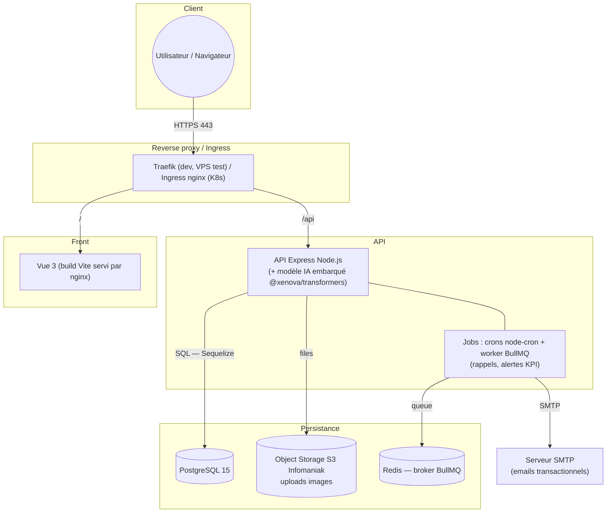
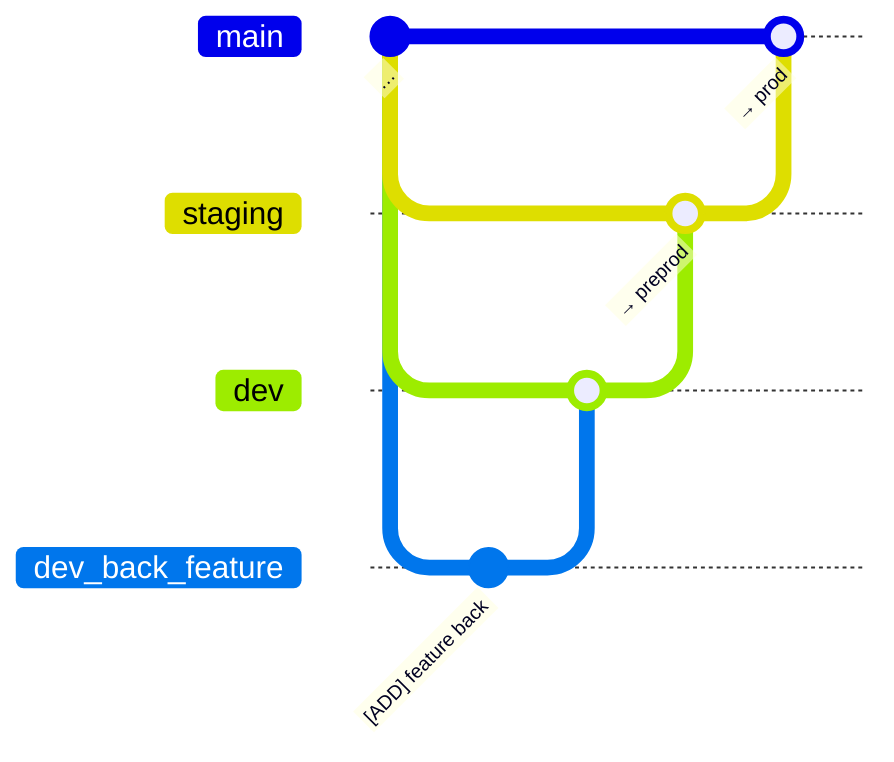
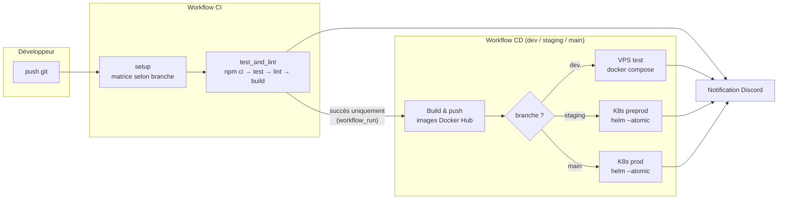
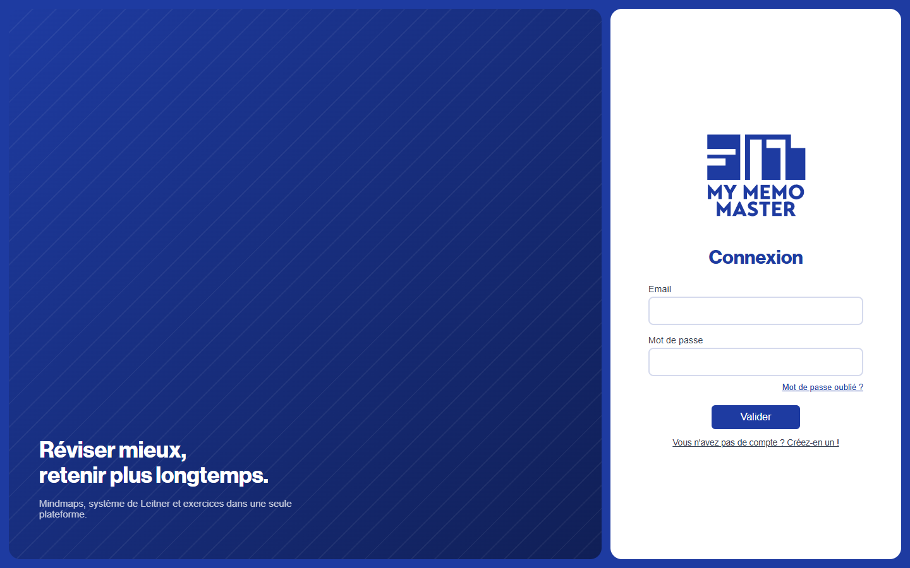
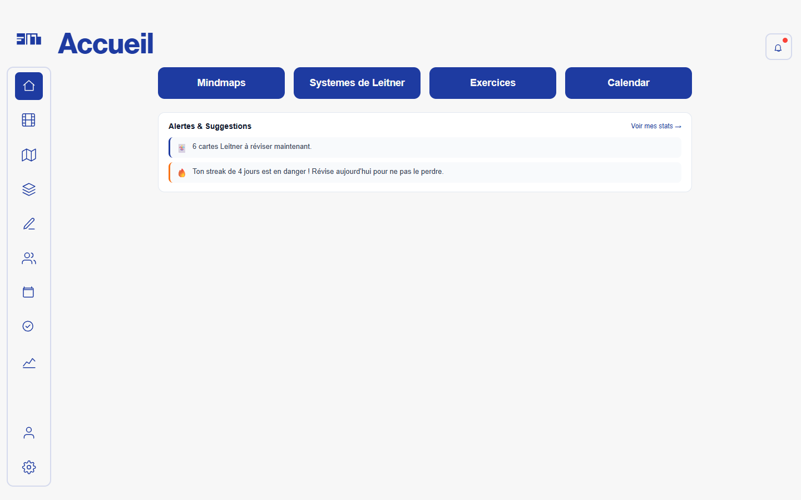
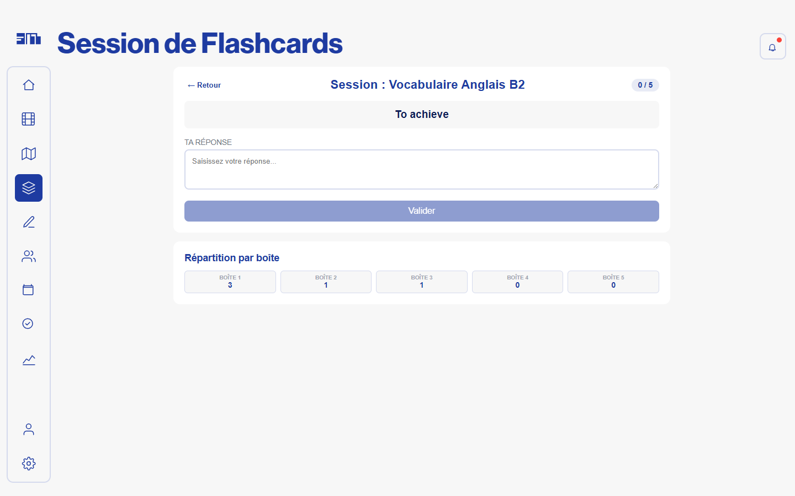
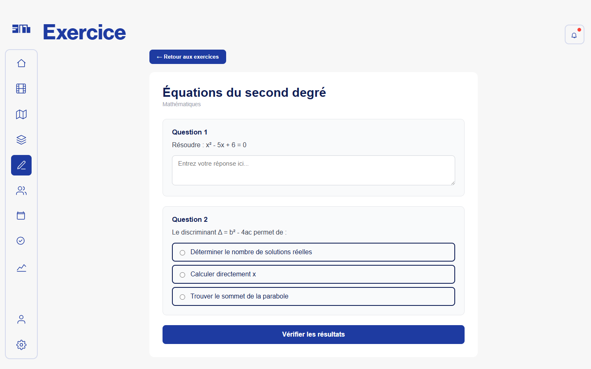
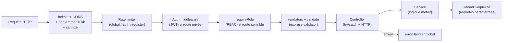
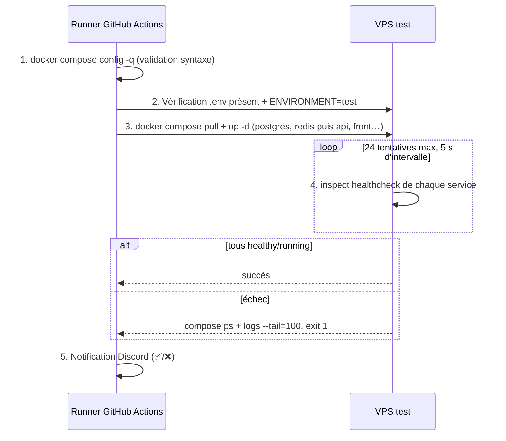
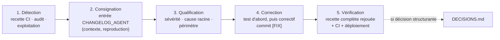

# Dossier de certification — Bloc 2 : Concevoir et développer des applications logicielles

**Projet : MyMemoMaster** — plateforme web de révision et de suivi pédagogique

**Candidat : Macabiau Frédéric** — Expert en développement logiciel (RNCP niveau 7)

---

## Avant-propos : conventions du document

Ce dossier couvre les compétences **C2.1.1 à C2.4.1** du référentiel « Expert en développement logiciel ». Chaque section ouvre sur la ou les compétences qu'elle couvre. Les conventions suivantes s'appliquent à l'ensemble du document :

- **Toute affirmation technique est adossée à un fichier réel du dépôt** : le chemin est indiqué, accompagné si nécessaire d'un extrait court (≤ 30 lignes).
- Ce qui est **cité du code** est distingué de ce qui est **inféré** ou relève d'une **décision de conception** ; ces deux derniers cas sont signalés explicitement dans la prose.
- Les preuves externes au dépôt (maquettes Figma, interfaces en ligne) sont signalées par des marqueurs `[SCREENSHOT ICI : …]`.
- Les schémas sont réalisés en Mermaid ; les schémas non représentables dans ce formalisme sont signalés par `[SCHEMA ICI : …]`.
- Le dépôt analysé est le monorepo `MyMemoMaster` (https://github.com/entrezunfredici/MyMemoMaster), qui contient l'API, le front, l'infrastructure de déploiement et la documentation projet.

### Plan du dossier

| Section | Contenu                                                       | Compétence couverte |
| ------- | ------------------------------------------------------------- | -------------------- |
| 0       | Présentation du projet et de son architecture                | —                   |
| 1       | Environnements de développement, de test et de déploiement  | C2.1.1               |
| 2       | Intégration continue                                         | C2.1.2               |
| 3       | Prototypage et conception de l'application                    | C2.2.1               |
| 4       | Harnais de tests unitaires                                    | C2.2.2               |
| 5       | Développement : évolutivité, sécurisation, accessibilité | C2.2.3               |
| 6       | Déploiement continu et progressif                            | C2.2.4               |
| 7       | Cahier de recettes                                            | C2.3.1               |
| 8       | Plan de correction des bogues                                 | C2.3.2               |
| 9       | Documentation technique d'exploitation                        | C2.4.1               |
| 10      | Glossaire                                                     | —                   |

---

# Section 0 — Présentation du projet

## 0.1 Le produit : MyMemoMaster

MyMemoMaster est une plateforme web d'aide à la révision destinée principalement aux étudiants, et secondairement aux enseignants et aux gestionnaires d'établissement pour le suivi pédagogique. Le constat de départ, documenté dans le dossier d'architecture du projet ([tp.md](tp.md), section 1), est que la majorité des étudiants s'appuient sur des méthodes de révision passives et peu efficaces. La plateforme centralise des outils fondés sur des méthodes pédagogiques actives :

- **Systèmes de Leitner** : questions-réponses à répétition espacée — l'algorithme représente les cartes dans des « boîtes » et fait remonter plus fréquemment les questions échouées ;
- **Cartes mentales** : éditeur graphique de schémas de notions et de leurs liens ;
- **Séries d'exercices** : entraînement avec correction automatique, y compris une correction par **similarité sémantique** pour les réponses ouvertes, exécutée par un modèle d'IA embarqué dans l'API (bibliothèque `@xenova/transformers`, modèle `all-mpnet-base-v2`) ;
- **Calendrier, échéances et rappels** : planification des sessions de révision, todo-list, notifications par email (file de traitement BullMQ/Redis) ;
- **KPI personnels et pédagogiques** : indicateurs de progression pour l'étudiant, tableaux de bord pour l'enseignant, avec gestion du consentement de partage ;
- **Groupes classes et établissements** : partage de ressources pédagogiques, invitations, périmètre d'administration pour les gérants d'établissement.

Cette liste correspond aux modules effectivement présents dans le code : chaque fonctionnalité ci-dessus se retrouve dans les routes de l'API, montées dans [my_memo_master_api/app.js](my_memo_master_api/app.js) (extrait, lignes 111–146 abrégées) :

```javascript
// Routes v1
const v1 = express.Router()
v1.use(apiLimiter)
subjectRoutes(v1)
// ...
leitnerSystemRoutes(v1)   // systèmes de Leitner
diagrammeRoutes(v1)       // cartes mentales
questionRoutes(v1)        // exercices
semanticRoutes(v1)        // correction sémantique (IA embarquée)
calendarEventRoutes(v1)   // calendrier
kpiRoutes(v1)             // indicateurs
classGroupRoutes(v1)      // groupes classes
etablissementRoutes(v1)   // établissements
// ...
app.use('/api/v1', v1)
```

## 0.2 Stack technique

La stack est documentée dans [.agents/CONVENTIONS.md](.agents/CONVENTIONS.md) et vérifiable dans les manifestes npm des deux applications ([my_memo_master_api/package.json](my_memo_master_api/package.json), [my_memo_master_front/package.json](my_memo_master_front/package.json)) :

| Couche                      | Technologie                                                                      |
| --------------------------- | -------------------------------------------------------------------------------- |
| Runtime API                 | Node.js 22                                                                       |
| Framework API               | Express.js v4                                                                    |
| ORM / Base de données      | Sequelize v6 — PostgreSQL 15 (test/preprod/prod), SQLite (développement local) |
| Authentification            | JWT (`jsonwebtoken`) + `bcryptjs`, refresh token avec rotation               |
| File de tâches asynchrones | BullMQ + Redis (rappels, notifications email)                                    |
| IA embarquée               | `@xenova/transformers` (correction par similarité sémantique)                |
| Front                       | Vue.js 3 + Vite v6 + Pinia (state) + Tailwind CSS v3                             |
| Tests                       | Jest + Supertest (API), Vitest + @vue/test-utils (front)                         |
| Qualité                    | ESLint (API v9, front v8) + Prettier                                             |
| Documentation API           | swagger-jsdoc + swagger-ui-express                                               |
| Conteneurisation            | Docker, Docker Compose, Helm/Kubernetes                                          |
| CI/CD                       | GitHub Actions                                                                   |

Le choix SQLite en développement / PostgreSQL en production est une décision de conception documentée et argumentée dans le journal des décisions du projet ([.agents/DECISIONS.md](.agents/DECISIONS.md), entrée du 2026-06-03) ; ce mécanisme est détaillé en section 1.

## 0.3 Organisation du monorepo

```txt
MyMemoMaster/
├── my_memo_master_api/       # API Express (controllers, services, models, tests…)
├── my_memo_master_front/     # Front Vue 3 (pages, components, stores, tests…)
├── .github/workflows/        # Pipelines CI/CD (ci.yml, cd.yml, notify_ci.yml)
├── helm/                     # Chart Helm (déploiements Kubernetes preprod/prod)
├── k8s/                      # Manifests Kubernetes + scripts de migration Helm
├── server_docker_compose/    # docker-compose déployé sur le VPS de test
├── docker-compose.yml        # Environnement de développement local complet
├── docs/                     # RUNBOOK, documentation d'administration, HTTPS
├── diagrams/                 # Spécifications : règles métier, schéma BDD, UI
└── .agents/                  # Mémoire du projet : conventions, décisions, changelog, audit OWASP
```

Le choix du monorepo est une décision de conception : les deux applications, l'infrastructure et la documentation évoluent dans un même historique git, ce qui permet à une même pull request de porter une fonctionnalité de bout en bout (migration de base, endpoint, écran, test, manifeste de déploiement) et au pipeline CI de cibler sélectivement l'API ou le front selon la branche (mécanisme détaillé en section 2).

## 0.4 Les trois environnements cibles

Le projet est déployé sur trois environnements distincts, chacun alimenté par une branche git dédiée. Cette correspondance est documentée dans le [README.md](README.md) (partie 3) et implémentée dans le pipeline [.github/workflows/cd.yml](.github/workflows/cd.yml) :

| Branche git | Environnement     | Infrastructure                          | Images Docker Hub                         |
| ----------- | ----------------- | --------------------------------------- | ----------------------------------------- |
| `dev`     | **test**    | VPS (Docker Compose + Traefik)          | `mymemomaster_test_api` / `_front`    |
| `staging` | **preprod** | Kubernetes Infomaniak mutualisé (Helm) | `mymemomaster_preprod_api` / `_front` |
| `main`    | **prod**    | Kubernetes Infomaniak dédié (Helm)    | `mymemomaster_api` / `_front`         |

## 0.5 Architecture de l'application déployée

Le schéma ci-dessous représente l'architecture **réellement déployée**, telle qu'elle résulte des fichiers d'infrastructure du dépôt ([docker-compose.yml](docker-compose.yml), [helm/templates/](helm/templates/)). Légende : les rectangles sont des conteneurs applicatifs, les cylindres des services de persistance, les flèches indiquent le sens des requêtes, et chaque sous-graphe correspond à une couche d'infrastructure.



Deux précisions d'honnêteté documentaire :

- Le document [archi.md](archi.md) du dépôt présente une architecture **cible** comportant une API IA séparée (Python/FastAPI). Cette brique n'existe pas dans le code à ce jour : la correction sémantique est exécutée **dans le processus Node de l'API** ([my_memo_master_api/services/Semantic.service.js](my_memo_master_api/services/Semantic.service.js), qui charge `require('@xenova/transformers').pipeline`). Le présent dossier décrit l'existant ; l'externalisation de l'IA est une évolution envisagée.
- Redis est utilisé **exclusivement** comme broker de la file BullMQ (rappels/notifications), pas comme cache applicatif — règle explicite de [.agents/CONVENTIONS.md](.agents/CONVENTIONS.md) (« Ce qui est hors-scope »).

## 0.6 Périmètre du dossier

Les sections suivantes déroulent le cycle complet de conception et de développement de cette application : mise en place des environnements et de l'outillage qualité (section 1), intégration continue (section 2), démarche de prototypage (section 3), harnais de tests (section 4), pratiques de développement — architecture, sécurité OWASP, accessibilité (section 5), déploiement continu (section 6), recette (section 7), traitement des anomalies (section 8) et documentation d'exploitation (section 9).

---

# Section 1 — Environnements de développement, de test et de déploiement

**Compétence couverte : C2.1.1** — Mettre en œuvre des environnements de déploiement et de test en y intégrant les outils de suivi de performance et de qualité afin de permettre le bon déroulement de la phase de développement du logiciel.

## 1.1 Environnement de développement local

J'ai conçu l'environnement de développement pour qu'un contributeur soit opérationnel en deux commandes : copier `.env.example` en `.env`, puis `docker compose up --build`. La procédure complète est documentée dans le [README.md](README.md) (partie 2, « Bien commencer »), qui liste aussi l'outillage attendu (VS Code, Postman, Git, Docker).

### Un docker-compose unifié piloté par profils

Plutôt que de maintenir trois fichiers compose divergents, j'ai unifié les environnements Docker dans un seul [docker-compose.yml](docker-compose.yml) piloté par les *profiles* Docker Compose. L'en-tête du fichier documente ce contrat :

```yaml
#  Usage:
#    Dev local : docker compose --env-file .env.dev  up --build
#    Test VPS  : docker compose --env-file .env.test up
#    Prod  VPS : docker compose --env-file .env.prod up
#
#  Profiles (défini via COMPOSE_PROFILES dans le .env.*) :
#    dev  — Traefik local HTTP, build depuis les sources, hot-reload API
#    test — Images DockerHub, Traefik externe HTTPS, domaines de test
#    prod — Images DockerHub, Traefik externe HTTPS, domaines de prod
```

Les services de persistance (`postgres`, `redis`) sont hors profil donc démarrés partout ; les services `dev` (Traefik local, PgAdmin, API buildée depuis les sources, front) et les services `test`/`prod` (`api_server`, `front_server`, images Docker Hub, TLS Let's Encrypt) sont mutuellement exclusifs. Bénéfice : l'environnement de développement reproduit la topologie de production (reverse proxy, réseau, healthchecks) tout en gardant ses spécificités locales — c'est une application du principe de parité dev/prod.

En dev, l'API monte le code source en volume pour le hot-reload via nodemon, et le front est routé par un Traefik local dont le dashboard (`localhost:8080`) sert d'outil de diagnostic du routage ([docker-compose.yml](docker-compose.yml), service `api`, lignes 125–133) :

```yaml
  api:
    profiles: ["dev"]
    image: ${IMAGE_API}
    build:
      context: ./my_memo_master_api
      dockerfile: Dockerfile
    volumes:
      - ./my_memo_master_api:/app
      - api-node-modules:/app/node_modules
```

### Développement hors Docker : la bascule SQLite / PostgreSQL

Pour permettre un développement encore plus léger (sans démon Docker), l'API sait tourner sur SQLite. La bascule est automatique et repose sur une seule condition — la présence de `PG_HOST` dans l'environnement ([my_memo_master_api/models/index.js](my_memo_master_api/models/index.js)) :

```javascript
const dbmsConfig = require('../config/dbms.config')  // PostgreSQL + pool
const dbConfig = require('../config/db.config')       // SQLite fichier local

// Instantiate Sequelize using the right configuration for the current environment
const instance = new Sequelize(process.env.PG_HOST ? dbmsConfig : dbConfig)
```

Cette décision est tracée dans le journal des décisions ([.agents/DECISIONS.md](.agents/DECISIONS.md), « [2026-06-03] SQLite en dev, PostgreSQL en prod ») avec ses conséquences assumées : Sequelize doit rester compatible avec les deux dialectes et les migrations doivent être testées sur les deux. Ce même mécanisme sert le harnais de test (section 4) : les tests s'exécutent sur SQLite in-memory, sans dépendance à une base externe — condition indispensable pour tourner dans les runners CI.

### Configuration par variables d'environnement

Toute la configuration passe par des variables d'environnement, jamais par des valeurs codées en dur : le fichier [.env.example](.env.example) (racine) sert de contrat documenté, et chaque environnement a son `.env` propre non versionné ([.gitignore](.gitignore)). Côté API, les accès sont centralisés dans [my_memo_master_api/config/](my_memo_master_api/config/) (`db.config.js`, `dbms.config.js`, `redis.config.js`, `storage.config.js`, `swagger.config.js`) ; côté front dans `src/config.js` — règle formalisée dans [.agents/CONVENTIONS.md](.agents/CONVENTIONS.md). L'homogénéité de style entre contributeurs est en outre garantie par un [.editorconfig](.editorconfig) à la racine.

## 1.2 Environnements de test, préproduction et production

Les trois environnements cibles présentés en section 0.4 ont des infrastructures volontairement différenciées, proportionnées à leur rôle :

**Test (VPS, Docker Compose).** L'environnement de test tourne sur un VPS avec le fichier dédié [server_docker_compose/docker-compose.yml](server_docker_compose/docker-compose.yml), déployé automatiquement par le pipeline CD (section 6). Il comprend PostgreSQL et Redis avec healthchecks, l'API, le front, PgAdmin, et un service `backup` que j'ai écrit pour produire un dump PostgreSQL quotidien avec rétention configurable (extrait des logs du service : `[backup] Service démarré — sauvegarde quotidienne à ${BACKUP_HOUR}h00 UTC`, `Rétention ${BACKUP_RETENTION_DAYS}j appliquée`).

**Preprod et prod (Kubernetes, Helm).** Les deux environnements Kubernetes sont déployés par un chart Helm unique ([helm/](helm/)) : les templates ([helm/templates/](helm/templates/) — deployments API/front/pgadmin, StatefulSet PostgreSQL, Redis, ConfigMap, Ingress, Services) sont partagés, et chaque environnement n'est qu'un fichier de surcharges ([helm/values-preprod.yaml](helm/values-preprod.yaml), [helm/values-prod.yaml](helm/values-prod.yaml)). Exemple de différenciation assumée en preprod :

```yaml
# Deployment sans PVC — pertes de cache acceptables en preprod
redis:
  persistent: false
```

C'est une décision de conception : la preprod économise un volume persistant là où la prod n'a pas ce droit. De même, PgAdmin est activé en preprod « pour faciliter l'administration » (commentaire du fichier de values) alors que l'exposition d'outils d'administration en prod est restreinte.

**Isolation des environnements.** Chaque environnement a son espace propre : namespaces Kubernetes distincts (`mymemomaster-preprod` / `mymemomaster`), réseaux Docker nommés par environnement (`my_memo_master_${ENVIRONMENT}_network`), images Docker Hub distinctes (`_test_`, `_preprod_`, sans suffixe pour la prod), secrets gérés hors dépôt (secrets GitHub Actions et Secrets Kubernetes créés manuellement — procédure documentée dans le [README.md](README.md), partie 3). Le pipeline CD vérifie même que le `.env` présent sur le VPS correspond bien à l'environnement attendu avant de déployer (`grep -q '^ENVIRONMENT=test$' .env`, [.github/workflows/cd.yml](.github/workflows/cd.yml)).

## 1.3 Outils de suivi de qualité et de performance

### Qualité du code : linters et formateurs

Les deux applications ont chacune leur configuration de lint, exécutée localement et **bloquante en CI** (section 2) :

- **API** : ESLint v9 en configuration *flat* ([my_memo_master_api/eslint.config.mjs](my_memo_master_api/eslint.config.mjs)) — règles `@eslint/js` recommandées + `eslint-config-prettier`, globals Node/Jest déclarés ;
- **Front** : ESLint v8 + `eslint-plugin-vue` + Prettier ([my_memo_master_front/package.json](my_memo_master_front/package.json), script `lint` couvrant `.vue,.js,.jsx,.cjs,.mjs`).

Les scripts npm normalisent l'usage : `npm run lint` et `npm run format` des deux côtés du monorepo.

### Qualité fonctionnelle : les harnais de test

Jest + Supertest côté API, Vitest + @vue/test-utils côté front, exécutés en CI à chaque push. Le harnais est détaillé en section 4 ; au titre de l'outillage d'environnement, le point notable est qu'il est **auto-suffisant** (SQLite in-memory, mock du modèle d'IA dans [my_memo_master_api/__mocks__/](my_memo_master_api/__mocks__/)) : aucun service externe n'est requis pour valider un commit.

### Suivi de performance et de disponibilité

- **Healthchecks** à tous les étages : `pg_isready` sur PostgreSQL, `redis-cli ping` sur Redis, `wget --spider` sur le front ([docker-compose.yml](docker-compose.yml) ; HEALTHCHECK aussi intégré à l'image front, [my_memo_master_front/Dockerfile](my_memo_master_front/Dockerfile)). Les dépendances de démarrage s'appuient dessus (`depends_on: condition: service_healthy`), et le pipeline CD s'en sert comme critère de succès du déploiement (section 6).
- **Limites de ressources** : chaque service Docker Compose déclare `limits` et `reservations` CPU/mémoire paramétrables (ex. API : 0.50 CPU / 512 Mo par défaut), et les manifests Helm déclarent `requests`/`limits` Kubernetes par environnement ([helm/values-preprod.yaml](helm/values-preprod.yaml)). Le pool de connexions PostgreSQL est dimensionné par configuration ([my_memo_master_api/config/dbms.config.js](my_memo_master_api/config/dbms.config.js) : `max`, `min`, `acquire`, `idle`).
- **Logs applicatifs structurés** : logger Winston + logs d'accès HTTP Morgan pipés dans Winston, format `combined` en production ([my_memo_master_api/app.js](my_memo_master_api/app.js), lignes 62–67).
- **Métriques applicatives RED/USE (Prometheus)** : l'API est instrumentée avec `prom-client` — histogramme `http_request_duration_seconds` et compteur `http_requests_total` labellisés méthode/route/code (RED), métriques process Node (CPU, mémoire, event-loop — USE) via `collectDefaultMetrics` ([my_memo_master_api/helpers/metrics.js](my_memo_master_api/helpers/metrics.js), [middlewares/metrics.middleware.js](my_memo_master_api/middlewares/metrics.middleware.js)). L'endpoint `/metrics` est servi par un **serveur HTTP dédié** (port 9090, [server.js](my_memo_master_api/server.js)) jamais exposé par l'Ingress — décision documentée dans [.agents/DECISIONS.md](.agents/DECISIONS.md) ; les annotations `prometheus.io/*` sont posées sur les pods ([k8s/](k8s/)). L'instrumentation est testée (9 tests dédiés).
- **Notifications temps réel** : chaque exécution CI/CD notifie un canal Discord (succès/échec, branche concernée) — [.github/workflows/notify_ci.yml](.github/workflows/notify_ci.yml) et job `notify` de [.github/workflows/cd.yml](.github/workflows/cd.yml). L'équipe est prévenue d'une régression sans avoir à surveiller GitHub.

### Analyse statique continue : SonarQube (temporairement désactivé)

Le projet a intégré une analyse SonarQube auto-hébergée : la configuration du scanner est versionnée ([sonar-project.properties](sonar-project.properties)) et le job d'analyse existe dans le pipeline CI avec une distinction prod/preprod par token ([.github/workflows/ci.yml](.github/workflows/ci.yml), lignes 68–91). Ce job est **actuellement commenté** : le serveur SonarQube que j'auto-hébergeais est hors service et sa reconfiguration est planifiée. J'assume ce choix de transparence plutôt que de présenter un outil comme actif alors qu'il ne l'est pas ; dans l'intervalle, la couverture qualité reste assurée par le triptyque bloquant lint + tests + build en CI, et la revue de sécurité a été menée manuellement (audit OWASP, section 5.2).

## 1.4 Dépôt de gestion du code source

Le code source est hébergé sur GitHub (`entrezunfredici/MyMemoMaster`), dépôt unique pour l'API, le front, l'infrastructure et la documentation (choix monorepo, section 0.3). J'ai défini la stratégie de branches suivante, documentée dans le [README.md](README.md) (« Méthode de travail ») et **outillée par le pipeline CI** (la matrice de jobs cible l'API ou le front selon le préfixe de la branche — section 2) :



- les branches de travail sont préfixées `dev_back_*` ou `dev_front_*` selon le périmètre ;
- `dev` intègre en continu et alimente l'environnement de **test** ;
- `staging` promeut vers la **preprod** ; `main` vers la **prod** ;
- les commits suivent une convention de préfixes `[ADD]` / `[IMP]` / `[REF]` / `[FIX]`, ce qui rend l'historique exploitable comme journal des évolutions et des correctifs (utilisé en sections 8 et 9).

La méthode de travail impose l'ordre « tests unitaires → code → documentation Swagger » pour chaque fonctionnalité ([README.md](README.md), étape 3) : l'environnement n'est pas qu'un outillage, il porte aussi le processus de développement.

### Synthèse de couverture C2.1.1

| Attendu du référentiel                   | Réponse apportée                                                                                  |
| ------------------------------------------ | --------------------------------------------------------------------------------------------------- |
| Environnement de développement détaillé | Docker Compose profil`dev` + mode hors Docker (SQLite), VS Code/Postman/Git documentés (README)  |
| Environnements de déploiement et de test  | test = VPS Compose, preprod/prod = Kubernetes Helm, isolation par namespace/réseau/images          |
| Outils de suivi de qualité                | ESLint ×2, Prettier, Jest/Vitest, npm audit bloquant en CI, SonarQube (configuré, désactivé — assumé)     |
| Outils de suivi de performance             | Healthchecks, limites de ressources, pool DB configuré, logs Winston/Morgan, métriques Prometheus RED/USE, notifications Discord |
| Gestion de sources                         | GitHub, monorepo, stratégie de branches alignée sur les environnements, conventions de commit     |

---

# Section 2 — Intégration continue

**Compétence couverte : C2.1.2** — Configurer le système d'intégration continue dans le cycle de développement du logiciel en fusionnant les codes sources et en testant régulièrement les blocs de code afin d'assurer un développement efficient qui réduit les risques de régression.

## 2.1 Protocole d'intégration continue

J'ai implémenté l'intégration continue avec GitHub Actions dans le workflow [.github/workflows/ci.yml](.github/workflows/ci.yml). Le protocole tient en une phrase : **aucun code ne progresse vers un environnement sans avoir passé tests, lint et build sur un runner neutre**. Le workflow se déclenche à chaque push sur les branches d'intégration (`main`, `staging`, `dev`) et sur les branches de travail (`dev_back_*`, `dev_front_*`, `*devops*`) :

```yaml
on:
  push:
    branches:
      - main
      - staging
      - dev
      - '*devops*'
      - 'dev_back_*'
      - 'dev_front_*'
```

Le déclenchement sur les branches de travail — et pas seulement sur les branches d'intégration — est un choix délibéré : le développeur reçoit le verdict de la CI **avant** de fusionner dans `dev`, ce qui déplace la détection des régressions au plus tôt dans le cycle (principe *shift-left*). La fusion dans une branche d'intégration re-déclenche une validation complète, qui conditionne ensuite le déploiement (section 2.3).

## 2.2 Une matrice de jobs adaptée au monorepo

Un monorepo pose un problème classique de CI : re-valider systématiquement les deux applications gaspille du temps de runner quand une branche ne touche qu'un côté. J'ai résolu ce point avec un job `setup` qui construit **dynamiquement la matrice de jobs selon le préfixe de la branche** ([.github/workflows/ci.yml](.github/workflows/ci.yml), job `setup`) :

```yaml
      - id: set-matrix
        run: |
          BRANCH="${GITHUB_REF##*/}"
          if [[ "$BRANCH" == dev_front_* ]]; then
            echo 'matrix={"include":[{"service":"front","path":"my_memo_master_front"}]}' >> $GITHUB_OUTPUT
          elif [[ "$BRANCH" == dev_back_* ]]; then
            echo 'matrix={"include":[{"service":"api","path":"my_memo_master_api"}]}' >> $GITHUB_OUTPUT
          else
            echo 'matrix={"include":[{"service":"api","path":"my_memo_master_api"},{"service":"front","path":"my_memo_master_front"}]}' >> $GITHUB_OUTPUT
          fi
```

Une branche `dev_front_*` ne valide que le front, une branche `dev_back_*` que l'API ; les branches d'intégration (`dev`, `staging`, `main`) valident **toujours les deux**, car c'est là que les contributions front et back se rencontrent — c'est précisément le moment où une régression d'interface entre les deux peut apparaître. La stratégie de nommage des branches (section 1.4) n'est donc pas cosmétique : elle pilote l'outillage.

## 2.3 Séquence de validation d'un bloc de code

Chaque entrée de la matrice exécute la même séquence, définie dans le job `test_and_lint` :

| Étape                        | Commande          | Rôle                                                                                                                                                            |
| ----------------------------- | ----------------- | ---------------------------------------------------------------------------------------------------------------------------------------------------------------- |
| 1. Installation reproductible | `npm ci`        | installe**exactement** les versions verrouillées dans `package-lock.json` — pas de dérive de dépendances entre le poste du développeur et le runner |
| 2. Tests                      | `npm run test`  | Jest + Supertest (API) / Vitest (front) — détection des régressions fonctionnelles                                                                            |
| 3. Lint                       | `npm run lint`  | ESLint — détection des défauts de qualité et erreurs statiques                                                                                               |
| 4. Audit des dépendances      | `npm audit --omit=dev --audit-level=high` | **bloque** si une dépendance de production porte une vulnérabilité high/critical connue (OWASP A06) — les devDependencies, absentes des images déployées, sont exclues |
| 5. Build (front uniquement)   | `npm run build` | vérifie que le bundle Vite de production se construit                                                                                                           |

Trois réglages du workflow méritent justification :

- `node-version: 22` avec cache npm par `package-lock.json` : le runner utilise **la même version de Node que les images Docker de production** (`node:22-bookworm-slim` / `node:22-alpine`, cf. Dockerfiles section 6.3) — on teste ce qu'on déploie ;
- `fail-fast: false` sur la matrice : si l'API échoue, la validation du front va quand même au bout — le développeur reçoit le diagnostic complet en une passe au lieu de découvrir les échecs un par un ;
- `permissions: contents: read` : le workflow ne dispose que du droit de lecture du dépôt, application du principe du moindre privilège aux jetons GitHub Actions.

Le harnais est exécutable en CI sans aucun service externe : SQLite in-memory pour la base, mock du modèle d'IA (`moduleNameMapper` vers [my_memo_master_api/__mocks__/@xenova/transformers.js](my_memo_master_api/__mocks__/), déclaré dans [my_memo_master_api/package.json](my_memo_master_api/package.json)). C'est ce qui rend la boucle rapide et déterministe.

## 2.4 La CI comme porte d'entrée du déploiement

Le pipeline de déploiement ([.github/workflows/cd.yml](.github/workflows/cd.yml)) ne se déclenche pas sur push : il s'abonne à la **fin du workflow CI** et vérifie sa conclusion :

```yaml
on:
  workflow_run:
    workflows:
      - CI
    types:
      - completed
    branches: [main, staging, dev]
```

```yaml
  push_images:
    if: >
      github.event.workflow_run.conclusion == 'success' &&
      github.event.workflow_run.event == 'push'
```

Cette architecture en deux workflows chaînés garantit structurellement qu'**aucune image Docker n'est construite ni déployée à partir d'un commit dont les tests ou le lint ont échoué**. C'est le cœur du protocole d'intégration continue : la séquence d'intégration (fusion → validation → livraison) est outillée, pas seulement conventionnelle.

## 2.5 Boucle de retour vers l'équipe

Chaque exécution CI notifie un canal Discord via le workflow dédié [.github/workflows/notify_ci.yml](.github/workflows/notify_ci.yml) : message de succès, ou message d'échec indiquant la branche fautive (`"Tests failed on branch $BRANCH_NAME!"`). Le pipeline CD envoie de son côté un bilan de déploiement (`✅/❌ Déploiement **<branche>** réussi/échoué`, job `notify` de [cd.yml](.github/workflows/cd.yml)). Une régression introduite sur `dev` est ainsi connue de l'équipe en quelques minutes, sans surveillance active de l'interface GitHub.

[SCREENSHOT ICI : canal Discord montrant une notification d'échec CI et une notification de déploiement réussi]

## 2.6 Vue d'ensemble du pipeline



Légende : rectangles = jobs GitHub Actions ; losange = aiguillage par branche ; la flèche CI → CD n'existe que si la CI conclut en succès.

### Synthèse de couverture C2.1.2

| Attendu du référentiel                     | Réponse apportée                                                                                                                  |
| -------------------------------------------- | ----------------------------------------------------------------------------------------------------------------------------------- |
| Protocole d'intégration continue explicité | Workflow ci.yml : déclencheurs, matrice, séquence npm ci → test → lint → audit dépendances → build                                                 |
| Fusion des codes sources                     | Stratégie de branches outillée : CI sur branches de travail avant fusion, re-validation complète sur les branches d'intégration |
| Tests réguliers des blocs de code           | Exécution des deux harnais à chaque push, environnement de test hermétique (SQLite in-memory, mocks)                             |
| Réduction des risques de régression        | CI bloquante en amont du CD (`workflow_run` + `conclusion == 'success'`), notification immédiate des échecs                   |
| Séquences d'intégration définies          | Chaînage documenté branche → CI → CD → environnement (schéma 2.6)                                                             |

---

# Section 3 — Prototypage et conception de l'application

**Compétence couverte : C2.2.1** — Concevoir un prototype de l'application logicielle en tenant compte des spécificités ergonomiques et des équipements ciblés (ex : web, mobile…) afin de répondre aux fonctionnalités attendues et aux exigences en termes de sécurité.

## 3.1 Démarche de prototypage : de la maquette au composant

La conception des interfaces suit trois niveaux de raffinement successifs :

**Niveau 1 — Prototype interactif versionné.** Les écrans principaux ont été prototypés en amont sous forme d'une maquette **interactive et navigable**, réalisée avec l'outil de design de Claude (assistance IA — démarche assumée et cohérente avec l'outillage du projet), exportée en **HTML autonome** et versionnée dans le dépôt : [prototype/MyMemoMaster - Standalone.html](prototype/) (14 écrans : authentification, accueil, mindmaps, flashcards et session Leitner, exercices, classe, calendrier, to-do, KPI, profil, réglages — procédure d'ouverture dans [prototype/README.md](prototype/README.md)). Le prototype fixe l'identité visuelle et les parcours ; les captures ci-dessous sont **générées automatiquement depuis ce fichier** par script Puppeteer ([prototype/captures/](prototype/captures/)), donc reproductibles :

| | |
|---|---|
|  |  |
| Connexion | Accueil — alertes & suggestions |
|  |  |
| Session de révision (répartition par boîte) | Exercice — question ouverte + QCM |

Des maquettes graphiques Figma antérieures existent également, externes au dépôt ; le prototype HTML versionné en constitue la trace exploitable et vérifiable.

**Niveau 2 — Spécifications UI versionnées.** Pour les fonctionnalités complexes, j'ai versionné dans le dépôt des documents de conception qui font le lien entre les règles métier et l'interface : [diagrams/dashboard_enseignant_ui.md](diagrams/dashboard_enseignant_ui.md), [diagrams/etablissement_admin_ui.md](diagrams/etablissement_admin_ui.md), [diagrams/kpi_consent_ui.md](diagrams/kpi_consent_ui.md), [diagrams/ui_navigation_sujet.md](diagrams/ui_navigation_sujet.md). Ces documents contiennent des **maquettes filaires** (wireframes) et précisent le contexte d'intégration de chaque écran. Extrait de [diagrams/dashboard_enseignant_ui.md](diagrams/dashboard_enseignant_ui.md) :

```
┌─ ClassroomPage ──────────────────────────────────────────────────────────┐
│  [Sélecteur de groupe]                                                   │
│  ┌─ Colonne principale (2/3) ──────────────────────────────────────────┐ │
│  │  [A] Fiche groupe + KPI de base + Sections/Rendus  (existant)       │ │
│  │  [B] Analyse pédagogique  ← NOUVEAU (S-01.02)                       │ │
│  │  [C] Calendrier du groupe  (existant)                               │ │
│  └─────────────────────────────────────────────────────────────────────┘ │
│  ┌─ Sidebar droite (1/3) ──────────────────────────────────────────────┐ │
│  │  [D] Formulaires enseignant  (existant)                             │ │
│  └─────────────────────────────────────────────────────────────────────┘ │
└──────────────────────────────────────────────────────────────────────────┘
```

Versionner ces maquettes avec le code est une décision de méthode : la spécification d'interface évolue dans les mêmes pull requests que son implémentation, et le document indique explicitement ce qui est existant et ce qui est nouveau — le prototype s'inscrit dans un incrément, pas dans une refonte.

**Niveau 3 — Implémentation Vue.** Chaque maquette se concrétise en une page (`src/pages/[Name]Page.vue`) composée de composants réutilisables (`src/components/[Name]Component.vue`), conventions formalisées dans [.agents/CONVENTIONS.md](.agents/CONVENTIONS.md).

## 3.2 Un prototype fonctionnel couvrant les fonctionnalités attendues

Le « prototype » au sens du référentiel est ici l'application elle-même, fonctionnelle et manipulable en autonomie : elle est déployée sur les trois environnements et utilisable de bout en bout (inscription, vérification email, connexion, création et révision de contenus). La couverture des fonctionnalités principales se lit directement dans l'arborescence des 28 pages de [my_memo_master_front/src/pages/](my_memo_master_front/src/pages/) :

| Fonctionnalité attendue           | Pages implémentées                                                                                                                                     |
| ---------------------------------- | -------------------------------------------------------------------------------------------------------------------------------------------------------- |
| Systèmes de Leitner (flashcards)  | `FlashcardsPage`, `FlashcardsCardsPage`, `FlashcardsSessionPage`                                                                                   |
| Cartes mentales                    | `MindmapsPage` (+ composants dédiés `MindmapComponent`, `components/mindmap/`)                                                                   |
| Exercices                          | `ExercisesPage`, `ExerciseDetailPage`, `CreateTestPage`                                                                                            |
| Organisation                       | `CalendarPage`, `TodoPage`, `SubjectsPage`                                                                                                         |
| KPI                                | `KpiPage`                                                                                                                                              |
| Groupes classes / établissements  | `ClassroomPage` + vues par rôle (`ClassroomEnseignantView`, `ClassroomEtudiantView`, `ClassroomEtablissementView`, `ClassroomPlateformeView`) |
| Compte et cycle de vie utilisateur | `login/`, `register/`, `VerifyEmailPage`, `ForgotPasswordPage`, `ResetPasswordPage`, `ProfilePage`, `AccountPage`, `SettingsPage`        |
| Prise en main                      | `OnboardingPage`, `TutorialsPage`                                                                                                                    |

Les composants d'interface génériques exigés par le critère (fenêtres, boutons, menus…) existent en tant que composants réutilisables : `ButtonComponent`, `ModalComponent`, `DropdownComponent`, `MenuItemComponent`, `LoaderComponent`, `PillComponent`, `ToggleButton`, etc. ([my_memo_master_front/src/components/](my_memo_master_front/src/components/)).

[SCREENSHOT ICI : page FlashcardsSessionPage en cours de session de révision, montrant les composants réels (boutons, modale, indicateur de boîte Leitner)]

## 3.3 Spécificités ergonomiques et équipements ciblés

L'équipement ciblé est le **navigateur web, desktop et mobile**. Trois dispositions concrètes en découlent :

- **Responsive design** : l'interface est construite avec Tailwind CSS et ses classes de points de rupture (`sm:`, `md:`, `lg:`) ; les maquettes de [diagrams/dashboard_enseignant_ui.md](diagrams/dashboard_enseignant_ui.md) spécifient d'ailleurs des colonnes 2/3 – 1/3 qui se replient sur mobile.
- **PWA (Progressive Web App)** : le front est installable sur mobile via le plugin `vite-plugin-pwa` configuré dans [my_memo_master_front/vite.config.js](my_memo_master_front/vite.config.js) — manifeste complet (nom, icônes 192/512, couleurs de thème) et mise à jour automatique du service worker :

```javascript
VitePWA({
  registerType: 'autoUpdate',
  workbox: {
    // Aucun asset pré-caché : évite le cache multi-Mo par défaut.
    // Les assets sont toujours servis depuis le réseau.
    globPatterns: [],
    cleanupOutdatedCaches: true,
  },
  manifest: {
    name: env.VITE_APP_NAME,
    ...
```

  Le choix de ne **pas** pré-cacher les assets est une décision de conception commentée dans le fichier : sur une application dont le contenu est essentiellement dynamique (données de révision de l'utilisateur), un pré-cache Workbox de plusieurs Mo dégraderait la première installation sans bénéfice réel.

- **Guidage utilisateur** : l'ergonomie de prise en main est traitée comme une fonctionnalité à part entière — parcours d'onboarding persisté côté serveur (module `OnboardingState` de l'API), page de tutoriels, notifications toast (`vue-toastification`), états vides explicites (`NoItemComponent`), indicateurs de chargement (`LoaderComponent`), titres d'onglet dynamiques par page (`document.title` dans le guard de navigation, [src/router/index.js](my_memo_master_front/src/router/index.js)).

Une règle d'ergonomie issue d'un défaut réellement rencontré est même codifiée dans les conventions du projet ([.agents/CONVENTIONS.md](.agents/CONVENTIONS.md)) : les popups et panneaux flottants doivent déclarer un fond opaque explicite pour rester lisibles quelle que soit la page en dessous.

## 3.4 Exigences de sécurité intégrées au prototype

La sécurité n'est pas reportée à la couche API : le prototype front l'intègre dès la navigation.

**Contrôle d'accès à la navigation.** Le routeur applique deux guards à chaque changement de route ([my_memo_master_front/src/router/index.js](my_memo_master_front/src/router/index.js)) :

```javascript
// Guard authentification
if (to.meta.private === true) {
  if (!authStore.authenticated || !authStore.token) {
    authStore.logout(false, null)
    return next({ path: '/auth' })
  }
}

// Guard rôles : meta.roles = [1, 4] signifie "admin plateforme ou admin établissement seulement"
if (to.meta.roles && to.meta.roles.length > 0) {
  const userRoleId = authStore.user?.roleId ?? null
  if (!to.meta.roles.includes(userRoleId)) {
    return next({ path: '/' })
  }
}
```

Les routes déclarent leur exigence dans leurs métadonnées (`meta.private`, `meta.roles`) : ajouter un écran protégé ne demande aucune logique nouvelle, seulement une déclaration — le contrôle d'accès est systématique par construction. Ce contrôle côté client est un confort d'expérience utilisateur (redirection immédiate) ; l'autorité reste côté API, où chaque route privée est protégée par middleware JWT et RBAC (section 5.2).

**Gestion de session sécurisée.** Le client HTTP centralisé ([my_memo_master_front/src/helpers/api.js](my_memo_master_front/src/helpers/api.js)) implémente le renouvellement silencieux de session : sur une réponse 401, un intercepteur tente d'échanger le refresh token puis rejoue la requête une seule fois (drapeau `_retried` contre les boucles infinies) ; si le renouvellement échoue, l'utilisateur est déconnecté proprement :

```javascript
axiosApi.interceptors.response.use(async (response) => {
  if (response.status === 401 && !response.config._retried) {
    const refreshed = await _tryRefreshToken()
    if (refreshed) {
      response.config._retried = true
      removeHeader(response.config.headers, 'Authorization')
      return axiosApi(response.config)
    }
  }
  return response
})
```

Ce mécanisme est la contrepartie ergonomique d'une exigence de sécurité : c'est lui qui rend acceptable un jeton d'accès à durée courte (15 minutes, décision documentée dans [.agents/DECISIONS.md](.agents/DECISIONS.md) et [.agents/SECURITY_AUDIT_OWASP.md](.agents/SECURITY_AUDIT_OWASP.md)) sans dégrader l'expérience — l'utilisateur ne se voit jamais demander de se reconnecter toutes les 15 minutes. Le front intègre aussi un indicateur de robustesse du mot de passe à l'inscription (`PasswordStrengthComponent.vue`).

### Synthèse de couverture C2.2.1

| Attendu du référentiel                         | Réponse apportée                                                                                       |
| ------------------------------------------------ | -------------------------------------------------------------------------------------------------------- |
| Prototype fonctionnel répondant aux besoins     | Prototype HTML interactif versionné (14 écrans, captures reproductibles) + application déployée et utilisable en autonomie ; 28 pages couvrant les 6 fonctionnalités principales |
| Composants d'interface présents et fonctionnels | Bibliothèque de composants réutilisables (boutons, modales, menus, loaders…)                          |
| Spécificités ergonomiques                      | Responsive Tailwind, PWA installable, onboarding/tutoriels, toasts, règles d'ergonomie codifiées       |
| Équipements ciblés                             | Web desktop + mobile (PWA, points de rupture)                                                            |
| Exigences de sécurité                          | Guards de navigation (authentification + rôles), refresh token silencieux, jauge de mot de passe        |
| User stories / cohérence fonctionnelle          | Prototype navigable (prototype/) + maquettes versionnées reliant règles métier ↔ écrans (diagrams/*_ui.md)                             |

---

# Section 4 — Harnais de tests unitaires

**Compétence couverte : C2.2.2** — Développer un harnais de test unitaire en tenant compte des fonctionnalités demandées afin de prévenir les régressions et de s'assurer du bon fonctionnement du logiciel.

## 4.1 État du harnais : les chiffres

Les chiffres ci-dessous sont issus d'une exécution réelle des deux suites sur le code actuel du dépôt (et non d'une déclaration) :

| Harnais | Outillage                                 | Volume                           | Résultat               | Durée |
| ------- | ----------------------------------------- | -------------------------------- | ----------------------- | ------ |
| API     | Jest + Supertest                          | **80 suites, 1 447 tests** | 1 447 passés, 0 échec | ~40 s  |
| Front   | Vitest + @vue/test-utils + @pinia/testing | **37 fichiers, 562 tests** | 562 passés, 0 échec   | ~35 s  |

Répartition par couche, révélatrice de la stratégie de test :

| Couche testée                                           | Fichiers | Tests | Ce qui est validé                                                                 |
| -------------------------------------------------------- | -------- | ----- | ---------------------------------------------------------------------------------- |
| `test/controllers/` (API)                              | 34       | 791   | contrat HTTP de chaque endpoint : codes de statut, corps de réponse, cas d'erreur |
| `test/services/` (API)                                 | 34       | 554   | logique métier isolée : algorithmes, règles de droits, cas limites              |
| `test/middlewares/` (API)                              | 4        | 31    | JWT, RBAC, rate limiting, instrumentation métriques (tests de sécurité dédiés)                            |
| `test/models/` (API)                                   | 2        | 18    | contraintes de modèles sensibles (AuditLog, Etablissement)                        |
| `test/helpers/` (API)                                  | 2        | 14    | helpers transverses : métriques Prometheus, signatures binaires des uploads (magic bytes)       |
| `test/bdd/` (API)                                      | 4        | 39    | scénarios fonctionnels de bout en bout (sessions complètes)                      |
| `test/components/` (front)                             | 17       | 256   | rendu et interactions des pages/composants critiques                               |
| `test/stores/` (front)                                 | 14       | 228   | state management Pinia : actions, mutations d'état, appels API mockés            |
| `test/router/`, `composables/`, `helpers/` (front) | 4        | 73    | guards de navigation, logique réutilisable                                        |
| `test/a11y/` (front)                                   | 1        | 4     | accessibilité runtime (axe-core) des composants critiques — non-régression RGAA          |

La pyramide est assumée : la masse des tests porte sur les couches controller et service de l'API — là où vivent le contrat public et la logique métier — complétée par des tests fonctionnels transverses (`test/bdd/`) qui valident les enchaînements réels.

## 4.2 Architecture du harnais API : hermétique et déterministe

Un harnais n'est utile contre les régressions que s'il est **rapide, isolé et reproductible** — sinon il n'est pas exécuté. J'ai conçu celui de l'API pour tourner sans aucun service externe. La configuration Jest tient dans [my_memo_master_api/package.json](my_memo_master_api/package.json) :

```json
"jest": {
  "testMatch": ["**/test/**/*.(spec|test).[tj]s?(x)"],
  "moduleNameMapper": {
    "^@xenova/transformers$": "<rootDir>/__mocks__/@xenova/transformers.js"
  },
  "testTimeout": 60000,
  "forceExit": true,
  "setupFiles": ["<rootDir>/test/setup.js"]
}
```

Trois mécanismes d'isolation, visibles dans l'en-tête du test de session Leitner ([my_memo_master_api/test/bdd/leitner.session.test.js](my_memo_master_api/test/bdd/leitner.session.test.js)) :

```javascript
// Base SQLite en mémoire — seul Semantic.service est mocké (dépendance NLP externe ~30s).
// Les autres couches (controller → service → model → DB) sont réelles.
process.env.DB_STORAGE = ':memory:'

jest.mock('../../services/Semantic.service', () => ({ gradeSemantic: jest.fn() }))
jest.mock('../../jobs/fifo.cron', () => ({ startFifoCron: jest.fn() }))
jest.mock('../../jobs/reminder.worker', () => ({ startReminderWorker: jest.fn() }))
```

- **Base de données** : SQLite in-memory, une instance par fichier de test — aucune pollution entre tests, aucun PostgreSQL requis (c'est la contrepartie directe de la bascule de dialecte décrite en section 1.1) ;
- **Modèle d'IA** : le pipeline `@xenova/transformers` (~30 s de chargement) est remplacé par un mock global ([my_memo_master_api/__mocks__/@xenova/transformers.js](my_memo_master_api/__mocks__/@xenova/transformers.js)) — sauf dans les tests dédiés au service sémantique qui contrôlent leur propre mock ;
- **Jobs asynchrones** : crons et worker BullMQ sont neutralisés pour ne pas dépendre de Redis ni introduire de timing non déterministe.

Le fichier [test/setup.js](my_memo_master_api/test/setup.js) désactive par défaut le rate limiting (`RATE_LIMIT_DISABLED = 'true'`), **sauf** pour les tests de sécurité qui le réactivent afin de valider précisément ce comportement ([test/middlewares/security.test.js](my_memo_master_api/test/middlewares/security.test.js)) — l'exception est documentée en commentaire dans le fichier même.

## 4.3 Jeu de tests couvrant une fonctionnalité : l'algorithme de Leitner

Pour illustrer la couverture d'une fonctionnalité complète, je prends le cœur métier de l'application : la répétition espacée. Elle est testée à deux niveaux complémentaires.

**Niveau unitaire — [test/services/LeitnerCard.service.test.js](my_memo_master_api/test/services/LeitnerCard.service.test.js) (21 tests).** Les intitulés suivent systématiquement le schéma *méthode – condition – comportement attendu*, et couvrent le cas nominal, les cas limites et les erreurs attendues :

```
correctResponse - bonne réponse - avance à la boîte suivante et incrémente correct_count
correctResponse - mauvaise réponse - retour boîte 1 et incrémente incorrect_count
correctResponse - bonne réponse en boîte 5 - reste en boîte 5 (plafonnement)
correctResponse - carte introuvable - retourne null
correctResponse - aucune réponse correcte en base - retourne null sans grading
addCard - droits insuffisants - lève une erreur
resolveUserRights - utilisateur partagé avec écriture - canAdd et canEdit true
resolveUserRights - utilisateur sans accès - aucun droit
```

On y lit l'algorithme (progression, rétrogradation, plafonnement en boîte 5) **et** le modèle de droits (propriétaire / partagé en écriture / sans accès) — les deux dimensions de la fonctionnalité.

**Niveau fonctionnel — [test/bdd/leitner.session.test.js](my_memo_master_api/test/bdd/leitner.session.test.js) (10 scénarios).** Une session réelle est déroulée via Supertest à travers toutes les couches (routes → controllers → services → modèles → base) : carte jamais révisée retournée comme due, avancement en boîte 2 après bonne réponse, réapparition après dépassement de `next_review_at`, et les erreurs de contrat (401 sans token, 404 carte inexistante, 400 corps invalide). Ce niveau attrape les régressions d'intégration que les tests unitaires par couche ne voient pas.

## 4.4 Harnais front : tester le comportement, pas l'implémentation

Côté front, les tests montent réellement les composants (`mount` de @vue/test-utils) avec un store Pinia de test (`createTestingPinia`) et des dépendances stubbing explicites. Exemple des 13 cas de [test/components/FlashcardsSessionPage.test.js](my_memo_master_front/test/components/FlashcardsSessionPage.test.js), qui valident le parcours utilisateur complet d'une session de révision :

```
affiche "Chargement" pendant onMounted, puis le masque après résolution
affiche "Aucune carte à réviser" quand dueCards est vide
le bouton Valider est désactivé quand la réponse est vide
bonne réponse — affiche le feedback vert avec le score
mauvaise réponse — affiche le feedback rouge avec la correction attendue
affiche "Session terminée" après la dernière carte
bouton Retour + confirmation — redirige vers /flashcards
```

Ces intitulés décrivent des comportements observables par l'utilisateur (états affichés, boutons actifs, redirections) et non des détails d'implémentation : un refactoring interne du composant ne casse pas ces tests, une régression fonctionnelle les casse — c'est exactement le rôle d'un harnais anti-régression.

## 4.5 Couverture et exécution systématique

La couverture de code de l'API, mesurée par `npx jest --coverage` sur le code actuel du dépôt, s'établit à :

| Métrique    | Couverture                        |
| ------------ | --------------------------------- |
| Lignes       | **86,17 %** |
| Instructions | 85,74 %           |
| Fonctions    | 84,81 %               |
| Branches     | 66,44 %           |

La majorité du code développé est donc couverte, conformément au critère du référentiel. La couverture de branches, plus basse, est typique d'un code défensif (branches d'erreur rares, garde-fous) ; les branches critiques — algorithme Leitner, droits, authentification — sont, elles, couvertes explicitement par les cas listés en 4.3.

Le harnais entier — les deux suites — est exécuté **à chaque push** par la CI et conditionne tout déploiement (sections 2.3 et 2.4). La méthode de travail du projet place par ailleurs l'écriture des tests **avant** le code dans le cycle de développement d'une fonctionnalité ([README.md](README.md), étape 3 : « 1. tests unitaires, 2. code, 3. documentation swagger »).

### Synthèse de couverture C2.2.2

| Attendu du référentiel                            | Réponse apportée                                                                                                 |
| --------------------------------------------------- | ------------------------------------------------------------------------------------------------------------------ |
| Harnais de test unitaire développé                | 2 009 tests au total (1 447 API + 562 front), exécution vérifiée verte                                          |
| Tests tenant compte des fonctionnalités demandées | Jeu complet sur la fonctionnalité cœur (Leitner) : 21 tests unitaires + 10 scénarios fonctionnels + 13 tests UI |
| Cas nominal, limites, erreurs                       | Nommage systématique*méthode – condition – attendu* ; erreurs de contrat testées (400/401/404)              |
| Prévention des régressions                        | Exécution bloquante en CI à chaque push ; tests de comportement côté front                                     |
| Bon fonctionnement du logiciel                      | Tests fonctionnels de bout en bout (test/bdd/) traversant toutes les couches réelles                              |

---

# Section 5 — Développement : évolutivité, sécurisation, accessibilité

**Compétence couverte : C2.2.3** — Développer le logiciel en veillant à l'évolutivité et à la sécurisation du code source, aux exigences d'accessibilité et aux spécifications techniques et fonctionnelles définies, pour garantir une exécution conforme aux exigences du client.

## 5.1 Une architecture logicielle structurée pour la maintenabilité

### Le pipeline d'une requête

J'ai imposé sur toute l'API une architecture en couches stricte — **route → middlewares → controller → service → model** — formalisée comme règle de projet dans [.agents/CONVENTIONS.md](.agents/CONVENTIONS.md) (« Pas de logique métier dans les controllers — tout passe par les services »). Chaque requête traverse le même pipeline :



Légende : chaque bloc est un fichier ou dossier réel de [my_memo_master_api/](my_memo_master_api/) ; les flèches pleines suivent le traitement nominal, la flèche pointillée le chemin d'erreur.

La composition est lisible directement dans la déclaration des routes ([my_memo_master_api/routes/User.routes.js](my_memo_master_api/routes/User.routes.js)) :

```javascript
router.post('/register', registerLimiter, userValidators.register, validate, user.register)
router.post('/login', authLimiter, userValidators.login, validate, user.login)
router.put('/:id', authMiddleware, userValidators.update, validate, user.update)
```

### Des responsabilités étanches

**Le controller ne fait que du HTTP.** Son rôle se limite à try/catch, appel du service et traduction en code de statut, messages en français ([my_memo_master_api/controllers/Subject.controller.js](my_memo_master_api/controllers/Subject.controller.js)) :

```javascript
exports.findAll = async (req, res) => {
  try {
    const data = await subjectService.findAll()
    res.status(200).send(data)
  } catch (error) {
    logger.error(error?.message || error)
    res.status(500).send({ message: "Une erreur s'est produite lors de la récupération des sujets." })
  }
}
```

**La validation est déclarative et centralisée.** Chaque entité a son fichier de règles ([my_memo_master_api/validators/User.validators.js](my_memo_master_api/validators/User.validators.js) — longueur et complexité du mot de passe, normalisation d'email…), appliquées par un middleware unique [validate.middleware.js](my_memo_master_api/middlewares/validate.middleware.js) qui renvoie un 400 uniforme. **La gestion d'erreur est un filet global** ([middlewares/errorHandler.middleware.js](my_memo_master_api/middlewares/errorHandler.middleware.js)) : toute erreur non gérée est loggée puis traduite en réponse JSON — en production le message interne est masqué (`isProd ? 'Erreur interne du serveur.' : err.message`), ce qui évite de divulguer des détails d'implémentation (voir 5.2).

Cette uniformité (36 controllers, 37 services, 34 fichiers de validators construits sur le même patron, conventions de nommage documentées) est ce qui rend le code **maintenable par quelqu'un d'autre que son auteur** : localiser une règle métier, une règle de validation ou un contrat HTTP ne demande aucune connaissance tribale, seulement la convention.

## 5.2 Sécurisation du code source : démarche OWASP Top 10

### La démarche : un audit formalisé, versionné, suivi

Plutôt que d'égrener des mesures de sécurité au fil de l'eau, j'ai conduit un **audit complet contre l'OWASP Top 10**, dont le livrable est versionné dans le dépôt : [.agents/SECURITY_AUDIT_OWASP.md](.agents/SECURITY_AUDIT_OWASP.md) (ticket M-00b.07). Ce document qualifie chaque constat (catégorie OWASP, sévérité, statut) et distingue trois ensembles : vulnérabilités corrigées immédiatement, vulnérabilités hautes corrigées dans le ticket suivant (M-00b.07b), et risques résiduels acceptés et documentés. Extrait du tableau de synthèse :

| ID         | OWASP | Titre                                                               | Sévérité | Statut      |
| ---------- | ----- | ------------------------------------------------------------------- | ----------- | ----------- |
| F-01/02/03 | A01   | Routes POST/PUT/DELETE de Fields/Tutorials/Test sans authMiddleware | Critique    | ✅ Corrigé |
| F-04       | A01   | Login sans vérification hasValidatedEmail                          | Moyenne     | ✅ Corrigé |
| F-05/06    | A04   | Énumération d'emails via forgotPassword / verifyEmail             | Moyenne     | ✅ Corrigé |
| F-07       | A02   | generateToken.js utilisait Math.random() (non-crypto)               | Faible      | ✅ Corrigé |
| F-08       | A05   | Swagger UI accessible en production                                 | Moyenne     | ✅ Corrigé |

Le backlog de l'audit a été **résorbé par lots successifs**, tracés dans le document : après M-00b.07b, la passe du 2026-07-06 a corrigé les priorités moyennes restantes — CSP explicite (A05-M4), vérification des uploads par magic bytes (A08-M2), journalisation des échecs d'authentification et des refus d'accès (A09-M3, F-M8), doublon d'email en 400 au lieu de 500 y compris sur la race condition de contrainte UNIQUE (F-M4), caractère spécial exigé dans les mots de passe (F-M2), neutralisation de l'injection de logs (F-M7). L'audit assume ce qui **reste** : A07-M1 (pas de révocation JWT — palliatif documenté : expiration 15 min + rotation du refresh token). Présenter au jury les risques résiduels documentés fait partie de la démarche : la sécurité est un processus tracé, pas un état déclaré.

### La défense en profondeur implémentée

Chaque étage du pipeline de la section 5.1 porte une mesure, rattachable à une catégorie OWASP :

- **A01 — Contrôle d'accès** : middleware JWT systématique sur les routes privées ([Auth.middleware.js](my_memo_master_api/middlewares/Auth.middleware.js)) ; RBAC par [requireRole.middleware.js](my_memo_master_api/middlewares/requireRole.middleware.js) qui revérifie le rôle **en base à chaque requête** — décision documentée dans [.agents/DECISIONS.md](.agents/DECISIONS.md) : un rôle révoqué prend effet immédiatement, au prix d'une requête DB, plutôt qu'à l'expiration du JWT ;
- **A02 — Cryptographie** : mots de passe bcrypt ; access token 15 min ; refresh token opaque avec **rotation à chaque renouvellement** ; token de reset password hashé SHA-256 en base, token brut envoyé par email uniquement (décisions des 2026-06-14/15, [.agents/DECISIONS.md](.agents/DECISIONS.md)) ;
- **A03 — Injection** : requêtes exclusivement via l'ORM Sequelize (paramétrées) ; nettoyage des balises HTML de tous les champs du body par [sanitize.middleware.js](my_memo_master_api/middlewares/sanitize.middleware.js) ; validation d'entrée déclarative par entité ;
- **A04 — Conception** : anti-énumération d'emails (réponses génériques) ; rate limiting à trois étages ([rateLimit.middleware.js](my_memo_master_api/middlewares/rateLimit.middleware.js)) : global 500 req/15 min, login 10 tentatives **échouées**/15 min (`skipSuccessfulRequests: true`), inscription 10/h. Le limiteur global cle-vère par userId extrait du JWT plutôt que par IP — le commentaire du code justifie ce choix : « le keying par userId évite le problème NAT scolaire (plusieurs élèves derrière la même IP) », cas d'usage central pour une application utilisée en classe ;
- **A05 — Configuration** : en-têtes durcis par `helmet` avec **CSP explicite** (défauts stricts + `blob:` pour les aperçus d'images — auditable dans le code, [app.js](my_memo_master_api/app.js)) ; CORS en liste blanche par fonction (pas de reflet d'origine inconnue, [app.js](my_memo_master_api/app.js) lignes 72–93) ; Swagger désactivé en production ; body JSON limité à 10 ko ; `trust proxy` réglé pour que le rate limiting voie la vraie IP derrière Traefik ; secrets hors dépôt (section 1.2) ; HTTPS forcé + HSTS par labels Traefik ([docker-compose.yml](docker-compose.yml)) ;
- **A06 — Composants vulnérables** : audit npm **bloquant en CI** sur les dépendances de production (`npm audit --omit=dev --audit-level=high`, section 2.3) — le driver SQLite (dev/test uniquement) a été déplacé en devDependencies pour sortir sa chaîne de build vulnérable des images déployées : **0 vulnérabilité high/critical** sur les deux applications à la date du dossier ;
- **A08 — Intégrité des données** : uploads vérifiés en **deux lignes de défense** ([helpers/fileSignature.js](my_memo_master_api/helpers/fileSignature.js)) — croisement extension ↔ MIME déclaré au filtrage, puis **magic bytes lus sur le flux** avant écriture S3 (remplace `AUTO_CONTENT_TYPE` qui détectait sans jamais rejeter) : un exécutable renommé en `.png` est refusé même avec un MIME forgé ;
- **A09 — Journalisation** : Winston + Morgan (section 1.3), messages d'erreur internes masqués en production, échecs d'authentification et refus d'accès (401/403) journalisés en `warn` avec IP, messages d'erreur nettoyés des caractères de contrôle avant écriture (anti log-injection).

Ces mesures sont **elles-mêmes testées** : [test/middlewares/security.test.js](my_memo_master_api/test/middlewares/security.test.js) et [test/middlewares/Auth.middleware.test.js](my_memo_master_api/test/middlewares/Auth.middleware.test.js) valident JWT invalide/expiré, RBAC (dont la journalisation des refus) et rate limiting (31 tests, section 4.1) ; la vérification des signatures binaires d'upload a ses 12 tests dédiés ([test/helpers/fileSignature.test.js](my_memo_master_api/test/helpers/fileSignature.test.js)).

## 5.3 Accessibilité : audit et plan de mise en conformité

### Choix du référentiel

Je retiens le **RGAA 4** (Référentiel Général d'Amélioration de l'Accessibilité) comme référentiel cible : c'est le standard officiel français, fondé sur WCAG 2.1, et le public visé (établissements scolaires, potentiellement soumis à obligation légale d'accessibilité) rend ce choix cohérent avec le produit. Pour un MVP, je l'applique en priorisant les critères à plus fort impact utilisateur (navigation clavier, alternatives textuelles, formulaires, structure), démarche d'échantillonnage inspirée de la checklist OPQUAST.

### Résultats de l'audit du code front

J'ai audité le code de [my_memo_master_front/src/](my_memo_master_front/src/) critère par critère. Les décomptes proviennent d'une analyse statique réelle des `.vue` du dépôt.

**Points conformes :**

| Critère (RGAA)                           | Constat dans le code                                                                                                                                                                                                                                                                                                                                      |
| ----------------------------------------- | --------------------------------------------------------------------------------------------------------------------------------------------------------------------------------------------------------------------------------------------------------------------------------------------------------------------------------------------------------- |
| Éléments interactifs natifs (7.x, 12.x) | **208 `<button>`** contre 21 `<div @click>` : l'écrasante majorité des actions utilise l'élément sémantique, focusable et activable au clavier par défaut                                                                                                                                                                                 |
| Images (1.x)                              | Les 5`` du code portent tous un attribut `alt` ; les icônes émoji décoratives sont neutralisées (`aria-hidden="true"`, [KpiAlertWidgetComponent.vue](my_memo_master_front/src/components/KpiAlertWidgetComponent.vue))                                                                                                                      |
| Fenêtres modales (7.x)                   | [ModalComponent.vue](my_memo_master_front/src/components/ModalComponent.vue) déclare `role="dialog"` et `aria-modal="true"`, fermeture au clic hors panneau                                                                                                                                                                                           |
| Navigation clavier (12.x)                 | Composants d'édition pilotables au clavier :[TagSelectorComponent.vue](my_memo_master_front/src/components/TagSelectorComponent.vue) gère Entrée, Échap, flèches haut/bas et Backspace (`@keydown.down.prevent="moveFocus(1)"`…) avec `aria-label` dynamique (`Retirer ${tag.name}`) ; édition des nœuds de carte mentale via Entrée/Échap |
| Structuration (9.x)                       | Hiérarchie de titres présente (9`<h1>`, 51 `<h2>`, 27 `<h3>`) ; 84 `<label>` dans les formulaires                                                                                                                                                                                                                                               |
| Lisibilité                               | Titres d'onglet par page (`document.title`, section 3.3) ; états de chargement et états vides explicites                                                                                                                                                                                                                                              |

**Non-conformités relevées** (constats de mon audit, à corriger) :

| Critère (RGAA)                   | Constat                                                                                                                                                                                                                                                                                                | Correction préconisée                                                                                                                                                                                                                                                                                                                        |
| --------------------------------- | ------------------------------------------------------------------------------------------------------------------------------------------------------------------------------------------------------------------------------------------------------------------------------------------------------ | ---------------------------------------------------------------------------------------------------------------------------------------------------------------------------------------------------------------------------------------------------------------------------------------------------------------------------------------------- |
| 8.3 — Langue de la page          | [index.html](my_memo_master_front/index.html) déclarait `<html lang="en">` alors que l'application est en français : les lecteurs d'écran prononçaient le contenu avec une voix anglaise                                                                                                          | ✅**Corrigé** pendant la rédaction de ce dossier : `lang="fr"`                                                                                                                                                                                                                                                                       |
| 11.1 — Étiquettes de champs     | 106`<input>` pour 84 `<label>` dont 20 seulement avec `for=` explicite : une partie des champs n'a vraisemblablement pas de nom accessible (les labels enveloppants sont valides, mais l'écart doit être résorbé champ par champ)                                                            | ✅ **Corrigé** (campagne outillée 2026-07-06) : l'audit statique a dénombré précisément **111 champs sans nom accessible** ; `aria-label` ajouté sur chacun, ré-audit à **0** — voir [docs/AUDIT_RGAA.md](docs/AUDIT_RGAA.md)                                                                                                                                                                                                                                                                                |
| 7.x — Gestion du focus           | [ModalComponent.vue](my_memo_master_front/src/components/ModalComponent.vue) se fermait à Échap mais ne piégeait pas le focus (Tab sortait de la modale) et ne le restituait pas à la fermeture ; le bouton × n'avait pas de nom accessible ; 21 `<div @click>` restent inaccessibles au clavier | ✅**Corrigé** pour la modale pendant la rédaction : focus trap Tab/Shift+Tab, focus initial, restitution à la fermeture, `aria-label="Fermer"` — couvert par 10 tests ([test/components/ModalComponent.test.js](my_memo_master_front/test/components/ModalComponent.test.js)). ✅ Les éléments cliquables restants sont **tous traités** (2026-07-06) : conversion sémantique ou pattern ARIA `role="button"`/`tabindex`/`@keydown`, motifs d'overlay documentés comme justifiés |
| 3.x — Information par la couleur | Le feedback bonne/mauvaise réponse en session de révision s'appuie sur vert/rouge (section 4.4) ; à doubler d'une information textuelle systématique (déjà partiel : score et correction affichés)                                                                                              | ✅ **Vérifié conforme** : chaque feedback couleur est doublé d'un texte explicite (« Correct »/« Incorrect », score, correction attendue)                                                                                                                                                                                                                                                                                             |
| 13.x — Zones dynamiques          | Aucune région`aria-live` : les mises à jour dynamiques (toasts, compteurs de session) ne sont pas annoncées aux lecteurs d'écran                                                                                                                                                                 | ✅ **Corrigé** : zones `aria-live="polite"` toujours montées sur le feedback de session (FlashcardsSessionPage) et le score d'exercice (ExerciseDetailPage) ; les toasts portent nativement `role="alert"`                                                                                                                                                                                                                                                                                               |

### Mise en conformité : campagne outillée et non-régression

Les chantiers annoncés ont été **réalisés et outillés** (campagne du 2026-07-06, tracée dans [.agents/CHANGELOG_AGENT.md](.agents/CHANGELOG_AGENT.md)) ; le livrable d'audit complet, avec méthode, chiffres avant/après et commandes de reproduction, est versionné : **[docs/AUDIT_RGAA.md](docs/AUDIT_RGAA.md)**.

1. **Audit statique développé pour le projet** ([my_memo_master_front/scripts/audit-a11y.mjs](my_memo_master_front/scripts/audit-a11y.mjs)) : vérifie sur les 73 fichiers `.vue` les noms accessibles des champs (RGAA 11.1), les `alt` (1.1), les équivalents clavier des éléments cliquables (7.1), les noms des boutons symboles (11.9), la langue (8.3) et les zones `aria-live` (13.x). Première exécution : **135 non-conformités** — 111 champs sans nom accessible, 14 boutons « × » sans nom, 10 éléments cliquables sans clavier.
2. **Campagne de correction intégrale** : `aria-label` en français sur chaque champ (statiques ou dynamiques pour les champs générés en boucle), noms contextuels sur les boutons symboles (« Fermer », « Supprimer la ressource »…), conversion sémantique (lien natif pour les tuiles de tutoriel), pattern ARIA `role="button"`/`tabindex`/`@keydown` sur les cartes, accordéons, cellules de calendrier et dropzone. Les motifs légitimes (overlays de fermeture, `@click.stop`) sont **documentés comme exceptions dans l'outil**. Ré-exécution : **0 non-conformité**.
3. **Non-régression** : 4 tests axe-core (DOM réellement rendu) tournent dans la suite Vitest **à chaque push** ([my_memo_master_front/test/a11y/axe.test.js](my_memo_master_front/test/a11y/axe.test.js)) — l'accessibilité est vérifiée par la CI au même titre que les tests fonctionnels. Deux zones `aria-live` couvrent désormais les feedbacks dynamiques (session de révision, score d'exercice).

Restent hors périmètre de cet audit outillé, documentés dans [docs/AUDIT_RGAA.md](docs/AUDIT_RGAA.md) §5 : la mesure des contrastes (à faire au navigateur — jsdom ne rend pas les styles) et un test lecteur d'écran réel (protocole NVDA planifié sur les trois parcours critiques).

## 5.4 Évolutivité du code

- **API versionnée** : toutes les routes sont montées sous `/api/v1` ([app.js](my_memo_master_api/app.js)) — une v2 pourra coexister sans casser les clients existants ;
- **Schéma de base évolutif** : **61 migrations Sequelize** versionnées ([my_memo_master_api/migrations/](my_memo_master_api/migrations/)) documentent chaque évolution du schéma et se rejouent sur les deux dialectes (SQLite/PostgreSQL) ;
- **Configuration externalisée** : aucun paramètre d'environnement en dur (section 1.1) — la même image Docker sert plusieurs environnements, y compris par injection runtime de la config front (`window.__APP_CONFIG__`, [docker-compose.yml](docker-compose.yml) service `front_server`) ;
- **Contrat d'API documenté** : annotations Swagger sur chaque route, servies sur `/api-docs` (section 9.3) — un client tiers peut être développé contre le contrat, pas contre le code ;
- **Mémoire du projet** : le dossier [.agents/](.agents/) (conventions, décisions au format Contexte/Décision/Alternative/Conséquences, changelog d'état) est conçu pour qu'un nouveau développeur — humain ou agent — reprenne le travail sans contexte oral. C'est de l'évolutivité organisationnelle, complémentaire de l'évolutivité technique.

## 5.5 Traçabilité des versions

L'historique git est structuré par les conventions de commit `[ADD]/[IMP]/[REF]/[FIX]` (section 1.4), et doublé de deux journaux versionnés : [.agents/CHANGELOG_AGENT.md](.agents/CHANGELOG_AGENT.md) (état global module par module + une entrée par ticket terminé, avec dette éventuelle) et [.agents/DECISIONS.md](.agents/DECISIONS.md) (chaque choix structurant avec l'alternative écartée). Les évolutions du prototype sont donc tracées à trois niveaux : le commit (quoi), le changelog (où en est-on), la décision (pourquoi).

### Synthèse de couverture C2.2.3

| Attendu du référentiel                            | Réponse apportée                                                                                                                   |
| --------------------------------------------------- | ------------------------------------------------------------------------------------------------------------------------------------ |
| Bonnes pratiques, framework, paradigmes             | Express/Vue/Sequelize ; architecture en couches uniforme sur 36 controllers ; validation déclarative                                |
| Sécurisation couvrant l'OWASP Top 10               | Audit versionné (8 corrections tracées + risques résiduels documentés), défense en profondeur par catégorie, mesures testées  |
| Exigences d'accessibilité, référentiel justifié | RGAA 4 choisi et justifié ; audit outillé versionné ([docs/AUDIT_RGAA.md](docs/AUDIT_RGAA.md)) : 135 non-conformités détectées → 0 après campagne ; non-régression axe-core en CI |
| Évolutivité                                       | API versionnée, 61 migrations, config externalisée, contrat Swagger, mémoire de projet                                            |
| Traçabilité / gestion de versions                 | Git + conventions de commit + double journal (état, décisions)                                                                     |

---

# Section 6 — Déploiement continu et progressif

**Compétence couverte : C2.2.4** — Déployer le logiciel à chaque modification de code et de façon progressive en vérifiant la performance fonctionnelle et technique auprès des utilisateurs afin de présenter une solution stable et conforme à l'attendu.

## 6.1 Déployer à chaque modification : le protocole

Chaque fusion sur une branche d'intégration déclenche un déploiement automatique complet — à condition que la CI soit verte (mécanisme `workflow_run`, section 2.4). Le pipeline [.github/workflows/cd.yml](.github/workflows/cd.yml) enchaîne systématiquement : construction des images Docker, poussée sur Docker Hub avec un nom d'image propre à l'environnement, puis déploiement sur la cible correspondante (VPS test pour `dev`, Kubernetes preprod pour `staging`, Kubernetes prod pour `main`).

La **progressivité** du déploiement est structurelle, à deux niveaux :

1. **Promotion entre environnements** : une modification atteint d'abord l'environnement de test (fusion dans `dev`), y est vérifiée, puis est promue en preprod (`staging`), et seulement ensuite en production (`main`). Le même code traverse trois déploiements successifs avant d'atteindre les utilisateurs finaux.
2. **Garde-fou de production** : le job de déploiement prod est conditionné à une variable d'activation explicite, en plus de la branche ([cd.yml](.github/workflows/cd.yml)) :

```yaml
  deploy_prod:
    if: needs.push_images.outputs.branch == 'main' && vars.K8S_PROD_ENABLED == 'true'
```

Ce double verrou permet de fusionner sur `main` (et donc de construire les images de prod) sans déployer, tant que la mise en production n'est pas explicitement décidée — utile pendant la phase de préparation du cluster dédié.

## 6.2 Des artefacts de déploiement reproductibles

Les images sont construites en **multi-stage** pour livrer des artefacts minimaux et identiques d'un environnement à l'autre :

- **API** ([my_memo_master_api/Dockerfile](my_memo_master_api/Dockerfile)) : un stage `deps` installe les dépendances natives avec la toolchain de compilation (python3/make/g++, requis par le runtime ONNX du modèle d'IA), puis le stage `production` ne reçoit que les `node_modules` compilés — **aucun outil de build dans l'image finale**. Le commentaire d'en-tête trace la contrainte : « node:22-bookworm-slim est basé sur Debian (glibc) — requis par onnxruntime-node » ;
- **Front** ([my_memo_master_front/Dockerfile](my_memo_master_front/Dockerfile)) : stage 1 build Vite, stage 2 nginx statique avec `HEALTHCHECK` embarqué.

Au démarrage, l'API applique elle-même ses migrations et ses seeds de référence ([my_memo_master_api/entrypoint.sh](my_memo_master_api/entrypoint.sh)) :

```sh
echo "[entrypoint] Running database migrations..."
npx sequelize-cli db:migrate

echo "[entrypoint] Seeding roles..."
npx sequelize-cli db:seed --seed 20260605000001-seed-roles.js
```

Le déploiement d'une modification de schéma ne demande donc **aucune intervention manuelle** : la migration voyage avec le code (61 migrations versionnées, section 5.4), et `db:migrate` est idempotent — les migrations déjà appliquées sont ignorées.

## 6.3 Vérifier avant, pendant et après : le déploiement VPS (test)

Le job `deploy_test` de [cd.yml](.github/workflows/cd.yml) illustre la démarche « vérifier à chaque étape » :



- **Avant** : la syntaxe du compose est validée sur le runner (`config -q`), puis le `.env` du serveur est contrôlé — présence et cohérence d'environnement (`grep -q '^ENVIRONMENT=test$'`) — ce qui interdit de déployer la configuration de test sur une autre cible ;
- **Pendant** : les services de données démarrent d'abord (PostgreSQL, Redis), les applicatifs ensuite, en s'appuyant sur les healthchecks (section 1.3) ;
- **Après** : une boucle de vérification interroge l'état de santé réel de chaque conteneur (jusqu'à 24 × 5 s) ; en cas d'échec, le job **collecte les logs** (`compose logs --tail=100`) et échoue explicitement — le déploiement n'est déclaré réussi que si l'application répond, pas seulement si les commandes se sont exécutées.

## 6.4 Déploiement Kubernetes : atomicité et rollback automatique

Pour la preprod et la prod, le déploiement passe par Helm avec deux mécanismes de stabilité ([cd.yml](.github/workflows/cd.yml)) :

```yaml
          helm upgrade --install mmm-preprod ./helm \
            -f helm/values-preprod.yaml \
            -n mymemomaster-preprod \
            --create-namespace \
            --set "rolloutTimestamp=$(date +%s)" \
            --atomic \
            --timeout 5m
```

- **`--atomic`** : si le rollout ne converge pas dans le délai (5 min en preprod, 8 min en prod), Helm **annule et restaure automatiquement la version précédente** — un déploiement raté ne laisse jamais l'environnement dans un état intermédiaire ;
- **`rolloutTimestamp`** : les images étant taguées `latest` par environnement, cette annotation injectée dans le template de pod ([helm/templates/deployment-api.yaml](helm/templates/deployment-api.yaml)) change à chaque exécution et force un rolling update même à tag constant, combinée à `imagePullPolicy: Always` ;
- **Readiness probes** : le chart déclare des sondes de disponibilité — HTTP `/` sur le front, HTTP `/api/v1/health` sur l'API — qui conditionnent la bascule du trafic vers les nouveaux pods.

**Anomalie détectée lors de la rédaction de ce dossier** : en auditant le code pour adosser cette section à des preuves, j'ai constaté que la route `/api/v1/health` ciblée par la readiness probe de l'API **n'existe pas dans le code Express** — le handler 404 global y répond, ce qui empêche les nouveaux pods d'être déclarés prêts et fait échouer le rollout `--atomic`. Ce constat recoupe les échecs de déploiement preprod en cours d'investigation (commits `[TEST] debug pods/pvc/events`, `[TEST] debug node taints/conditions` visibles dans l'historique git). Le correctif — exposer un endpoint de santé minimal dans l'API — est traité dans le plan de correction des bogues (section 8), où cette anomalie sert d'exemple complet du processus de détection/correction.

## 6.5 Vérification fonctionnelle auprès des utilisateurs

La chaîne d'environnements sert précisément à cela : l'environnement de **test** (`test.my-memo-master.com`) est le lieu de vérification fonctionnelle par les utilisateurs du projet avant promotion — les domaines par environnement sont configurés dans les `.env` serveur et values Helm (sections 1.2, [README.md](README.md) partie 3). Chaque déploiement notifie le canal Discord de l'équipe (`✅ Déploiement **staging** réussi.`), qui sait ainsi quand une version est disponible pour vérification.

[SCREENSHOT ICI : environnement de test test.my-memo-master.com et environnement de preprod preprod.my-memo-master.com côte à côte, montrant la même fonctionnalité en cours de validation]

### Synthèse de couverture C2.2.4

| Attendu du référentiel                             | Réponse apportée                                                                                                               |
| ---------------------------------------------------- | -------------------------------------------------------------------------------------------------------------------------------- |
| Déploiement à chaque modification de code          | CD automatique sur chaque fusion`dev`/`staging`/`main`, conditionné à la CI verte                                        |
| Déploiement progressif                              | Promotion test → preprod → prod ; verrou explicite`K8S_PROD_ENABLED` sur la prod                                             |
| Vérification de la performance technique            | Healthchecks bloquants (boucle VPS, readiness probes K8s),`helm --atomic` avec rollback auto, collecte de logs en échec       |
| Vérification fonctionnelle auprès des utilisateurs | Environnement de test dédié à la validation avant promotion, notifications de disponibilité                                  |
| Solution stable et conforme                          | Images multi-stage reproductibles, migrations automatiques idempotentes, anomalie de probe détectée et tracée vers correction |

---

# Section 7 — Cahier de recettes

**Compétence couverte : C2.3.1** — Élaborer le cahier de recettes en rédigeant les scénarios de tests et les résultats attendus afin de détecter les anomalies de fonctionnement et les régressions éventuelles.

## 7.1 Démarche : un cahier de recettes exécutable

J'ai fait le choix d'un cahier de recettes **exécutable** : chaque scénario de recette est formalisé sous forme d'un test fonctionnel automatisé versionné dans le dépôt, et le cahier ci-dessous en est la vue documentaire — chaque ligne référence le test qui l'implémente. Ce choix a une conséquence forte sur la détection des régressions : la recette n'est pas rejouée une fois par livraison, elle est rejouée **à chaque push** par la CI (section 2), et un scénario qui casse bloque le déploiement.

Le cahier s'organise en trois volets, conformément au critère (tests fonctionnels, structurels, de sécurité) :

- **Recette fonctionnelle de bout en bout** : les parcours utilisateur complets, implémentés dans [my_memo_master_api/test/bdd/](my_memo_master_api/test/bdd/) — requêtes HTTP réelles traversant toutes les couches jusqu'à la base (section 4.2) — et, côté interface, dans les tests de pages ([my_memo_master_front/test/components/](my_memo_master_front/test/components/)) ;
- **Recette structurelle** : le contrat HTTP de chaque endpoint (codes de statut, corps, cas d'erreur), implémenté par les 791 tests de [test/controllers/](my_memo_master_api/test/controllers/) couvrant les 34 modules de l'API — l'exhaustivité des fonctionnalités attendues est portée par ce volet ;
- **Recette de sécurité** : les tests dédiés de [test/middlewares/security.test.js](my_memo_master_api/test/middlewares/security.test.js) et l'audit OWASP (section 5.2).

**Statut de la recette** : les statuts « ✅ » des tableaux ci-dessous correspondent à la dernière exécution réelle des suites sur le code actuel du dépôt (1 447/1 447 tests API et 562/562 tests front passés — section 4.1).

## 7.2 Recette fonctionnelle — parcours de bout en bout

Les intitulés de scénario et les résultats attendus ci-dessous sont **directement extraits des tests du dépôt** (les intitulés encodent systématiquement condition → résultat attendu, convention de nommage du harnais, section 4.3).

### Fonctionnalité 1 — Session de révision Leitner ([test/bdd/leitner.session.test.js](my_memo_master_api/test/bdd/leitner.session.test.js))

| ID   | Scénario                                                                          | Résultat attendu                                           | Statut |
| ---- | ---------------------------------------------------------------------------------- | ----------------------------------------------------------- | ------ |
| L-01 | Récupération des cartes dues — carte jamais révisée (`next_review_at` null) | Carte retournée comme due                                  | ✅     |
| L-02 | Récupération des cartes dues sans token                                          | 401                                                         | ✅     |
| L-03 | Bonne réponse à une carte                                                        | Carte avance en boîte 2, compteurs mis à jour             | ✅     |
| L-04 | Dépassement de`next_review_at`                                                  | La carte redevient disponible                               | ✅     |
| L-05 | Mauvaise réponse                                                                  | Carte retourne en boîte 1,`incorrect_count` incrémenté | ✅     |
| L-06 | Bonne réponse en boîte 5 (dernière)                                             | Reste en boîte 5 (plafonnement),`fifo=false`             | ✅     |
| L-07 | Session multi-cartes                                                               | Plusieurs cartes dues retournées ensemble                  | ✅     |
| L-08 | Réponse sur carte inexistante                                                     | 404                                                         | ✅     |
| L-09 | Réponse sans token                                                                | 401                                                         | ✅     |
| L-10 | Corps invalide (`cardId` manquant)                                               | 400                                                         | ✅     |

### Fonctionnalité 2 — Passage d'une série d'exercices ([test/bdd/exercise.session.test.js](my_memo_master_api/test/bdd/exercise.session.test.js))

| ID   | Scénario                                                | Résultat attendu                                         | Statut |
| ---- | -------------------------------------------------------- | --------------------------------------------------------- | ------ |
| E-01 | Soumission sans token                                    | 401                                                       | ✅     |
| E-02 | Soumission sans réponses (`answers` manquant ou vide) | 400                                                       | ✅     |
| E-03 | Soumission sur test introuvable                          | 404                                                       | ✅     |
| E-04 | Parcours nominal — 4/4 réponses correctes              | Score = 4,`TestResult` persisté en base                | ✅     |
| E-05 | 0/4 réponse correcte                                    | Score = 0                                                 | ✅     |
| E-06 | Question non répondue                                   | Traitée comme incorrecte pour tous les types de question | ✅     |
| E-07 | QCM — bonne option choisie                              | `correct: true` + réponse correcte renvoyée           | ✅     |
| E-08 | Texte à trou — casse et espaces différents            | Accepté (correction insensible à la casse/espaces)      | ✅     |
| E-09 | Remise en ordre — ordre incorrect                       | `correct: false` + ordre attendu renvoyé               | ✅     |
| E-10 | Consultation d'un test                                   | Les 4 questions retournées avec leur contenu parsé      | ✅     |

### Fonctionnalité 3 — Échéances et rappels ([test/bdd/deadline.reminder.test.js](my_memo_master_api/test/bdd/deadline.reminder.test.js))

| ID   | Scénario                                       | Résultat attendu                                                                            | Statut |
| ---- | ----------------------------------------------- | -------------------------------------------------------------------------------------------- | ------ |
| D-01 | Accès sans token                               | 401                                                                                          | ✅     |
| D-02 | Création avec champs obligatoires manquants    | 400                                                                                          | ✅     |
| D-03 | Création d'un rappel sur une échéance        | Job BullMQ planifié                                                                         | ✅     |
| D-04 | Date de rappel déjà passée                   | 400                                                                                          | ✅     |
| D-05 | Échéance introuvable /`entityType` invalide | 404 / 400                                                                                    | ✅     |
| D-06 | Liste des rappels                               | Rappel créé listé avec statut`pending`                                                  | ✅     |
| D-07 | Suppression d'un rappel                         | Rappel supprimé**et** job BullMQ annulé ; liste vide ensuite ; re-suppression → 404 | ✅     |

### Recette de l'interface — session de révision ([test/components/FlashcardsSessionPage.test.js](my_memo_master_front/test/components/FlashcardsSessionPage.test.js))

| ID    | Scénario                 | Résultat attendu                                                             | Statut |
| ----- | ------------------------- | ----------------------------------------------------------------------------- | ------ |
| UI-01 | Chargement de la session  | Indicateur « Chargement » affiché puis masqué                             | ✅     |
| UI-02 | Aucune carte due          | Message « Aucune carte à réviser »                                        | ✅     |
| UI-03 | Saisie de réponse        | Bouton Valider désactivé si vide, actif sinon                               | ✅     |
| UI-04 | Bonne / mauvaise réponse | Feedback vert avec score / rouge avec correction attendue                     | ✅     |
| UI-05 | Fin de session            | « Session terminée » après la dernière carte                             | ✅     |
| UI-06 | Sortie de session         | Bouton Retour + confirmation → redirection ; annulation → reste sur la page | ✅     |

## 7.3 Recette de sécurité

Volet exécutable ([test/middlewares/security.test.js](my_memo_master_api/test/middlewares/security.test.js), intitulés réels) :

| ID   | Scénario                                     | Résultat attendu                                                                                                          | Statut |
| ---- | --------------------------------------------- | -------------------------------------------------------------------------------------------------------------------------- | ------ |
| S-01 | Requête depuis une origine CORS configurée  | Autorisée                                                                                                                 | ✅     |
| S-02 | Requête depuis une origine inconnue          | Pas d'en-tête`access-control-allow-origin`                                                                              | ✅     |
| S-03 | Preflight OPTIONS                             | Méthodes et en-têtes autorisés retournés (Content-Type, Authorization)                                                 | ✅     |
| S-04 | 5 tentatives de connexion échouées          | 429 sur /users/login (authLimiter)                                                                                         | ✅     |
| S-05 | 10 inscriptions successives                   | 429 sur /users/register (registerLimiter)                                                                                  | ✅     |
| S-06 | 200 requêtes rapprochées sur une route      | 429 (apiLimiter global)                                                                                                    | ✅     |
| S-07 | JWT invalide ou expiré                       | 401 ([test/middlewares/Auth.middleware.test.js](my_memo_master_api/test/middlewares/Auth.middleware.test.js))               | ✅     |
| S-08 | Accès à une route RBAC sans le rôle requis | 403 ([test/middlewares/requireRole.middleware.test.js](my_memo_master_api/test/middlewares/requireRole.middleware.test.js)) | ✅     |

Volet manuel : l'audit OWASP Top 10 (section 5.2, [.agents/SECURITY_AUDIT_OWASP.md](.agents/SECURITY_AUDIT_OWASP.md)) constitue la recette de sécurité approfondie ; ses constats et leur traitement alimentent le plan de correction (section 8).

## 7.4 Surveillance des régressions

Le dispositif de détection fonctionne en continu :

1. **Détection automatique** : la recette exécutable tourne à chaque push (CI bloquante) ; toute régression sur un scénario ci-dessus fait échouer le pipeline **avant** tout déploiement (section 2.4) ;
2. **Signalement immédiat** : l'échec est notifié sur Discord avec la branche fautive (section 2.5) ;
3. **Régression réelle documentée** : ce dispositif a fonctionné en conditions réelles — exemple tracé dans [.agents/CHANGELOG_AGENT.md](.agents/CHANGELOG_AGENT.md), entrée du 2026-07-04 : un commit d'amélioration (`[IMP] classgroup`) a cassé le comportement du sélecteur de vue de ClassroomPage ; la CI front l'a détecté via `test/components/ClassroomPage.test.js`, et la correction est documentée (analysée en section 8) ;
4. **Anomalies hors recette** : les anomalies découvertes autrement (audit, exploitation) rejoignent le même circuit de consignation et de correction — section 8.

### Synthèse de couverture C2.3.1

| Attendu du référentiel                                           | Réponse apportée                                                                                                       |
| ------------------------------------------------------------------ | ------------------------------------------------------------------------------------------------------------------------ |
| Cahier de recettes reprenant l'ensemble des fonctionnalités       | Volet structurel : contrat HTTP des 33 modules (785 tests) ; volet fonctionnel : parcours complets détaillés ci-dessus |
| Scénarios de tests et résultats attendus rédigés               | 42 scénarios formalisés (L-01→UI-06, S-01→S-08) avec résultat attendu explicite, extraits des tests réels          |
| Tests fonctionnels, structurels et de sécurité conformes au plan | Trois volets exécutés à chaque push, statuts issus d'une exécution réelle vérifiée (1 447 + 562 tests verts)      |
| Détection des anomalies et régressions                           | CI bloquante + notification ; cas de régression réel détecté et tracé (2026-07-04)                                  |

---

# Section 8 — Plan de correction des bogues

**Compétence couverte : C2.3.2** — Élaborer un plan de correction des bogues à partir de l'analyse des anomalies et des régressions détectées au cours de la recette afin de garantir le fonctionnement du logiciel conformément à l'attendu.

## 8.1 Le processus de correction

Le circuit de traitement d'une anomalie suit cinq étapes outillées :



- **Détection** : trois sources alimentent le circuit — la recette exécutable en CI (section 7.4), les audits (OWASP, revue de code), et l'exploitation (échecs de déploiement, logs) ;
- **Consignation** : chaque anomalie corrigée donne lieu à une entrée structurée dans [.agents/CHANGELOG_AGENT.md](.agents/CHANGELOG_AGENT.md) — contexte permettant de reproduire, fichiers touchés, correction, état résultant. C'est la « fiche d'anomalie » du projet ;
- **Correction** : le correctif est accompagné d'un test qui matérialise le bogue (et empêche sa réapparition), puis commité avec le préfixe `[FIX]` — l'historique en compte **250** (`git log --all --grep="[FIX]"`), ce qui rend le flux de correction auditable ;
- **Vérification** : la recette complète est rejouée localement puis par la CI, qui conditionne le redéploiement (section 2.4) — le correctif emprunte exactement le même chemin qu'une fonctionnalité.

Les trois cas suivants, tous réels et tracés dans le dépôt, illustrent le processus sur les trois sources de détection.

## 8.2 Cas 1 — Régression fonctionnelle détectée par la recette (CI)

**Anomalie** (consignée le 2026-07-04, [.agents/CHANGELOG_AGENT.md](.agents/CHANGELOG_AGENT.md)) : le commit `f4d654e` (`[IMP] classgroup`) a modifié `ClassroomPage.vue` — le sélecteur de vue s'affichait désormais pour les étudiants/enseignants (qui n'en ont pas l'usage) et **disparaissait pour l'admin plateforme** (qui en a besoin).

**Détection** : la recette front en CI — les tests de [test/components/ClassroomPage.test.js](my_memo_master_front/test/components/ClassroomPage.test.js) ont échoué sur la branche, avant toute fusion.

**Analyse** (extrait de la fiche de consignation réelle) : la condition d'affichage `v-if="isAdmin"` avait été remplacée par `v-if="availableViews.length > 1"`, et le calcul de `availableViews` rendu exclusif — l'entrée du changelog décrit précisément le mécanisme de la régression pour chaque rôle, ce qui constitue les « informations permettant de reproduire le bogue » exigées par le critère.

**Correction** : restauration de la condition et du calcul additif des vues ; vérification par la suite front complète (548/548 verts, consigné dans la fiche).

## 8.3 Cas 2 — Anomalie d'exploitation : l'échec des déploiements preprod

Ce cas déroule le processus complet sur une anomalie **détectée en exploitation** et corrigée pendant la rédaction de ce dossier (fiche complète : entrée du 2026-07-06 de [.agents/CHANGELOG_AGENT.md](.agents/CHANGELOG_AGENT.md)).

**Symptôme** : les déploiements Kubernetes preprod échouaient — rollout `helm --atomic` en timeout puis rollback automatique.

**Investigation** : instrumentation temporaire du pipeline CD pour collecter l'état du cluster à chaque tentative (étape de debug envoyant pods/PVC/events puis taints/conditions des nœuds vers Discord) — démarche visible dans l'historique git : commits `372529c [TEST] ajoute etape debug temporaire pods/pvc/events sur Discord`, `db59e33 [TEST] debug node taints/conditions…`. On y voit aussi une première hypothèse corrigée en passant : `585ec4d [FIX] remplace le flag helm inexistant --rollback-on-failure par --atomic`.

**Cause racine** : la readiness probe de l'API cible `GET /api/v1/health` ([helm/templates/deployment-api.yaml](helm/templates/deployment-api.yaml)), mais cette route **n'existait pas** dans l'API — le handler 404 global répondait, les pods n'étaient jamais `Ready`, le rollout ne convergeait jamais. L'anomalie est structurelle (incohérence chart Helm ↔ code applicatif), pas environnementale — ce qui explique que l'investigation côté cluster (taints, PVC…) ne pouvait pas aboutir.

**Correctif** (commit `515bf84 [FIX] readiness probe K8s — ajout endpoint /api/v1/health`) : ajout de la route dans [my_memo_master_api/app.js](my_memo_master_api/app.js) —

```javascript
// Health endpoint — ciblé par les readiness probes K8s (helm/templates/deployment-api.yaml)
// CHOIX: déclaré avant le routeur v1 pour échapper au rate limiting global
app.get('/api/v1/health', async (_req, res) => {
  try {
    await instance.authenticate()
    res.status(200).json({ status: 'ok' })
  } catch (error) {
    logger.error(`Health check — base de données injoignable : ${error?.message || error}`)
    res.status(503).json({ status: 'unavailable' })
  }
})
```

Deux choix de conception accompagnent le correctif, consignés dans [.agents/DECISIONS.md](.agents/DECISIONS.md) (entrée 2026-07-06) : la route est déclarée **hors du rate limiter** (une sonde kubelet bloquée par le limiteur ferait passer les pods NotReady en cascade — l'alternative `routes/Health.routes.js` est écartée avec justification), et elle teste réellement la base (`authenticate()`) pour qu'un pod sans base de données ne reçoive pas de trafic.

**Vérification** : 3 tests ajoutés ([test/controllers/Health.test.js](my_memo_master_api/test/controllers/Health.test.js) — 200 si base joignable, 503 sinon, accès sans authentification), suite complète rejouée : 1 422/1 422 verts. Le correctif est déployé par le pipeline CD standard, et l'étape de debug temporaire du CD a été **retirée** une fois le correctif en place — le pipeline est revenu à son état nominal.

**Ce que ce cas démontre** : le traitement « tire profit du processus d'intégration et de déploiement continu » (critère C2.3.2) à double titre — l'instrumentation du pipeline a servi d'outil de diagnostic, et le correctif a suivi le circuit standard test → CI → CD sans procédure d'exception.

## 8.4 Cas 3 — Plan de correction issu d'un audit : les vulnérabilités OWASP

L'audit de sécurité (section 5.2) a produit un **plan de correction priorisé par sévérité**, dont l'exécution est tracée dans [.agents/SECURITY_AUDIT_OWASP.md](.agents/SECURITY_AUDIT_OWASP.md) :

| Lot                                          | Contenu                                                                                                     | Statut                                       |
| -------------------------------------------- | ----------------------------------------------------------------------------------------------------------- | -------------------------------------------- |
| Immédiat (session d'audit, M-00b.07)        | 8 corrections : routes sans auth (critique), énumération d'emails, tokens non-crypto, Swagger en prod…   | ✅ Corrigé                                  |
| Haute priorité avant production (M-00b.07b) | Refresh token hashé, JWT 15 min, contrôle de propriétaire sur Storage.delete, expiration des codes email | ✅ Corrigé (tracé par ticket)              |
| Priorité moyenne (2026-07-06)                | Magic bytes sur uploads, journalisation des échecs d'authentification et refus d'accès, CSP explicite, anti log-injection, doublon email en 400, caractère spécial mot de passe   | ✅ Corrigé (tracé dans l'audit)              |
| Risque résiduel assumé                       | Révocation JWT (blacklist Redis) — palliatif : expiration 15 min + rotation refresh token                  | 📋 Documenté avec recommandation             |

Ce plan illustre la **qualification** : chaque constat porte une sévérité, un fichier, un correctif proposé — et les éléments non corrigés immédiatement ne sont pas perdus, ils constituent un backlog argumenté avec palliatif documenté (ex. : pas de révocation JWT, palliatif = expiration 15 min).

### Synthèse de couverture C2.3.2

| Attendu du référentiel                             | Réponse apportée                                                                                                                                 |
| ---------------------------------------------------- | -------------------------------------------------------------------------------------------------------------------------------------------------- |
| Bogues détectés, qualifiés et traités            | 3 sources de détection illustrées par 3 cas réels ; qualification par sévérité (audit) et cause racine (cas 2)                               |
| Fiche de consignation permettant de reproduire       | Entrées structurées du CHANGELOG_AGENT (contexte, mécanisme, fichiers, état) — ex. 2026-07-04 et 2026-07-06                                   |
| Analyse des points d'amélioration par échec        | Analyse de cause racine documentée (régression de condition d'affichage ; incohérence chart↔code) ; dette résiduelle notée dans chaque fiche |
| Corrections conformes garantissant le fonctionnement | Correctif accompagné de tests anti-réapparition, recette complète rejouée, redéploiement par le circuit CI/CD standard                        |
| Tirer profit de l'intégration/déploiement continu  | Pipeline instrumenté pour le diagnostic ; correctifs livrés par le flux standard ; 250 commits`[FIX]` auditables                               |

---

# Section 9 — Documentation technique d'exploitation

**Compétence couverte : C2.4.1** — Rédiger la documentation technique d'exploitation du logiciel détaillant son fonctionnement afin d'assurer une traçabilité pour le suivi des équipes et des futures évolutions du logiciel.

## 9.1 Cartographie de la documentation

La documentation du projet est **versionnée avec le code** — elle évolue dans les mêmes pull requests, ce qui la protège de l'obsolescence. Chaque document a un public et une question à laquelle il répond :

| Document                                  | Fichier(s)                                                                                                                                                                  | Public                            | Question traitée                                      |
| ----------------------------------------- | --------------------------------------------------------------------------------------------------------------------------------------------------------------------------- | --------------------------------- | ------------------------------------------------------ |
| Manuel d'installation / prise en main dev | [README.md](README.md) (parties 1–2)                                                                                                                                        | Nouveau contributeur              | « Comment je démarre ? »                            |
| Manuel de déploiement                    | [README.md](README.md) (partie 3), [docs/https-setup.md](docs/https-setup.md)                                                                                                 | Ops / mainteneur                  | « Comment je mets en place un environnement ? »      |
| Manuel d'exploitation et de mise à jour  | [docs/RUNBOOK.md](docs/RUNBOOK.md)                                                                                                                                           | Ops / astreinte                   | « Comment j'opère, je mets à jour, je restaure ? » |
| Manuel d'utilisation                     | [docs/MANUEL_UTILISATION.md](docs/MANUEL_UTILISATION.md)                                                                                                                                    | Utilisateur final (étudiant, enseignant, gérant) | « Comment j'utilise l'application ? »               |
| Contrat d'API                             | Swagger généré, servi sur`/api-docs`                                                                                                                                   | Développeur front / tiers        | « Que fait chaque endpoint ? »                       |
| Fonctionnement des modules                | [docs/DOC_administration_etablissements.md](docs/DOC_administration_etablissements.md), [.agents/DOC_mindmap_editor.md](.agents/DOC_mindmap_editor.md), [diagrams/](diagrams/) | Développeur reprenant un module  | « Comment ce module fonctionne-t-il et pourquoi ? »  |
| Journal des décisions                    | [.agents/DECISIONS.md](.agents/DECISIONS.md)                                                                                                                                 | Toute l'équipe, futur soi        | « Pourquoi le code est-il comme ça ? »              |
| Journal d'état                           | [.agents/CHANGELOG_AGENT.md](.agents/CHANGELOG_AGENT.md)                                                                                                                     | Toute l'équipe                   | « Où en est chaque module ? »                       |
| Conventions                               | [.agents/CONVENTIONS.md](.agents/CONVENTIONS.md), [.agents/AGENT.md](.agents/AGENT.md)                                                                                        | Contributeur (humain ou agent IA) | « Comment on écrit le code ici ? »                  |

## 9.2 Manuel de déploiement

La partie 3 du [README.md](README.md) est le manuel de déploiement à proprement parler. Il couvre, pas à pas et par environnement : la table de correspondance branche → images → cible, la liste exhaustive des secrets GitHub Actions avec leur rôle, la procédure d'obtention et d'encodage du kubeconfig Infomaniak, la préparation du VPS de test (`.env` serveur avec valeurs obligatoires), la mise en place des prérequis cluster (cert-manager, ClusterIssuers Let's Encrypt, namespaces, ConfigMaps), et la création des Secrets Kubernetes — avec la règle de sécurité explicite « données sensibles — ne jamais committer ». Le document décrit les choix opérés (critère C2.4.1) et pas seulement les commandes : par exemple, la ségrégation ConfigMap (non sensible, versionnée) / Secret (sensible, créé manuellement sur le cluster).

## 9.3 Manuel d'exploitation et de mise à jour

Le [docs/RUNBOOK.md](docs/RUNBOOK.md) est le manuel d'exploitation de l'environnement VPS. Sa table des matières témoigne de sa couverture opérationnelle réelle : Prérequis VPS · Premier déploiement · **Mise à jour (déploiement continu)** · **Rollback** · Logs · **Sauvegarde et restauration PostgreSQL** · Commandes utiles · Variables d'environnement critiques · Accès PgAdmin · Surveillance · Contacts et ressources.

Trois points saillants pour la mise à jour :

- le cas nominal est **automatique** (pipeline CD, section 6) — le RUNBOOK documente le mode manuel de secours et le rollback ;
- les migrations de schéma sont documentées des deux côtés : exécution manuelle (`npx sequelize-cli db:migrate`, RUNBOOK § Premier déploiement) et automatique ([entrypoint.sh](my_memo_master_api/entrypoint.sh), section 6.2) ;
- la migration d'infrastructure elle-même est outillée et documentée : scripts [k8s/helm-migrate.sh](k8s/helm-migrate.sh) / [k8s/helm-migrate.ps1](k8s/helm-migrate.ps1) pour adopter dans Helm des ressources déployées auparavant en `kubectl apply`, référencés en commentaire du pipeline CD au moment exact où l'opérateur en a besoin ([cd.yml](.github/workflows/cd.yml) : « Première fois : exécuter k8s/helm-migrate.sh preprod… »).

## 9.4 Contrat d'API : documentation générée depuis le code

La documentation de l'API est générée par swagger-jsdoc à partir des annotations JSDoc portées par **chaque route** (convention illustrée en section 5.1 ; règle de méthode : la documentation Swagger fait partie de la *definition of done* d'une fonctionnalité, [README.md](README.md) étape 3). La configuration ([my_memo_master_api/config/swagger.config.js](my_memo_master_api/config/swagger.config.js)) définit le schéma d'authentification et l'applique globalement :

```javascript
    components: {
      securitySchemes: {
        bearerAuth: {
          type: 'http',
          scheme: 'bearer',
          bearerFormat: 'JWT',
          description: 'Token JWT obtenu via POST /api/v1/users/login'
        }
      }
    },
    // CHOIX: sécurité globale plutôt que par route
    // RAISON: évite de dupliquer security: [{bearerAuth:[]}] sur chaque route protégée
    security: [{ bearerAuth: [] }]
```

L'interface interactive est servie sur `/api-docs` en développement et test, et **désactivée en production** (correctif F-08 de l'audit OWASP, section 5.2). Générer le contrat depuis le code élimine la principale cause de mort des documentations d'API : la divergence avec l'implémentation.

[SCREENSHOT ICI : interface Swagger UI sur /api-docs montrant la liste des endpoints et le schéma bearerAuth]

## 9.5 Traçabilité pour les équipes et les évolutions futures

Le critère « assurer une traçabilité pour le suivi des équipes et des futures évolutions » est traité par un dispositif que j'ai conçu explicitement pour la **reprise sans contexte oral** — le dossier [.agents/](.agents/) :

- [.agents/DECISIONS.md](.agents/DECISIONS.md) impose un format à chaque décision structurante — *Contexte / Décision / Alternative écartée / Conséquences* — dont l'objectif est énoncé dans son en-tête : « permettre de comprendre "pourquoi" le code est comme il est, 2 mois plus tard ». Les sections précédentes de ce dossier en ont cité plusieurs entrées réelles (choix SQLite/PostgreSQL, rotation des refresh tokens, RBAC en base, placement du health endpoint) ;
- [.agents/CHANGELOG_AGENT.md](.agents/CHANGELOG_AGENT.md) maintient un tableau d'état module par module et une entrée par ticket (fichiers touchés, ce qui est utilisable, hypothèses, **dette éventuelle**) — les fiches d'anomalie de la section 8 en sont des extraits ;
- la documentation de fonctionnement par module descend au niveau des règles métier : [docs/DOC_administration_etablissements.md](docs/DOC_administration_etablissements.md) (11 sections : modèle de données, rôles et droits, référence des endpoints, audit trail, flux complets, contraintes et gardes, **dette connue et limitations V1**), [diagrams/schema_bdd.md](diagrams/schema_bdd.md) (ERD), [diagrams/leitner_algo.md](diagrams/leitner_algo.md), [diagrams/mindmap_rules.md](diagrams/mindmap_rules.md), etc.

Documenter la **dette et les limitations** dans les livrables (et pas seulement les réussites) est un choix délibéré : c'est ce qui rend la documentation digne de confiance pour celui qui reprend le code.

## 9.6 Manuel d'utilisation

L'aide à l'utilisateur final existe à deux niveaux complémentaires. **Embarquée dans l'application** : parcours d'onboarding à la première connexion (page dédiée + état persisté côté serveur, module `OnboardingState`), page de tutoriels alimentée par l'API (module `Tutorials`, [my_memo_master_front/src/pages/TutorialsPage.vue](my_memo_master_front/src/pages/TutorialsPage.vue)) — le guidage contextuel est adapté à une application grand public. **Manuel autonome** : [docs/MANUEL_UTILISATION.md](docs/MANUEL_UTILISATION.md), versionné avec le code, couvre les trois profils (étudiant, enseignant, gérant d'établissement) : création de compte et cycle de session, flashcards Leitner, cartes mentales, exercices, organisation (calendrier/to-do/rappels), suivi de progression et consentement KPI, groupes classes, administration, et une FAQ des blocages courants (email non vérifié, rate limiting, formats d'upload).

[SCREENSHOT ICI : parcours d'onboarding et page Tutoriels dans l'application]

### Synthèse de couverture C2.4.1

| Attendu du référentiel              | Réponse apportée                                                                                         |
| ------------------------------------- | ---------------------------------------------------------------------------------------------------------- |
| Manuel de déploiement                | README partie 3 (secrets, kubeconfig, VPS, cluster) + docs/https-setup.md                                  |
| Manuel de mise à jour                | RUNBOOK (mise à jour, rollback, sauvegarde/restauration) + migrations documentées + scripts helm-migrate |
| Manuel d'utilisation                  | [docs/MANUEL_UTILISATION.md](docs/MANUEL_UTILISATION.md) (3 profils + FAQ) + guidage embarqué (onboarding, tutoriels)                |
| Clarté et choix opérés décrits    | Documentation par question/public ; décisions au format Contexte/Décision/Alternative/Conséquences      |
| Traçabilité équipes et évolutions | .agents/ (décisions + état + conventions), dette documentée, contrat d'API généré du code            |

---

# Section 10 — Glossaire

| Terme                                   | Définition dans le contexte du projet                                                                                          |
| --------------------------------------- | ------------------------------------------------------------------------------------------------------------------------------- |
| **BullMQ**                        | File de tâches asynchrones sur Redis ; utilisée pour planifier l'envoi des rappels par email.                                 |
| **CD (déploiement continu)**     | Pipeline qui construit les images et déploie automatiquement à chaque fusion validée ([cd.yml](.github/workflows/cd.yml)).    |
| **Chart Helm**                    | Paquet de templates Kubernetes paramétrés ; un seul chart sert la preprod et la prod via des fichiers de valeurs.             |
| **CI (intégration continue)**    | Validation automatique (tests, lint, build) de chaque push ([ci.yml](.github/workflows/ci.yml)).                                 |
| **CORS**                          | Mécanisme du navigateur contrôlant les origines autorisées à appeler l'API ; configuré en liste blanche.                   |
| **Harnais de test**               | Ensemble des tests automatisés et de leur outillage d'exécution (Jest/Supertest, Vitest).                                     |
| **Healthcheck / readiness probe** | Sonde vérifiant qu'un conteneur/pod est apte à recevoir du trafic ; conditionne démarrages et rollouts.                      |
| **JWT (access token)**            | Jeton signé porté par chaque requête authentifiée ; durée de vie 15 minutes.                                               |
| **Leitner (système de)**         | Méthode de répétition espacée : les cartes montent de boîte en cas de succès et redescendent en boîte 1 en cas d'échec. |
| **Migration (Sequelize)**         | Script versionné décrivant une évolution du schéma de base de données, rejouable et idempotent.                            |
| **Monorepo**                      | Dépôt unique contenant API, front, infrastructure et documentation.                                                           |
| **Multi-stage (Docker)**          | Construction d'image en étapes : les outils de build n'entrent pas dans l'image finale.                                        |
| **ORM**                           | Couche d'abstraction de la base de données (Sequelize) ; requêtes paramétrées, dialectes SQLite/PostgreSQL.                 |
| **OWASP Top 10**                  | Référentiel des dix principales catégories de vulnérabilités web ; base de l'audit de sécurité du projet.                |
| **PWA**                           | Progressive Web App : application web installable sur mobile avec manifeste et service worker.                                  |
| **RBAC**                          | Contrôle d'accès par rôles ; implémenté par`requireRole` avec vérification en base à chaque requête.                  |
| **Rate limiting**                 | Limitation du nombre de requêtes par client (IP ou userId) sur une fenêtre de temps.                                          |
| **Recette exécutable**           | Cahier de recettes dont chaque scénario est implémenté par un test automatisé rejoué à chaque push.                       |
| **Refresh token (rotation)**      | Jeton opaque long servant à renouveler l'access token ; remplacé à chaque utilisation.                                       |
| **RGAA**                          | Référentiel Général d'Amélioration de l'Accessibilité — référentiel d'accessibilité cible du projet.                  |
| **Rollback**                      | Retour automatique ou manuel à la version précédente après un déploiement échoué (`helm --atomic`, RUNBOOK).           |
| **Rolling update**                | Remplacement progressif des pods d'une version par la suivante, sans interruption de service.                                   |
| **Seed**                          | Jeu de données de référence inséré en base (rôles, compte admin) au premier démarrage.                                   |
| **SQLite in-memory**              | Base de données jetable en mémoire utilisée par les tests pour l'isolation et la vitesse.                                    |
| **Wireframe (maquette filaire)**  | Maquette schématique d'un écran spécifiant zones et hiérarchie sans le graphisme final.                                     |

---

*Fin du dossier — Bloc 2. Les compétences C2.1.1, C2.1.2, C2.2.1, C2.2.2, C2.2.3, C2.2.4, C2.3.1, C2.3.2 et C2.4.1 sont chacune couvertes par une section dédiée avec preuves issues du dépôt.*
