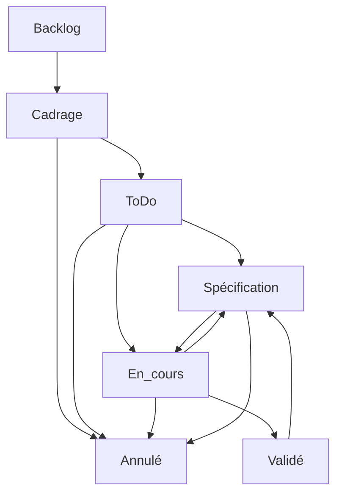

# MyMemoMaster

## Partie 1: Présentation

MyMemoMaster est une plateforme qui a pour but d'aider les étudiants dans leurs révisions, en centralisant diverses fonctionnalités visant à optimiser l'apprentissage. Là où MyMemoMaster se démarque de ses concurrents, c'est par le large éventail de fonctionnalités proposées.

Les fonctionnalités principales sont :
⇒ un éditeur de cartes mentales
⇒ un système de Leitner
⇒ une fonctionnalité exercices

L'application dispose de fonctionnalités interactives.

## Partie 2: À l'attention des collaborateurs

### Détails du projet

Arborescence du projet:

```txt
MyMemoMaster
│   README.md
|   .gitignore
|   ./my_memo_master_api
|       ./controllers //controlleurs de l'api
|       ./models //modèles de l'api
|       ./routes //routes de l'api
|       ./services //services de l'api
|       ./test //test unitaires de l'api
|       ./app.js //fichier principal de l'api
|       ./package.json //package de l'api
|   ./my_memo_master_front
```

### Bien commencer:

1. Logiciels nécessaires :

- Postman ⇒ https://www.postman.com
- VS Code ⇒ https://code.visualstudio.com
- Git ⇒ https://git-scm.com
- Docker/Docker-compose ⇒ https://www.docker.com
- Un navigateur web

2. Récupération du projet:
   HTTP:

```sh
git clone https://github.com/entrezunfredici/MyMemoMaster.git
```

SSH:

```sh
git clone git@github.com:entrezunfredici/MyMemoMaster.git
```

3. Copiez `.env.example` en `.env` et remplissez les variables d'environnement.
4. Lancer votre environnement local:

Avec docker-compose:

```sh
cd MyMemoMaster
docker-compose down ; docker-compose up --build
```

À noter : le docker compose dispose d'un reverse proxy (Traefik). Lorsque vous démarrez le projet avec Docker, le front est accessible à l'adresse :

```
 http://localhost/
```

L'api a l'adresse :

```
  http://localhost/api
```

et le traefik a l'adresse:

```
 http://localhost:8080/dashboard/#/
```

A l'ancienne (comme la moutarde):

```sh
cd MyMemoMaster/my_memo_master_api
npm install
npm run start
```

```sh
cd MyMemoMaster/my_memo_master_front
npm install
npm run dev
```

5. Lancer le seed de la base de données:

avec docker (dans un terminal classique)

```sh
docker compose exec api sh -c "npm run seed"
```

sans docker ou dans le terminal docker

```sh
cd MyMemoMaster/my_memo_master_api
npm run seed
```

6. Configurer PgAdmin :
   6.1. PgAdmin Docker :
   Ouvrez votre navigateur et allez à l'adresse suivante : http://localhost:5050
   Entrez les identifiants définis dans le .env.
   Une fois connecté, faites un clic droit sur "Servers", passez la souris sur "Nouveau" puis cliquez sur "Server".
   Remplissez les champs comme suit :
   dans l'onglet Général :

- Name : my memo master (ou le nom que vous voulez)
  dans l'onglet Connexion :
- Nom d'hôte/Adresse : la valeur de PG_HOST dans le .env
- Port : la valeur de PG_PORT dans le .env
- Identifiant de connexion : la valeur de PG_USER dans le .env
- Mot de passe : la valeur de PG_PASS dans le .env
  Pour finir, cliquez sur "Enregistrer".
  6.2. PgAdmin local :
  Téléchargez PostgreSQL et PgAdmin sur votre machine.
  Ouvrez PgAdmin et connectez-vous avec les identifiants définis dans le .env.
  Créez la base de données "PG_DB".

### Méthode de travail :

Étape 1, se caler sur la branche dev :

```sh
git checkout dev
git pull
```

Étape 2, créer une branche pour la feature que vous souhaitez ajouter :

```sh
git checkout -b dev_front/back_ma-feature
```

Étape 3, travailler sur votre feature :

1. tests unitaires
2. code
3. documentation swagger

Étape 4, pusher sur votre branche (à chaque fin de séance et quand votre feature est finie) :
quand votre branche n'est pas encore sur git

```sh
git add .
git commit -m "`<message>`"
git push origin dev_front/back_ma-feature
```

quand votre branche est déjà sur git

```sh
git add .
git commit -m "`<message>`"
git push
```

Règles de nommage du commit :
un préfixe :

- [ADD] pour les ajouts de fonctionnalités
- [IMP] pour les améliorations de fonctionnalités
- [REF] pour les refactorisations
- [FIX] pour les corrections de bugs
  suivi d'une courte description de la fonctionnalité ajoutée ou modifiée

Workflow



---

## Partie 3 : Déploiement

> **Manuels de déploiement détaillés** : [docs/MANUEL_DEPLOIEMENT_VPS.md](docs/MANUEL_DEPLOIEMENT_VPS.md) (environnement test) et [docs/MANUEL_DEPLOIEMENT_KUBERNETES.md](docs/MANUEL_DEPLOIEMENT_KUBERNETES.md) (preprod/prod via **Helm**).
> Cette partie reste la référence pour les **secrets et variables GitHub Actions** (CI/CD). Les sections preprod/prod ci-dessous décrivent le déploiement historique par `kubectl apply -f k8s/…` : depuis la migration Helm (2026-06-30), le CD déploie via `helm upgrade --install` avec le chart [helm/](helm/) — seuls les prérequis cluster (cert-manager, secret Cloudflare, ClusterIssuers) et la création des Secrets applicatifs restent d'actualité tels quels.

### Vue d'ensemble

```
Branche git  →  Images Docker Hub                          →  Cible
─────────────────────────────────────────────────────────────────────────
dev          →  mymemomaster_test_api/front:latest         →  VPS (docker compose)
staging      →  mymemomaster_preprod_api/front:latest      →  Kubernetes Infomaniak mutualisé
main         →  mymemomaster_api/front:latest              →  Kubernetes Infomaniak dédié
```

Le pipeline CI/CD fonctionne en deux temps :

1. **CI** (`.github/workflows/ci.yml`) — tests + lint + build, déclenché sur toutes les branches
2. **CD** (`.github/workflows/cd.yml`) — build Docker + déploiement, déclenché quand le CI passe sur `dev`, `staging` ou `main`

---

### Secrets GitHub Actions à configurer

> **Settings → Secrets and variables → Actions → Secrets**

| Secret                   | Description                                                                               |
| ------------------------ | ----------------------------------------------------------------------------------------- |
| `DOCKERHUB_USERNAME`   | Nom d'utilisateur Docker Hub                                                              |
| `DOCKERHUB_PASSWORD`   | Mot de passe ou token Docker Hub                                                          |
| `DISCORD_LOG`          | URL du webhook Discord pour les notifications CI/CD                                       |
| `SSH_TEST_PRIVATE_KEY` | Clé SSH privée pour accéder au VPS test                                                |
| `SSH_TEST_USERNAME`    | Utilisateur SSH du VPS test                                                               |
| `VPS_PORT`             | Port SSH du VPS                                                                           |
| `VPS_IP`               | Adresse IP du VPS                                                                         |
| `KUBECONFIG_PREPROD`   | Kubeconfig Infomaniak preprod encodé en base64 (voir ci-dessous)                         |
| `KUBECONFIG_PROD`      | Kubeconfig Infomaniak prod encodé en base64 (à ajouter quand le cluster prod est prêt) |

**Où trouver le kubeconfig Infomaniak :**

1. Se connecter sur [manager.infomaniak.com](https://manager.infomaniak.com)
2. Aller dans **Public Cloud → Kubernetes**
3. Cliquer sur le cluster concerné
4. Onglet **Accès** → bouton **Télécharger le kubeconfig**
5. Sauvegarder le fichier (ex : `config-infomaniak-preprod`)

**Vérifier que le fichier fonctionne :**

```bash
kubectl --kubeconfig=config-infomaniak-preprod cluster-info
```

**Encoder en base64 pour GitHub (Linux/macOS) :**

```bash
base64 -w0 config-infomaniak-preprod
# Copier la sortie dans le secret KUBECONFIG_PREPROD
```

**Encoder en base64 pour GitHub (Windows PowerShell) :**

```powershell
[Convert]::ToBase64String([IO.File]::ReadAllBytes("config-infomaniak-preprod"))
# Copier la sortie dans le secret KUBECONFIG_PREPROD
```

### Variable GitHub Actions à configurer

> **Settings → Secrets and variables → Actions → Variables**

| Variable             | Valeur   | Description                                                                             |
| -------------------- | -------- | --------------------------------------------------------------------------------------- |
| `K8S_PROD_ENABLED` | `true` | Active le déploiement prod. À ajouter uniquement quand le cluster prod K8s est prêt. |

---

### Environnement TEST — VPS (docker compose)

Le VPS fait tourner l'environnement de test via docker compose.
Le `docker-compose.yml` racine (unifié dev/test) est déployé automatiquement par le CD,
qui n'y active que le profil `test` (`--profile test`).

**Prérequis sur le VPS :**

Créer le fichier `/var/www/html/my_memo_master_test/.env` en copiant et remplissant `.env.test.example` :

```bash
mkdir -p /var/www/html/my_memo_master_test
cp .env.test.example /var/www/html/my_memo_master_test/.env
nano /var/www/html/my_memo_master_test/.env
```

Variables obligatoires à renseigner dans ce `.env` :

```env
COMPOSE_PROFILES=test                     # active les services VPS du compose unifié
ENVIRONMENT=test                          # NE PAS CHANGER — vérifié par le CD

IMAGE_API=fredissimo/mymemomaster_test_api:latest
IMAGE_FRONT=fredissimo/mymemomaster_test_front:latest

PG_USER=postgres
PG_PASS=<mot_de_passe_fort>
PG_DB=mymemomasterdb

AUTH_JWT_SECRET=<secret_aléatoire_long>
AUTH_JWT_EXPIRES_IN=1d

SMTP_HOST=smtp.hostinger.com
SMTP_PORT=587
SMTP_SECURE=false
SMTP_USER=<email_smtp>
SMTP_PASS=<mot_de_passe_smtp>
EMAIL_FROM=noreply@my-memo-master.com

FRONT_DOMAIN=test.my-memo-master.com
API_DOMAIN=test-api.my-memo-master.com
PGADMIN_DOMAIN=test-pgadmin.my-memo-master.com

VITE_API_URL=https://test-api.my-memo-master.com/api/v1
VITE_FRONT_URL=https://test.my-memo-master.com

PGADMIN_DEFAULT_EMAIL=admin@my-memo-master.com
PGADMIN_DEFAULT_PASSWORD=<mot_de_passe>

REDIS_PASS=
```

---

### Environnement PREPROD — Kubernetes Infomaniak (mutualisé)

#### 1. Prérequis cluster (à faire une seule fois)

```bash
# Pointer kubectl vers le cluster preprod
export KUBECONFIG=~/.kube/config-infomaniak-preprod

# Vérifier la connexion
kubectl cluster-info

# Appliquer le secret Cloudflare pour cert-manager
kubectl apply -f k8s/cert-manager/cloudflare-secret.yml

# Appliquer les ClusterIssuers Let's Encrypt (Cloudflare DNS01)
kubectl apply -f k8s/cert-manager/cluster-issuer-cloudflare.yml
```

#### 2. Créer le namespace et la ConfigMap

```bash
kubectl apply -f k8s/preprod/namespace.yml
kubectl apply -f k8s/preprod/configmap.yml
```

#### 3. Créer le Secret applicatif (données sensibles — ne jamais committer)

```bash
kubectl create secret generic mmm-preprod-secrets \
  --namespace mymemomaster-preprod \
  --from-literal=PG_USER=postgres \
  --from-literal=PG_PASS=<mot_de_passe_fort> \
  --from-literal=AUTH_JWT_SECRET=<secret_aléatoire_long> \
  --from-literal=SMTP_USER=<email_smtp> \
  --from-literal=SMTP_PASS=<mot_de_passe_smtp> \
  --from-literal=REDIS_PASS= \
  --from-literal=PGADMIN_DEFAULT_PASSWORD=<mot_de_passe>
```

#### 4. Déployer tous les manifests

```bash
kubectl apply -f k8s/preprod/
```

#### 5. Vérifier le déploiement

```bash
kubectl get pods -n mymemomaster-preprod
kubectl get ingress -n mymemomaster-preprod
kubectl get certificate -n mymemomaster-preprod
```

#### Valeurs de la ConfigMap preprod (`k8s/preprod/configmap.yml`)

| Clé               | Valeur                                            |
| ------------------ | ------------------------------------------------- |
| `ENVIRONMENT`    | `preprod`                                       |
| `API_PORT`       | `3000`                                          |
| `PG_DB`          | `mymemomasterdb`                                |
| `API_PUBLIC_URL` | `https://preprod-api.my-memo-master.com`        |
| `CORS_ORIGIN`    | `https://preprod.my-memo-master.com`            |
| `VITE_API_URL`   | `https://preprod-api.my-memo-master.com/api/v1` |
| `VITE_FRONT_URL` | `https://preprod.my-memo-master.com`            |
| `SMTP_HOST`      | `smtp.hostinger.com`                            |
| `SMTP_PORT`      | `587`                                           |
| `EMAIL_FROM`     | `noreply@my-memo-master.com`                    |

Pour modifier une valeur : éditer `k8s/preprod/configmap.yml` et merger sur `staging` (le CD applique automatiquement).

#### Migration depuis l'ancienne preprod (namespace `default`)

Si des ressources existent encore dans le namespace `default` :

```bash
# Supprimer les anciens ingress
kubectl delete ingress mymemomaster-test-api mymemomaster-test-front -n default

# Vérifier et supprimer les anciens deployments si présents
kubectl get deployments -n default
kubectl delete deployment <nom> -n default
```

---

### Environnement PROD — Kubernetes Infomaniak (dédié)

> Le cluster prod n'est pas encore créé. Cette section documente la procédure à suivre lors de sa mise en place.

#### 1. Prérequis cluster (identiques à preprod)

```bash
export KUBECONFIG=~/.kube/config-infomaniak-prod

kubectl apply -f k8s/cert-manager/cloudflare-secret.yml
kubectl apply -f k8s/cert-manager/cluster-issuer-cloudflare.yml
```

#### 2. Namespace, ConfigMap et manifests

```bash
kubectl apply -f k8s/prod/namespace.yml
kubectl apply -f k8s/prod/configmap.yml
```

#### 3. Secret applicatif

```bash
kubectl create secret generic mmm-prod-secrets \
  --namespace mymemomaster \
  --from-literal=PG_USER=postgres \
  --from-literal=PG_PASS=<mot_de_passe_fort> \
  --from-literal=AUTH_JWT_SECRET=<secret_aléatoire_long> \
  --from-literal=SMTP_USER=<email_smtp> \
  --from-literal=SMTP_PASS=<mot_de_passe_smtp> \
  --from-literal=REDIS_PASS= \
  --from-literal=PGADMIN_DEFAULT_PASSWORD=<mot_de_passe>
```

#### 4. Déployer et activer le CD

```bash
kubectl apply -f k8s/prod/
```

Puis dans GitHub **Settings → Variables → Actions**, ajouter `K8S_PROD_ENABLED=true`.

#### Valeurs de la ConfigMap prod (`k8s/prod/configmap.yml`)

| Clé               | Valeur                                    |
| ------------------ | ----------------------------------------- |
| `ENVIRONMENT`    | `prod`                                  |
| `API_PUBLIC_URL` | `https://api.my-memo-master.com`        |
| `CORS_ORIGIN`    | `https://my-memo-master.com`            |
| `VITE_API_URL`   | `https://api.my-memo-master.com/api/v1` |
| `VITE_FRONT_URL` | `https://my-memo-master.com`            |

---

### Structure des fichiers de déploiement

```
.github/workflows/
├── ci.yml                  — Tests, lint, build (toutes les branches)
└── cd.yml                  — Build Docker + déploiement (dev/staging/main)

docker-compose.yml          — Compose unifié : profil dev (local) + profil test (VPS, déployé par le CD)
.env.example                — Template .env dev local
.env.test.example           — Template à copier en .env sur le VPS test

k8s/
├── cert-manager/           — ClusterIssuers Let's Encrypt + secret Cloudflare
├── preprod/                — Manifests Kubernetes preprod (Infomaniak mutualisé)
│   ├── namespace.yml
│   ├── configmap.yml       — Variables non-sensibles preprod
│   ├── deployment.yml      — Postgres, Redis, API, Front, PgAdmin
│   ├── service.yml         — Services ClusterIP
│   └── ingress.yml         — Ingress nginx + TLS cert-manager
└── prod/                   — Manifests Kubernetes prod (Infomaniak dédié)
    ├── namespace.yml
    ├── configmap.yml
    ├── deployment.yml
    ├── service.yml
    └── ingress.yml
```
