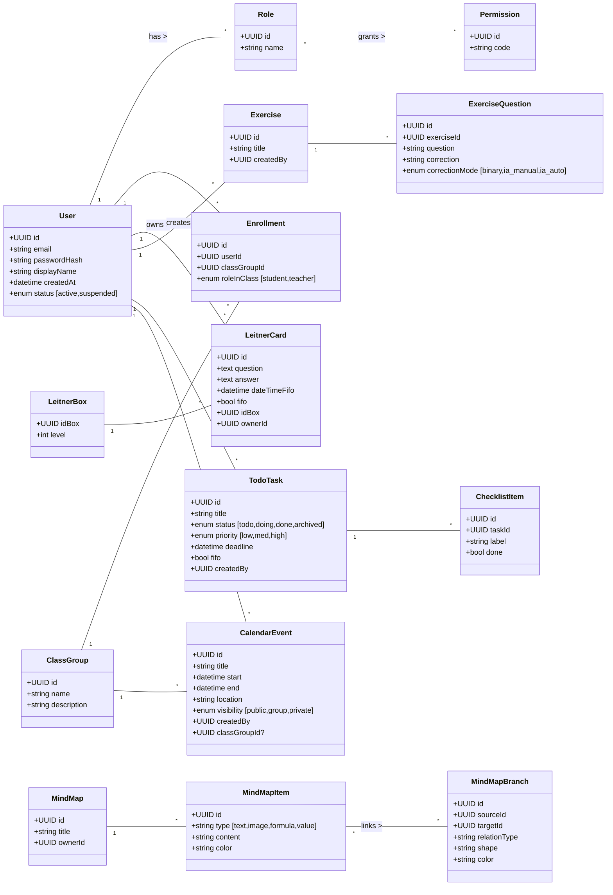

```mermaid
classDiagram
    direction LR

    %% --- Utilisateurs & rôles ---
    class User {
      +UUID id
      +string email
      +string passwordHash
      +string displayName
      +datetime createdAt
      +enum status [active,suspended]
    }

    class Role {
      +UUID id
      +string name
    }

    class Permission {
      +UUID id
      +string code
    }

    User "1" -- "*" Role : has >
    Role "*" -- "*" Permission : grants >

    %% --- Groupes de classe ---
    class ClassGroup {
      +UUID id
      +string name
      +string description
    }

    class Enrollment {
      +UUID id
      +UUID userId
      +UUID classGroupId
      +enum roleInClass [student,teacher]
    }

    User "1" -- "*" Enrollment
    ClassGroup "1" -- "*" Enrollment

    %% --- Cartes mentales ---
    class MindMap {
      +UUID id
      +string title
      +UUID ownerId
    }

    class MindMapItem {
      +UUID id
      +string type [text,image,formula,value]
      +string content
      +string color
    }

    class MindMapBranch {
      +UUID id
      +UUID sourceId
      +UUID targetId
      +string relationType
      +string shape
      +string color
    }

    MindMap "1" -- "*" MindMapItem
    MindMapItem "*" -- "*" MindMapBranch : links >

    %% --- Leitner ---
    class LeitnerBox {
      +UUID idBox
      +int level
    }

    class LeitnerCard {
      +UUID id
      +text question
      +text answer
      +datetime dateTimeFifo
      +bool fifo
      +UUID idBox
      +UUID ownerId
    }

    LeitnerBox "1" -- "*" LeitnerCard
    User "1" -- "*" LeitnerCard : owns >

    %% --- Exercices ---
    class Exercise {
      +UUID id
      +string title
      +UUID createdBy
    }

    class ExerciseQuestion {
      +UUID id
      +UUID exerciseId
      +string question
      +string correction
      +enum correctionMode [binary,ia_manual,ia_auto]
    }

    Exercise "1" -- "*" ExerciseQuestion
    User "1" -- "*" Exercise : creates >

    %% --- Tâches & calendrier ---
    class TodoTask {
      +UUID id
      +string title
      +enum status [todo,doing,done,archived]
      +enum priority [low,med,high]
      +datetime deadline
      +bool fifo
      +UUID createdBy
    }

    class ChecklistItem {
      +UUID id
      +UUID taskId
      +string label
      +bool done
    }

    class CalendarEvent {
      +UUID id
      +string title
      +datetime start
      +datetime end
      +string location
      +enum visibility [public,group,private]
      +UUID createdBy
      +UUID classGroupId?
    }

    TodoTask "1" -- "*" ChecklistItem
    User "1" -- "*" TodoTask
    User "1" -- "*" CalendarEvent
    ClassGroup "1" -- "*" CalendarEvent
```