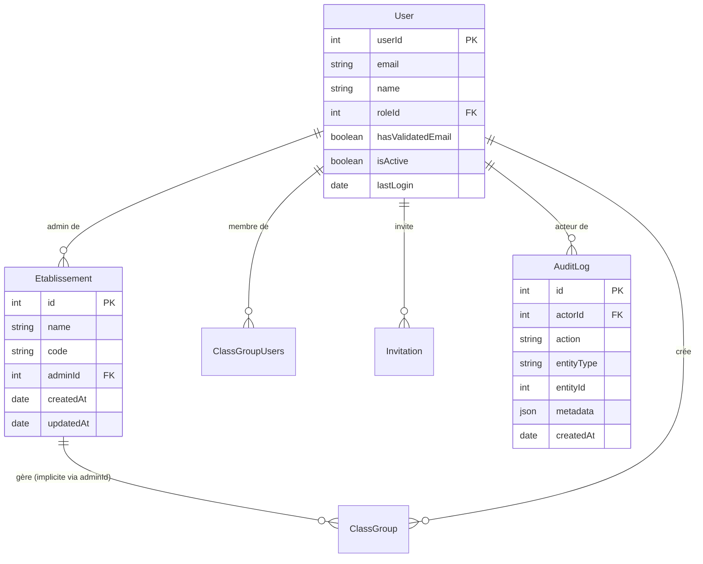

# Périmètre admin établissement — Gestion des établissements et invitations

> Document de référence pour la fonctionnalité **Gestion des établissements et invitations** (S-04 / Analyse V1).
> Livré dans le cadre de S-04.01 (Définition périmètre admin). User stories : US-16, US-22.

---

## 1. Contexte et objectif

MyMemoMaster supporte un déploiement **établissement** : une école ou un organisme de formation s'inscrit sur la plateforme, dispose d'un administrateur dédié, et peut inviter ses enseignants et étudiants sans que ceux-ci aient à s'inscrire seuls.

Ce document définit :
- ce qu'est un **Établissement** dans le système
- ce que peut et ne peut pas faire l'**Admin établissement** (roleId=4)
- le flux d'**activation de compte** piloté par l'admin
- l'approche d'**audit trail**
- le périmètre des endpoints à livrer en V1

---

## 2. Périmètre

| Fonctionnalité | Dans le périmètre S-04 V1 |
|---|---|
| Entité Établissement (model, CRUD minimal) | ✅ |
| Rôle Admin établissement (roleId=4) | ✅ déjà livré (M-05.01) |
| Invitation utilisateur par email | ✅ déjà livré (S-01.07) |
| Activation / désactivation de comptes | ✅ |
| Audit trail (table `AuditLog`) | ✅ conception ; implémentation différée |
| Vue pilotage établissement (front) | ✅ partielle (ClassroomEtablissementView) |
| Facturation établissement | ❌ hors version |
| Provisioning SCIM | ❌ hors version |
| Interopérabilité ENT complète | ❌ hors version |
| Gestion multi-établissements par un même admin | ❌ hors V1 |

---

## 3. Acteurs

| Acteur | roleId | Rôle dans la fonctionnalité |
|---|---|---|
| **Admin plateforme** | 1 | Crée les établissements, assigne les admins établissement, voit tous les logs |
| **Admin établissement** | 4 | Gère ses groupes classes, invite des utilisateurs, active/désactive les comptes dans son périmètre, voit ses logs |
| **Enseignant** | 3 | Reçoit une invitation, crée du contenu pédagogique dans ses groupes |
| **Étudiant** | 2 | Reçoit une invitation, accède aux groupes assignés |

---

## 4. Modèle de données

### 4.1 Entité `Etablissement`

```
Etablissement
├── id          : INTEGER PK AUTO_INCREMENT
├── name        : STRING NOT NULL          — "Lycée Victor Hugo"
├── code        : STRING UNIQUE NOT NULL   — "LVH-PARIS"  (identifiant court)
├── adminId     : INTEGER FK → User.userId (ON DELETE SET NULL)
├── createdAt   : DATE DEFAULT NOW
└── updatedAt   : DATE DEFAULT NOW
```

**Règles :**
- Un établissement a exactement **un admin désigné** (adminId) — l'admin plateforme peut le changer.
- Un utilisateur (roleId=4) peut n'être admin que d'un seul établissement en V1.
- Les `ClassGroup` ne sont pas directement liés à l'établissement en base en V1 : l'appartenance est implicite via le `createdBy` ou la gestion par roleId=4.

> **Décision V1** : pas de FK `etablissementId` sur `ClassGroup` ni sur `User`. Le lien est établi par le fait que l'admin établissement crée et gère des groupes dans son scope. Une colonne `etablissementId` sera ajoutée en V2 si le multi-établissement devient nécessaire.

### 4.2 Champ `isActive` sur `User`

```
User (modification)
└── isActive : BOOLEAN NOT NULL DEFAULT true
```

- `false` = compte désactivé par un admin (ne peut plus se connecter)
- Distinct de `hasValidatedEmail` (vérification email à l'inscription)
- Le login vérifie `isActive` AVANT de délivrer le JWT

**Qui peut modifier `isActive` :**
- Admin plateforme (1) : sur n'importe quel compte
- Admin établissement (4) : sur les comptes qu'il a invités (à vérifier via `Invitation.invitedBy`)

### 4.3 Entité `AuditLog` (conception — implémentation V2)

```
AuditLog
├── id         : INTEGER PK AUTO_INCREMENT
├── actorId    : INTEGER FK → User.userId (ON DELETE SET NULL, nullable)
├── action     : STRING NOT NULL    — "USER_ACTIVATED", "USER_INVITED", "GROUP_CREATED"...
├── entityType : STRING NOT NULL    — "User", "ClassGroup", "Etablissement"
├── entityId   : INTEGER            — id de l'entité concernée
├── metadata   : JSON               — détails contextuels (ancien état, nouveau état)
└── createdAt  : DATE DEFAULT NOW
```

**Événements à auditer (V2) :**

| Action | Déclencheur |
|---|---|
| `USER_INVITED` | Admin envoie une invitation |
| `USER_ACCOUNT_ACTIVATED` | Admin active un compte (`isActive → true`) |
| `USER_ACCOUNT_DEACTIVATED` | Admin désactive un compte (`isActive → false`) |
| `USER_ROLE_CHANGED` | Admin plateforme change le rôle d'un user |
| `GROUP_CREATED` | Création d'un groupe classe |
| `GROUP_MEMBER_ADDED` | Ajout d'un membre dans un groupe |
| `GROUP_MEMBER_REMOVED` | Retrait d'un membre |
| `LOGIN_SUCCESS` | Connexion réussie |
| `LOGIN_FAILED` | Tentative échouée (email valide, mot de passe invalide) |

> **Décision** : l'audit trail est conçu maintenant pour éviter une migration douloureuse, mais l'implémentation est différée en V2. En V1, `hasValidatedEmail` et les logs Winston suffisent pour la traçabilité minimale.

### 4.4 Schéma ERD (Mermaid)



---

## 5. Périmètre admin établissement — matrice de contrôle d'accès

| Action | Admin plateforme (1) | Admin établissement (4) | Enseignant (3) | Étudiant (2) |
|---|---|---|---|---|
| Créer un établissement | ✅ | ❌ | ❌ | ❌ |
| Modifier un établissement | ✅ | ❌ | ❌ | ❌ |
| Assigner un admin établissement | ✅ | ❌ | ❌ | ❌ |
| Créer / modifier / supprimer des groupes classes | ✅ | ✅ | ❌ | ❌ |
| Gérer les membres des groupes classes | ✅ | ✅ | ❌ | ❌ |
| Inviter un utilisateur par email | ✅ | ✅ | ❌ | ❌ |
| Activer / désactiver un compte | ✅ (tous) | ✅ (ses invités) | ❌ | ❌ |
| Changer le rôle d'un utilisateur | ✅ | ❌ | ❌ | ❌ |
| Consulter les logs audit | ✅ (tous) | ✅ (son périmètre) | ❌ | ❌ |
| Voir les KPI pédagogiques du groupe | ✅ | ✅ | ✅ | ❌ |
| Accéder aux KPI personnels | ❌ (sans consentement) | ❌ | ✅ si consentement | ❌ |

---

## 6. Endpoints API à livrer

### 6.1 Établissements

| Méthode | Route | Acteur | Description |
|---|---|---|---|
| `POST` | `/api/v1/etablissements` | Admin plateforme (1) | Crée un établissement |
| `GET` | `/api/v1/etablissements` | Admin plateforme (1) | Liste tous les établissements |
| `GET` | `/api/v1/etablissements/:id` | Admin plateforme (1), Admin étab. (4) | Détail d'un établissement |
| `PUT` | `/api/v1/etablissements/:id` | Admin plateforme (1) | Modifie nom / code / adminId |
| `DELETE` | `/api/v1/etablissements/:id` | Admin plateforme (1) | Supprime (si aucun groupe actif) |

### 6.2 Activation de comptes

| Méthode | Route | Acteur | Description |
|---|---|---|---|
| `PATCH` | `/api/v1/users/:id/activate` | Admin plateforme (1), Admin étab. (4) | Active le compte (`isActive = true`) |
| `PATCH` | `/api/v1/users/:id/deactivate` | Admin plateforme (1), Admin étab. (4) | Désactive le compte (`isActive = false`) |

> **Garde :** l'admin établissement ne peut activer/désactiver que les utilisateurs qu'il a directement invités (`Invitation.invitedBy = req.user.id`). Vérification dans le service avant toute modification.

### 6.3 Audit trail (V2)

| Méthode | Route | Acteur | Description |
|---|---|---|---|
| `GET` | `/api/v1/audit` | Admin plateforme (1) | Tous les logs |
| `GET` | `/api/v1/audit?entityType=User&entityId=X` | Admin plateforme (1) | Logs filtrés par entité |
| `GET` | `/api/v1/etablissements/:id/audit` | Admin plateforme (1), Admin étab. (4) | Logs de l'établissement |

---

## 7. Flux utilisateurs nominaux

### 7.1 Déploiement d'un établissement

```
Admin plateforme
  │
  ├─ POST /etablissements { name: "Lycée Hugo", code: "LVH", adminId: 42 }
  │        └─ Crée Etablissement + assigne user 42 en roleId=4
  │           → 201 { data: Etablissement }
  │
Admin établissement (userId=42)
  │
  ├─ POST /class-groups { name: "Terminale G1", ... }
  │        └─ requireRole(1, 4) ✓ — groupe créé, createdBy=42
  │
  ├─ POST /class-groups/:id/invitations { email: "prof@lycee.fr", role: "teacher" }
  │        └─ Email envoyé. Si compte existant : ajout direct. Sinon : invitation en attente.
  │
  └─ POST /class-groups/:id/invitations { email: "eleve@lycee.fr", role: "student" }
           └─ Même flux d'invitation
```

### 7.2 Activation / désactivation de compte

```
Admin établissement (userId=42)
  │
  ├─ PATCH /users/55/deactivate
  │        └─ Vérifie : user 55 a été invité par req.user (Invitation.invitedBy=42) ✓
  │           user 55 → isActive = false
  │           → 200 { message: "Compte désactivé" }
  │
User 55 tente de se connecter
  │
  └─ POST /auth/login { email, password }
           └─ Auth.middleware vérifie isActive ✓ → 403 "Compte désactivé"
```

---

## 8. Stratégie de tests

| Couche | Ce qui doit être testé |
|---|---|
| `Etablissement.service` | create, findAll, findOne, update, delete — accès requis (roleId=1 uniquement) |
| `Etablissement.controller` | 201 création, 403 si non admin plateforme, 404 not found, 409 code dupliqué |
| `User.service` (activation) | activate/deactivate — guard scope admin établissement |
| `User.controller` (activation) | 200 succès, 403 si hors périmètre, 404 user introuvable |
| `Auth.middleware` (login) | Refus si `isActive = false` → 403 |
| `AuditLog.service` (V2) | Insertion à chaque action auditée, filtrage par acteur/entité |

---

## 9. Liens vers l'implémentation (à créer)

| Fichier | Rôle |
|---|---|
| `models/Etablissement.model.js` | Modèle Sequelize — à créer |
| `migrations/YYYYMMDD-create-etablissement.js` | Migration table Etablissement — à créer |
| `migrations/YYYYMMDD-add-isActive-to-user.js` | Migration colonne isActive sur User — à créer |
| `services/Etablissement.service.js` | CRUD + scoping admin — à créer |
| `controllers/Etablissement.controller.js` | Handlers HTTP — à créer |
| `validators/Etablissement.validators.js` | Validation entrées — à créer |
| `routes/Etablissement.routes.js` | Routes + Swagger — à créer |
| `middlewares/Auth.middleware.js` | Ajouter garde `isActive` au login — à modifier |
| `services/User.service.js` | Méthodes activate/deactivate + garde scope — à modifier |
| `controllers/User.controller.js` | Handlers PATCH activate/deactivate — à modifier |
| `routes/User.routes.js` | Routes PATCH activate/deactivate — à modifier |
| `models/AuditLog.model.js` | Modèle AuditLog — à créer (V2) |

---

## 10. Points d'attention et dette

- **`isActive` dans Auth.middleware** : la vérification doit intervenir APRÈS la vérification JWT, AVANT la vérification du rôle. Un compte désactivé retourne 403 "Compte désactivé", pas 401.
- **Scope de l'admin établissement** : sans `etablissementId` sur `User` ou `ClassGroup`, le scope est dérivé des `Invitation.invitedBy`. Cela fonctionne en V1 mais devient fragile si un utilisateur change d'établissement. À revisiter en V2.
- **Suppression d'établissement** : bloquer si des groupes actifs existent (protection RESTRICT ou vérification applicative). Ne pas supprimer en cascade les utilisateurs.
- **Audit trail RGPD** : en V2, définir une politique de rétention (`AuditLog` purgé après X mois pour les logs de connexion, conservation plus longue pour les changements de compte).
- **`ClassroomEtablissementView.vue`** : la vue front actuelle gère les groupes classes de l'admin établissement. La section "gestion des utilisateurs" (liste des invités, activation/désactivation) est à ajouter dans un ticket S-04 front.
- **Code `Etablissement` unique** : contrainte UNIQUE sur la colonne `code` — l'admin plateforme doit choisir un code non conflictuel. Retourner 409 en cas de conflit.
