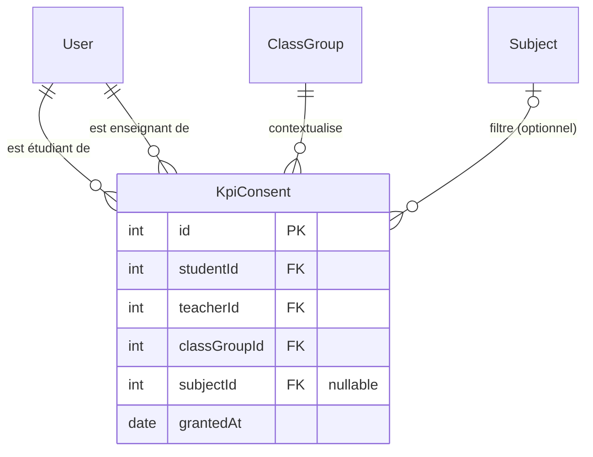

# Modèle de consentement partage — KPI personnels

> Document de référence pour la fonctionnalité **Partage maîtrisé des KPI personnels** (S-02 / Sprint 9 — Analyse V1).
> Livré dans le cadre de S-02.01. Mis à jour après clarification métier sur la distinction KPI pédagogiques / personnels et le filtrage par matière.

---

## 1. Contexte et objectif

Un étudiant dispose de **deux catégories** de KPI :

### 1.1 KPI pédagogiques — visibles par l'étudiant ET son enseignant (sans consentement)

Ces données sont contextuelles au groupe classe et à l'activité pédagogique assignée par l'enseignant :

| KPI | Source |
|---|---|
| Résultats aux exercices fournis par l'enseignant | `TestResult` sur `Test.createdBy = teacher` |
| Taux de complétion des séries d'exercices assignées | `TestResult / Test` |
| Nombre de rendus soumis dans le groupe | `ClassGroupSubmission` |
| Ponctualité sur les rendus (dans les délais / en retard) | `ClassGroupSubmission.submittedAt vs Deadline.dueDate` |

Ces KPI sont accessibles via `GET /class-groups/:id/kpi/students` (vue enseignant) et dans le profil étudiant.

### 1.2 KPI personnels — privés par défaut, partageables avec consentement

Ces données appartiennent à l'étudiant et reflètent son travail autonome :

| KPI | Source |
|---|---|
| Systèmes Leitner (flashcards, maîtrise par matière) | `LeitnerSystem / LeitnerCard` |
| Exercices créés par l'étudiant et résultats associés | `Test.createdBy = student + TestResult` |
| Niveaux de maîtrise par matière | `LeitnerSystem.subjectId` |
| Discipline (sessions planifiées vs complétées) | `RevisionSession` |
| Streak de révision | `RevisionSession.isDone` |
| Badges | Calculés côté service |

**Valeur utilisateur :** l'étudiant conserve le contrôle sur ses données personnelles tout en pouvant choisir de les partager — matière par matière — avec l'enseignant de son choix dans un groupe donné.

---

## 2. Périmètre

| Fonctionnalité | Dans le périmètre S-02 |
|---|---|
| Accord de consentement (global ou par matière) | ✅ |
| Révocation (globale ou par matière) | ✅ |
| Consultation de la liste de ses consentements actifs | ✅ |
| Accès enseignant aux KPI d'un étudiant consentant | ✅ |
| Filtrage des KPI retournés par matières consenties | ✅ |
| Ressources pédagogiques CRUD par groupe (ClassGroupResource) | ✅ |
| Partage public des KPI (sans consentement) | ❌ hors version |
| Consentement établissement imposé globalement | ❌ hors version |
| Notification à l'enseignant lors de l'accord/révocation | ❌ hors version |

---

## 3. Acteurs

| Acteur | Rôle dans la fonctionnalité |
|---|---|
| **Étudiant** | Accorde ou révoque le consentement, choisit le niveau de partage (global ou par matière) |
| **Enseignant du groupe** | Consulte les KPI d'un étudiant uniquement si consentement accordé dans ce groupe |
| **Admin / autre étudiant** | Aucun accès aux KPI personnels — pas de bypass |

---

## 4. Modèle de données

### 4.1 Entité `KpiConsent`

```
KpiConsent
├── id           : INTEGER PK AUTO_INCREMENT
├── studentId    : INTEGER FK → User.userId  (ON DELETE CASCADE)
├── teacherId    : INTEGER FK → User.userId  (ON DELETE CASCADE)
├── classGroupId : INTEGER FK → ClassGroup.id (ON DELETE CASCADE)
├── subjectId    : INTEGER FK → Subject.subjectId (ON DELETE SET NULL, nullable)
└── grantedAt    : DATE DEFAULT NOW
```

**Sémantique de `subjectId` :**
- `null` = consentement global — l'enseignant voit TOUS les KPI personnels de l'étudiant
- valeur entière = consentement filtré — l'enseignant voit uniquement les KPI liés à cette matière (Leitner + exercices)

**Contrainte d'unicité :** `(studentId, teacherId, classGroupId, subjectId)` — une seule entrée par combinaison.
*Note :* les SGBD traitent NULL comme distinct dans les indexes uniques — l'idempotence pour les consentements globaux est garantie par `findOrCreate` au niveau service.

**Cardinalités :**
- Un étudiant peut avoir **N consentements** (un par enseignant × groupe × matière optionnelle).
- L'enseignant A en groupe G peut recevoir : un consentement global OU des consentements par matière.
- Les deux peuvent coexister — en cas de consentement global, le service retourne tous les KPI.

### 4.2 Schéma ERD (Mermaid)



---

## 5. Règles métier

### 5.1 Accord du consentement

| Règle | Détail |
|---|---|
| L'acteur qui accorde est le `req.user` | L'étudiant ne peut accorder que pour lui-même |
| L'étudiant doit avoir le rôle `'student'` dans le groupe | Vérification stricte via `ClassGroupUsers.role = 'student'` |
| L'enseignant désigné doit avoir le rôle `'teacher'` dans le même groupe | Vérification via `ClassGroupUsers.role = 'teacher'` — aucun bypass admin |
| `subjectId` optionnel | Null = global ; valeur = filtré par matière |
| Idempotence | `findOrCreate` — accorder deux fois n'échoue pas, retourne le consentement existant |

### 5.2 Révocation

| Règle | Détail |
|---|---|
| Seul l'étudiant concerné peut révoquer | `studentId = req.user.id` |
| Sans `subjectId` | Révoque TOUS les consentements pour ce (teacher, group) |
| Avec `subjectId` | Révoque uniquement le consentement de cette matière |
| Consentement inexistant | Retourne 404 |

### 5.3 Consultation des KPI par l'enseignant

| Règle | Détail |
|---|---|
| L'enseignant doit être membre `'teacher'` du groupe | Vérification avant toute requête KPI |
| Au moins un consentement doit exister | Absence = 403 |
| Si un consentement global (subjectId null) existe | `KpiService.getMyKpis(studentId)` — tous les KPI |
| Si uniquement des consentements par matière | `KpiService.getPersonalKpisForSubjects(studentId, subjectIds)` — Leitner + exercices filtrés |
| Révision et discipline en mode filtré | Partagées telles quelles (données générales non liées à une matière) |

---

## 6. Endpoints API

### 6.1 Tableau récapitulatif

| Méthode | Route | Acteur | Description |
|---|---|---|---|
| `POST` | `/api/v1/kpi/consent` | Étudiant | Accorde le consentement (global ou par matière) |
| `DELETE` | `/api/v1/kpi/consent/:teacherId/:classGroupId[?subjectId=X]` | Étudiant | Révoque (tout ou une matière) |
| `GET` | `/api/v1/kpi/consent/my` | Étudiant | Liste ses consentements actifs |
| `GET` | `/api/v1/kpi/student/:studentId?classGroupId=X` | Enseignant | Consulte les KPI d'un étudiant |

Toutes les routes requièrent un JWT valide (`Authorization: Bearer <token>`).

### 6.2 Détail des paramètres

#### `POST /kpi/consent`
```json
Body : {
  "teacherId"    : 3,   // entier ≥ 1, requis
  "classGroupId" : 1,   // entier ≥ 1, requis
  "subjectId"    : 5    // entier ≥ 1, optionnel — null ou absent = consentement global
}
```

| Réponse | Code | Condition |
|---|---|---|
| `{ message, data: KpiConsent }` | 201 | Consentement accordé (ou déjà existant) |
| `{ message }` | 400 | Validation échouée (subjectId invalide) |
| `{ message }` | 403 | `req.user` n'est pas étudiant dans ce groupe |
| `{ message }` | 404 | `teacherId` n'est pas enseignant dans ce groupe |
| `{ message }` | 500 | Erreur serveur |

#### `DELETE /kpi/consent/:teacherId/:classGroupId[?subjectId=X]`

| Comportement | Condition |
|---|---|
| Révoque tous les consentements pour ce (teacher, group) | Pas de `?subjectId` |
| Révoque uniquement le consentement de la matière X | `?subjectId=X` fourni |

| Réponse | Code | Condition |
|---|---|---|
| `{ message }` | 200 | Consentement(s) révoqué(s) |
| `{ message }` | 404 | Consentement introuvable |
| `{ message }` | 500 | Erreur serveur |

#### `GET /kpi/consent/my`

Chaque entrée inclut : `teacher` (`userId`, `name`, `email`) + `classGroup` (`id`, `name`) + `subject` (`subjectId`, `name`) — null si consentement global.

#### `GET /kpi/student/:studentId?classGroupId=X`

| Réponse | Code | Condition |
|---|---|---|
| `{ revision, exercises, leitner, subjects, discipline, badges }` | 200 | KPI retournés (filtrés ou complets selon consentements) |
| `{ message }` | 400 | `classGroupId` manquant ou invalide |
| `{ message }` | 403 | Pas enseignant dans le groupe, ou pas de consentement |
| `{ message }` | 500 | Erreur serveur |

---

## 7. Contrôle d'accès — matrice

| Action | Étudiant (propre compte) | Enseignant du groupe (avec consentement) | Autre étudiant / Admin |
|---|---|---|---|
| Accorder consentement | ✅ | ❌ | ❌ |
| Révoquer consentement | ✅ | ❌ | ❌ |
| Lister ses consentements | ✅ | ❌ | ❌ |
| Voir KPI pédagogiques | ✅ (ses propres) | ✅ (tous les étudiants du groupe) | ❌ |
| Voir KPI personnels | ✅ (ses propres) | ✅ si consentement accordé (filtré par matière si consent par sujet) | ❌ sans exception |

> **Règle stricte** : les KPI personnels d'un étudiant ne peuvent être consultés que par l'étudiant lui-même et par l'enseignant **membre du groupe** auquel le consentement a été accordé. Aucun bypass pour les admins.

---

## 8. Flux utilisateur nominal

```
Étudiant
  │
  ├─ POST /kpi/consent { teacherId: 3, classGroupId: 1, subjectId: 5 }
  │        └─ Vérifie : req.user est student dans groupe 1 ✓
  │           Vérifie : user 3 est teacher dans groupe 1 ✓
  │           findOrCreate(studentId=req.user.id, teacherId=3, classGroupId=1, subjectId=5)
  │           → 201 { data: KpiConsent }
  │           (seuls les KPI de la matière 5 — Physique — sont partagés)
  │
Enseignant (userId=3)
  │
  ├─ GET /kpi/student/2?classGroupId=1
  │        └─ Vérifie : req.user est teacher dans groupe 1 ✓
  │           findAll(studentId=2, teacherId=3, classGroupId=1) → [{ subjectId: 5 }]
  │           → pas de consentement global → getPersonalKpisForSubjects(2, [5])
  │           → 200 { exercises (filtrés), leitner (filtrés), revision, discipline, badges }
  │
Étudiant
  │
  ├─ POST /kpi/consent { teacherId: 3, classGroupId: 1 }  ← sans subjectId
  │        └─ Consentement global accordé
  │           (l'enseignant voit maintenant TOUS les KPI)
  │
  └─ DELETE /kpi/consent/3/1?subjectId=5
           └─ Révoque uniquement le consentement Physique
              (le consentement global reste actif)
```

---

## 9. Liens vers l'implémentation

| Fichier | Rôle |
|---|---|
| `my_memo_master_api/models/KpiConsent.model.js` | Modèle Sequelize |
| `my_memo_master_api/migrations/20260627000001-create-kpiconsent-table.js` | Migration BDD |
| `my_memo_master_api/services/KpiConsent.service.js` | Logique métier consentement |
| `my_memo_master_api/services/Kpi.service.js` | `getPersonalKpisForSubjects` (filtrage par matière) |
| `my_memo_master_api/controllers/KpiConsent.controller.js` | Handlers HTTP |
| `my_memo_master_api/validators/KpiConsent.validators.js` | Validation entrées (subjectId optionnel) |
| `my_memo_master_api/routes/Kpi.routes.js` | Déclaration des routes |
| `my_memo_master_api/test/services/KpiConsent.service.test.js` | Tests service (22) |
| `my_memo_master_api/test/controllers/KpiConsent.controller.test.js` | Tests controller (23) |

---

## 10. Points d'attention et dette

- **Front non livré** : pas d'UI pour accorder/révoquer le consentement — à planifier dans un ticket S-02 front.
- **Notifications** : l'enseignant n'est pas notifié lors de l'accord/révocation — hors V1.
- **Audit trail** : `grantedAt` trace la date d'accord. Aucun historique des révocations n'est conservé.
- **Pas de bypass admin** : les admins n'ont pas accès aux KPI personnels. Seul `ClassGroupUsers.role='teacher'` + consentement explicite donnent accès.
- **Distinction exercices enseignant / étudiant** : `getPersonalKpisForSubjects` filtre tous les exercices par matière sans distinguer qui les a créés. La distinction `createdBy` (enseignant vs étudiant) sera traitée dans un ticket séparé.
- **NULLs dans l'index unique** : SQLite et PostgreSQL traitent NULL comme distinct dans les indexes uniques. Deux lignes `(1,2,3,NULL)` peuvent coexister. L'idempotence des consentements globaux est gérée par `findOrCreate` au niveau applicatif.
