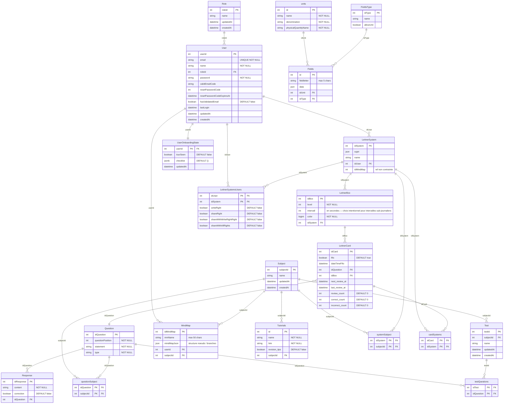

# Schéma BDD — MyMemoMaster (implémenté)

> Documentation de la base de données telle qu'implémentée (Sequelize + migrations).  
> Dialectes : PostgreSQL (prod) / SQLite (dev).  
> Mise à jour : 2026-06-06 — ticket M-00.15.

---

## Diagramme ERD

---

## Groupes fonctionnels

### Authentification & utilisateurs
| Table | Rôle |
|-------|------|
| `Role` | Rôles applicatifs (Admin, Étudiant) |
| `User` | Comptes utilisateurs avec JWT, vérification email, reset password |
| `UserOnboardingState` | État du guide d'onboarding par utilisateur (1:1 avec User) |

### Contenu pédagogique
| Table | Rôle |
|-------|------|
| `Subject` | Matière / discipline (pivot central du contenu) |
| `Question` | Question de révision ou d'exercice |
| `Response` | Réponse associée à une question |
| `Test` | Série de questions liées à un sujet |
| `Tutorials` | Ressource externe (lien) associée à un sujet |

### Système Leitner (répétition espacée)
| Table | Rôle |
|-------|------|
| `LeitnerSystem` | Système de cartes d'un utilisateur |
| `LeitnerBox` | Boîte numérotée (niveau 1-N) avec intervalle de révision |
| `LeitnerCard` | Carte individuelle avec compteurs de révision et dates |
| `LeitnerSystemsUsers` | Table de partage : droits d'accès d'un utilisateur sur un système |

### Cartes mentales
| Table | Rôle |
|-------|------|
| `MindMap` | Mind map avec structure JSON complète, lié à un User et un Subject |

### Champs dynamiques (Fields)
| Table | Rôle |
|-------|------|
| `FieldsType` | Type de champ (ex: numérique, texte, formule) |
| `units` | Unités de mesure associables aux champs |
| `Fields` | Instance de champ avec valeur JSON, type et unité |

### Tables de jointure (N:N)
| Table | Relation |
|-------|---------|
| `systemSubject` | LeitnerSystem ↔ Subject |
| `questionSubject` | Question ↔ Subject |
| `testQuestions` | Test ↔ Question |
| `cardSystems` | LeitnerCard ↔ LeitnerSystem |

---

## Index définis

| Table | Colonne(s) indexée(s) | Raison |
|-------|----------------------|--------|
| `User` | `roleId` | Jointures User→Role |
| `LeitnerSystem` | `idUser` | Récupération des systèmes d'un utilisateur |
| `LeitnerBox` | `idSystem` | Boîtes d'un système |
| `LeitnerCard` | `idQuestion` | Carte liée à une question |
| `LeitnerCard` | `idBox` | Cartes d'une boîte |
| `LeitnerCard` | `next_review_at` | Requête FIFO de révision (cron + `GET /leitnercards/due/:systemId`) |
| `Response` | `idQuestion` | Réponses d'une question |
| `Fields` | `idType` | Champs par type |
| `Fields` | `idUnit` | Champs par unité |
| `MindMap` | `userId` | Mind maps d'un utilisateur |
| `MindMap` | `subjectId` | Mind maps d'une matière |
| `Test` | `subjectId` | Tests d'une matière |
| `Tutorials` | `subjectId` | Tutoriels d'une matière |

> En dev (SQLite) : index créés via `db.sync()`.  
> En prod (PostgreSQL) : index créés via la migration `20260605000001-add-indexes.js`.

---

## Comportements de suppression (ON DELETE)

| Relation | Comportement |
|---------|-------------|
| Role → User | CASCADE (suppression rôle supprime les users) |
| User → UserOnboardingState | CASCADE |
| User → LeitnerSystemsUsers | CASCADE |
| LeitnerSystem → LeitnerSystemsUsers | CASCADE |
| LeitnerSystem → systemSubject | CASCADE |
| Subject → systemSubject | CASCADE |
| Subject → questionSubject | CASCADE |
| Question → questionSubject | CASCADE |
| Test → testQuestions | CASCADE |
| Question → testQuestions | CASCADE |
| LeitnerCard → cardSystems | CASCADE |
| LeitnerSystem → cardSystems | CASCADE |
| LeitnerSystem → User | SET NULL (`idUser` nullable) |
| Fields → FieldsType | SET NULL (`idType` nullable) |
| Fields → units | SET NULL (`idUnit` nullable) |

---

## Points d'attention / dette documentée

- `LeitnerCard.idBox` n'a pas de contrainte `REFERENCES` formelle dans le modèle Sequelize (association déclarée mais pas de `references:` inline) — la contrainte FK est dans la migration.
- `LeitnerSystem.idMindMap` est une référence non contrainte (pas de FK formelle vers `MindMap`) — couplage loose intentionnel.
- `LeitnerBox.color` est de type `BIGINT` — stocke une valeur hexadécimale de couleur encodée.
- `LeitnerBox.intervall` est en secondes — choix intentionnel pour permettre des intervalles sub-journaliers (< 1 jour). Les valeurs de dev (5/10/15/20/30 s) sont des valeurs de test ; en production, utiliser des valeurs réalistes (ex. 3600 = 1h, 86400 = 1 jour, etc.).
- `UserOnboardingState.checklist` utilise `JSONB` (PostgreSQL natif) — en SQLite dev, sera stocké en JSON (Sequelize l'émule silencieusement).
- `MindMap.mindMapJson` est déclaré `JSON` mais un commentaire dans le modèle note que `TEXT` serait plus approprié pour des structures volumineuses.
