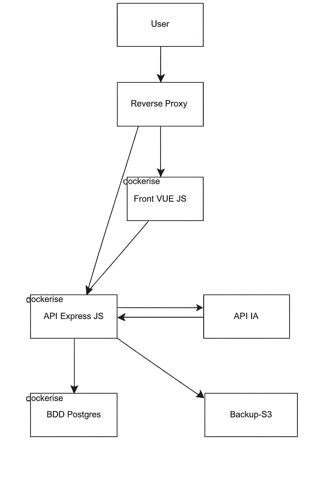

# Document d'Architecture — MyMemoMaster

## TP M2 Dev Cloud — Stratégie de déploiement

---

## 1. Analyse de la problématique

    La plupart des etudiants ont des methodes de revision peu efficaces qui les mettent en difficultée. 83,6% ont des methodes de révisions passives, 27% préparent leurs examents au dernier moment, seulement 34% ont un calendrier de révcision utile et seulmement 1 étudiant sur 2 s’entraîne via des annales ou des exercices. Pour remedier a ces problème My Memo Master propose une plateforme de révision et de suivi étudiant tout en un à destination des étudiants principalement et des enseignants. Pour répondre aux besoin des étudiants la plateforme propose diverses fontionnalitées bésées sur des methodes pédagogiques efficaces pour les etudiants :

* Systèmes de leitner : système de questions-réponses qui se base sur le fonctionnement de la mémoire, l’idée est simple, l’algorythme vous posera des questions, vous répondez et derrière le système corriger. si vous échouez sur une question alors elle sera posée plus souvent afin que vous reteniez la réponse. Une fois que vous aurais rettenu la réponse et que donc votre réposne sera juste, le sytème la posera moins souvent (car c‘est moins nécéssaire) mais la posera de temps en temps pour que vous ne l’ouvbliez pas.
* Cartes mentales : schemat servant à itentifier les différentes notions (définitions, formules, grandeurs physiques ect..) et les liens entre elles.
* Séries d’exercices: séries d’exercices permettant de s’entrainer
* Calendier et todolist : outils d’organisation permettant de planifier les seances de révisions et visualiser les échéances (ds, exams ect...)
* Kpi personnels : Ensemble de données permettant de voir son niveaux, ces points forts et ces points faibles, l’application mesure les kpi suivants : nombe de jours de révision consécutifs, activité hebdomadaire sur 8 semaines, taux de maîtrise Leitner, répartition par sujet, discipline, badges (gamification)

La plateforme propose aussi des fonctionnalitées pour faciliter le suivi étudiant :

* Groupes classes permettant de faciliter le partage de ressources pedagogiques, et les echanges etudiants/enseigannts
* Kpi pedagogiques : scores obtennus aux tests créés par les enseignants
* Synchronisation des emplois du temps (entre les groupes classes (heures de cours et exams) et les emplois du temps de lerus membres (etudiants et enseignants)) afin de centraliser et faciliter l’organisation
* Interface gerant établissement : pour permettre au gérant/responsable de l’établissement de creer les groupes classes, les emplois du temps et d’y inviter les membres (enseignants et étudiants).

Il y a egalement des fonctionnalitées d’IA. Un système de correction via similaritée sémantqiue pour les exercices et les systèmes de leitner passant par un petit modèle d’IA locale (Xenova/all-mpnet-base-V2). Et un système de création de systèmes de leitner, de séries d’exercices et de carte mentale à partir du cours utilisant des outils IA externes api OCR + api LLM

En contexte de production, plusieurs étudiants peuvent utiliser simultanément la plateforme (pics pendant les periode scolaires, avant les examens). En sacahtn que la disponibilitée de l'application est critique, par rapport à la responsabilitée qu'elle a (garantir aux etudiants des revisions dans de bonnes conditions/indispensable pour leur reussite profetionnelle future). L'objectif est donc de garantir **disponibilité**, **performance** et **résilience** face à cette charge variable en adaptant l'infra en conséquence.

**Stack technique :** Node.js 22 · Express.js v4 · Sequelize v6 · PostgreSQL ·
Vue 3 + Vite + Pinia · JWT + bcryptjs · Redis (BullMQ)
**Dev :** Docker Compose · Traefik · **Prod :** Kubernetes · nginx Ingress



---

## 2. Identification des points critiques

### 2.1 Endpoints coûteux

#### `GET /api/v1/kpi/me` — Calcul KPI pédagogique

À chaque appel, l'endpoint `KpiService.getMyKpis()` déclenche
**3 requêtes SQL parallèles** avec plusieurs jointures :

```js
const [sessions, testResults, leitnerSystems] = await Promise.all([
  RevisionSession.findAll({ where: { userId }, order: [['date', 'DESC']] }),
  TestResult.findAll({
    where: { userId },
    include: [{ model: Test, include: [Subject] }]
  }),
  LeitnerSystem.findAll({
    where: { idUser: userId },
    include: [{ model: LeitnerBox, include: [LeitnerCard] }]
  })
])
```

Puis calcule 6 métriques côté serveur : nombe de jours de révision consécutifs, activité hebdomadaire sur 8 semaines, taux de maîtrise Leitner, répartition par sujet, discipline, badges (gamification).
Pour un utilisateur actif (100+ cartes, 50+ sessions), cela représente plusieurs
centaines de lignes agrégées **à chaque chargement de page**.

#### `POST /grading/semantic` — Correction sémantique par modèle IA local

Cet endpoint utilise le modèle d'embeddings **`Xenova/all-mpnet-base-v2`** (110M paramètres,
~86 Mo quantifié ONNX), qui tourne **entièrement dans le conteneur Docker** sans appel
à une API externe.

Le modèle ne "sait" pas les réponses : il transforme deux textes en vecteurs de 768
dimensions et mesure leur similarité cosinus. Une réponse de référence est donc
obligatoire pour la comparaison.

```
"La photosynthèse produit de l'oxygène"  →  vecteur [0.23, -0.11, 0.87, ...]
"Les plantes rejettent de l'O2"          →  vecteur [0.21, -0.09, 0.84, ...]
                                              → cosinus ≈ 0.91 → ✅ correct
```

**Le premier appel prend ~30 secondes** (chargement du modèle en mémoire).
Un singleton garantit qu'il n'est chargé qu'une fois par instance. En multi-instance,
chaque réplica charge son propre modèle (~250 Mo de RAM supplémentaires pour 3 réplicas).

Le code intègre une **zone grise** entre les seuils 0.55 et 0.78 avec un fallback
sur l'overlap de mots-clés pour les cas ambigus.

#### `GET /api/v1/planning/load` — Charge de révision quotidienne

Agrège RevisionSessions + LeitnerCards dues + Deadlines (via groupes) sur N jours.
Implique 4+ requêtes SQL et un calcul de score pondéré (deadlines×5, sessions×3, cartes×1)
par jour sur la plage demandée.

### 2.2 Rate limiting non distribué — dette technique documentée

Le rate limiter (`express-rate-limit`) utilise un **MemoryStore** local à chaque instance :

```js
// authLimiter : 5 req/15 min — compteur en mémoire locale uniquement
const authLimiter = rateLimit({ windowMs: 15 * 60 * 1000, max: 5 })
```

En multi-instance, chaque réplica possède son propre compteur indépendant.
Un attaquant distribue ses requêtes sur N réplicas → quota effectif multiplié par N.
**Cette dette est explicitement documentée dans le projet (ticket M-00.09).**

### 2.3 État utilisateur non partagé entre instances

L'authentification repose sur des JWT stockés en **localStorage** côté client, sans
session serveur. En cas de compromission, la révocation ne peut se faire qu'à
l'expiration naturelle du JWT (le refresh token hashé en base pallie partiellement ce point).

L'état d'onboarding (`OnboardingState`) et les rappels en attente (`pendingReminders`)
— rechargés par `NotificationBell` toutes les 5 minutes — sont recalculés à chaque
requête depuis la base, sans cache.

---

## 3. Stratégie de Load Balancing

### 3.1 Deux environnements, deux reverse proxies

Le projet distingue deux environnements avec des reverse proxies différents :

- **Dev (Docker Compose) :** **Traefik** assure le reverse proxy avec terminaison HTTPS, HSTS et redirect HTTP → HTTPS. Il détecte les conteneurs via le Docker socket et équilibre le trafic automatiquement entre les réplicas.
- **Prod (Kubernetes) :** **nginx Ingress Controller** remplace Traefik. L'Ingress K8s expose les services avec les mêmes règles de routage, et le Service de type `ClusterIP` répartit le trafic entre les Pods via kube-proxy.

### 3.2 Passage en multi-instance

**Dev — Docker Compose :**

```bash
docker compose up --scale api=3
```

Traefik détecte automatiquement les 3 réplicas et répartit le trafic entre eux en temps réel.

**Prod — Kubernetes :**

```bash
kubectl scale deployment api --replicas=3
```

Le Service K8s reroute le trafic vers les nouveaux Pods dès qu'ils passent `Ready`.

### 3.3 Algorithme de répartition choisi : Round-Robin

**Round-robin** est adapté pour des requêtes de durée homogène (CRUD standard) — c'est le comportement par défaut aussi bien de Traefik (dev) que du Service K8s via kube-proxy (prod). Les JWT étant stateless, **aucune sticky session n'est nécessaire** : chaque réplica peut traiter n'importe quelle requête authentifiée sans état local partagé.

Pour l'endpoint IA (`/grading/semantic`), CPU-bound et très long (~30s), la stratégie
retenue est de le déporter dans une **queue BullMQ** avec un worker dédié (voir paragraphe 6).

### 3.4 Health checks et retrait automatique des instances défaillantes

**Dev — Docker Compose + Traefik :**

```yaml
# docker-compose.yml
healthcheck:
  test: ["CMD", "wget", "-qO-", "http://localhost:3000/health"]
  interval: 10s
  timeout: 5s
  retries: 3
```

Traefik retire automatiquement du pool un réplica dont le health check échoue.

**Prod — Kubernetes :**

```yaml
# deployment.yaml
livenessProbe:
  httpGet:
    path: /health
    port: 3000
  initialDelaySeconds: 10
  periodSeconds: 10
readinessProbe:
  httpGet:
    path: /health
    port: 3000
  initialDelaySeconds: 5
  periodSeconds: 5
```

K8s exclut automatiquement du Service tout Pod dont la `readinessProbe` échoue, et redémarre celui dont la `livenessProbe` ne répond plus.

---

## 4. Schémas d'architecture

### 4.1 Architecture actuelle — Dev mono-instance (Docker Compose + Traefik)

```
┌─────────────┐     HTTPS      ┌──────────────────────┐
│  Navigateur │ ─────────────► │       Traefik        │
│  Vue 3 SPA  │                │   Reverse Proxy      │
└─────────────┘                └──────────┬───────────┘
                                           │
                            ┌──────────────┴──────────────┐
                            │                             │
                     ┌──────▼──────┐             ┌───────▼──────┐
                     │  front:80   │             │  api:3000    │
                     │  nginx+SPA  │             │  Node.js ×1  │
                     └─────────────┘             └──────┬───────┘
                                                        │
                                           ┌────────────┴────────────┐
                                           │                         │
                                    ┌──────▼──────┐        ┌────────▼──────┐
                                    │ redis:6379  │        │ postgres:5432 │
                                    │ BullMQ only │        │  1 instance   │
                                    └─────────────┘        └───────────────┘

Limites identifiées :
  ❌ Thread Node unique → KPI bloque pendant l'agrégation
  ❌ Rate limiter en mémoire locale (non distribué)
  ❌ PostgreSQL sans réplica → SPOF
  ❌ Pas de cache → chaque appel KPI relit toute la base
  ❌ Modèle IA chargé à froid au premier appel (~30s de latence)
```

### 4.2 Architecture cible — Prod haute disponibilité (Kubernetes + nginx Ingress)

```
┌─────────────┐     HTTPS      ┌──────────────────────────────────────┐
│  Navigateur │ ─────────────► │          nginx Ingress (K8s)         │
│  Vue 3 SPA  │                │     Load Balancer — Round-Robin      │
└─────────────┘                │     HTTPS + Readiness/Liveness       │
                               └──────┬─────────────────┬─────────────┘
                                      │                 │
                               ┌──────▼──────┐  ┌───────▼──────────────────────┐
                               │  front      │  │         API Cluster          │
                               │  Service    │  │  ┌────────┐ ┌────────┐       │
                               │  nginx+SPA  │  │  │ api-1  │ │ api-2  │       │
                               └─────────────┘  │  └───┬────┘ └───┬────┘       │
                                                │      └─── api-3 ┘            │
                                                └──────────────┬───────────────┘
                                                               │
                              ┌────────────────────────────────┤
                              │                                │
               ┌──────────────▼────────────────┐   ┌───────────▼─────────────┐
               │             Redis             │   │       PostgreSQL        │
               │  ┌────────────────────────┐   │   │ ┌─────────────────────┐ │
               │  │ Cache KPI  TTL 5 min   │   │   │ │  Primary (R/W)      │ │
               │  │ Cache Planning TTL 2mn │   │   │ └──────────┬──────────┘ │
               │  │ Rate Limit Store       │   │   │            │ streaming  │
               │  │ BullMQ — rappels       │   │   │ ┌──────────▼──────────┐ │
               │  │ BullMQ — correction IA │   │   │ │  Replica (Read Only)│ │
               │  └────────────────────────┘   │   │ └─────────────────────┘ │
               └───────────────────────────────┘   └─────────────────────────┘
```

---

## 5. Scalabilité et résilience

### 5.1 Scalabilité horizontale sans friction

Chaque réplica `api` est **stateless** (JWT côté client, état en Redis ou PG).
On peut ajouter des instances sans downtime ni reconfiguration :

**Dev :**

```bash
docker compose up --scale api=5 --no-recreate
```

Traefik met à jour son pool de backends en temps réel via le Docker socket.

**Prod :**

```bash
kubectl scale deployment api --replicas=5
```

Le Service K8s reroute le trafic dès que les nouveaux Pods passent la `readinessProbe`.

### 5.2 Profils de charge identifiés

| Période      | Comportement                                             | Stratégie                                   |
| ------------- | -------------------------------------------------------- | -------------------------------------------- |
| Matin 8h–10h | Ouverture session, chargement KPI → fort volume lecture | Cache Redis absorbe les requêtes identiques |
| Soir 18h–21h | Sessions Leitner, soumission exercices, correction IA    | Queue BullMQ pour ne pas bloquer les threads |
| Avant examens | Pic imprévisible sur tous les endpoints                 | Scale horizontal`--scale api=N`            |

### 5.3 Résilience base de données

Le projet dispose déjà d'un service Docker `backup` avec `pg_dump` planifié et
rétention configurable. En ajoutant un replica PostgreSQL :

- Le **primary** continue de recevoir les écritures
- Le **replica** peut être promu en cas de défaillance du primary (failover)
- Les backups s'effectuent sur le replica sans impacter les performances de production

### 5.4 Gestion du modèle IA en multi-instance

Pour éviter que chaque réplica charge son propre modèle (~86 Mo × N) :

- Dédier **un seul worker** BullMQ au traitement de la correction sémantique
- Les réplicas API enfilent les tâches dans la queue, le worker les consomme
- Le modèle n'est chargé qu'**une seule fois** en mémoire, quelle que soit
  l'échelle de l'API

---

## 6. Caching et Réplication

### 6.1 Cache Redis — Endpoint KPI (TTL 5 min)

```js
// services/Kpi.service.js
async getMyKpis(userId) {
  const cacheKey = `kpi:${userId}`
  const cached = await redis.get(cacheKey)
  if (cached) return JSON.parse(cached)

  // 3 requêtes SQL + 6 calculs d'agrégation
  const result = await this._computeAll(userId)
  await redis.setex(cacheKey, 300, JSON.stringify(result)) // TTL 5 min
  return result
}
```

**Invalidation ciblée :** à la soumission d'un exercice (`POST /tests/:id/submit`)
ou d'une réponse Leitner (`POST /leitnercards/response`), on supprime la clé
`kpi:{userId}` pour forcer un recalcul propre au prochain appel.

**Justification du TTL 5 min :** les métriques KPI (streak, scores, répartition des
cartes) ne varient pas à la seconde. Un cache de 5 minutes couvre les scénarios de
rechargement rapide de page sans perte d'information significative.

### 6.2 Rate Limiting distribué via Redis

Remplacement du `MemoryStore` par `rate-limit-redis` :

```js
const { RedisStore } = require('rate-limit-redis')

const authLimiter = rateLimit({
  windowMs: 15 * 60 * 1000,
  max: 5,
  store: new RedisStore({
    sendCommand: (...args) => redis.call(...args)
  })
})
```

Le compteur est partagé entre toutes les instances — le quota de 5 req/15 min est
respecté **globalement**, quelle que soit l'instance qui reçoit la requête.
Corrige la dette technique documentée en M-00.09.

### 6.3 Réplication PostgreSQL — Séparation lecture / écriture

**PostgreSQL Streaming Replication :** le primary envoie les WAL logs au replica
en temps réel. Le replica est en lecture seule.

**Configuration Sequelize avec replication :**

```js
// config/dbms.config.js
const sequelize = new Sequelize(database, username, password, {
  dialect: 'postgres',
  replication: {
    read:  [{ host: process.env.PG_REPLICA_HOST, port: 5432 }],
    write: { host: process.env.PG_PRIMARY_HOST, port: 5432 }
  },
  pool: { max: 10, min: 2, acquire: 30000, idle: 10000 }
})
```

Sequelize route automatiquement :

- `findAll`, `findOne`, `count` → **replica** (lecture)
- `create`, `update`, `destroy` → **primary** (écriture)

Les endpoints KPI et Planning, qui ne font que de la lecture, bénéficient
immédiatement de la décharge sur le replica **sans aucune modification du code
applicatif**.

### 6.4 Queue BullMQ — Correction sémantique asynchrone

Plutôt que de bloquer un thread Node pendant ~30 secondes :

```js
// Controller : réponse immédiate
await semanticQueue.add('grade', {
  userId, questionId, studentAnswer, correctAnswers
})
res.status(202).json({ message: 'Correction en cours...' })

// Worker dédié : traite la queue, modèle chargé une seule fois
worker.on('completed', (job, result) => {
  // notifie le client via WebSocket ou polling
})
```

Le controller répond `202 Accepted` immédiatement. Le résultat est récupéré
par le client via polling une fois le worker terminé.

### 6.5 Queue BullMQ — Génération IA (OCR + LLM) asynchrone

L'intégration de la génération de systèmes de leitner et de séries d'exercices à partir des cours implique deux appels API externes séquentiels : une **API OCR** (extraction du texte) puis une **API LLM** (génération du contenu). Ces appels peuvent durer plusieurs dizaines de secondes et dépendent de services tiers — ils ne peuvent pas bloquer un thread Node.

**Flux complet :**

```
Utilisateur uploade un cours (PDF/image)
        │
        ▼
POST /courses/:id/generate
  → stocke le fichier
  → enfile un job dans BullMQ
  → répond 202 Accepted immédiatement
        │
        ▼
Worker "generation" (dédié)
  1. Appel API OCR  → texte brut extrait
  2. Appel API LLM  → cartes Leitner / exercices générés
  3. Sauvegarde en base
  4. Notifie le client (polling ou WebSocket)
```

**Stratégie par appel :**

- **API OCR** — résultat déterministe pour un même fichier : le hash du contenu est stocké en base. Si le même fichier est soumis deux fois, le worker saute l'appel OCR et réutilise le texte déjà extrait, évitant un appel payant redondant.
- **API LLM** — appel long et coûteux : timeout explicite côté worker (ex. 60s), retry avec exponential backoff sur les erreurs 429 et 5xx (max 3 tentatives), abandon propre avec message d'erreur utilisateur au-delà.

```js
// Worker génération
const generationWorker = new Worker('generation', async (job) => {
  const { courseId, fileHash, filePath } = job.data

  // Cache OCR : évite de re-payer si même fichier
  let text = await CourseText.findOne({ where: { fileHash } })
  if (!text) {
    text = await callOcrApi(filePath)          // appel externe OCR
    await CourseText.create({ fileHash, text })
  }

  // Appel LLM avec timeout et retry gérés par BullMQ
  const generated = await callLlmApi(text)    // appel externe LLM
  await saveGeneratedContent(courseId, generated)
}, {
  concurrency: 2   // limite les appels LLM simultanés (coût + quotas)
})
```

La `concurrency: 2` du worker évite de saturer le quota de l'API LLM en cas de pic de soumissions simultanées.

### 6.6 Récapitulatif des clés Redis

| Clé                         | Type         | TTL    | Invalidation                           |
| ---------------------------- | ------------ | ------ | -------------------------------------- |
| `kpi:{userId}`             | JSON         | 5 min  | Submit exercice / réponse Leitner     |
| `planning:{userId}:{days}` | JSON         | 2 min  | Ajout session / deadline               |
| `ratelimit:auth:{ip}`      | counter      | 15 min | Sliding window automatique             |
| `bull:reminders:*`         | BullMQ queue | —     | Dépilé par worker emails             |
| `bull:semantic:*`          | BullMQ queue | —     | Dépilé par worker IA locale          |
| `bull:ocr:*`               | BullMQ queue | —     | Dépilé par worker génération       |
| `bull:generation:*`        | BullMQ queue | —     | Dépilé par worker génération (LLM) |

---

## Synthèse des choix architecturaux

| Décision                            | Justification                                                                                                                                           |
| ------------------------------------ | ------------------------------------------------------------------------------------------------------------------------------------------------------- |
| Traefik (dev) / nginx Ingress (prod) | Traefik en Docker Compose pour le dev ; nginx Ingress Controller en K8s pour la prod                                                                    |
| Round-robin stateless                | JWT stateless → pas de sticky sessions nécessaires                                                                                                    |
| Cache Redis KPI TTL 5 min            | 3 JOINs + 6 métriques à chaque appel, données stables à la minute                                                                                   |
| Redis store pour rate-limit          | Garantie du quota global en multi-instance, corrige dette M-00.09                                                                                       |
| PG Streaming Replication             | Décharge les lectures sur le replica, résilience failover, zéro changement code                                                                      |
| Worker BullMQ dédié IA locale      | Modèle chargé une seule fois (~86 Mo), appel non-bloquant, latence absorbée                                                                          |
| Worker BullMQ génération (OCR+LLM) | Appels externes longs et coûteux déportés en queue ; cache OCR par hash fichier ; retry backoff LLM ; concurrency limitée pour respecter les quotas |
| Health checks Docker / K8s probes    | Dev : Traefik retire les conteneurs KO ; Prod : readiness/liveness probes K8s excluent les Pods défaillants                                            |
